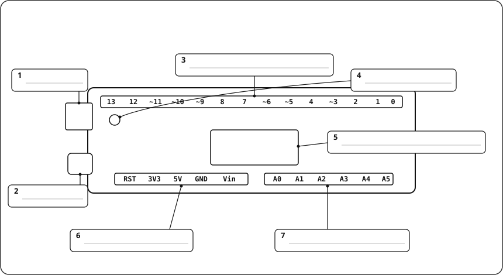

# Prova SA1 · Què és un robot? (teoria + pràctica en paper)

**Durada:** 50 min · **Material:** només bolígraf (sense apunts, sense ordinador ni mòbil) · **Puntuació:** 10 punts (Part A 5 + Part B 5)

<!-- web:only-github -->

> El full té **dos models (A i B)** amb els mateixos exercicis i dades diferents. Cada alumne/a respon **només el seu model**. Docent: graella, logística i solucions: [`Prova_SA1_solucionari.md`](Prova_SA1_solucionari.md) (només docent).

<!-- /web:only-github -->

---

<style>
@media print {
  .prose { font-size: 10pt; }
  .prose h3, .prose h4 { break-after: avoid; margin-top: .9em; }
  .prose p:has(+ .codehilite), .prose p:has(+ table), .prose p:has(+ div > table) { break-after: avoid; }
  .prose pre, .prose .highlight, .prose .codehilite, .prose table, .prose img, .prose p:has(img) { break-inside: avoid; }
  .prose hr { margin: 1.4em 0 .4em; }
}
</style>

## MODEL A

**Nom i cognoms:** ……………………………………………………… **Grup:** ………… **Data:** ……………

> ⏱️ Reparteix-te el temps: **Part A ~25 min** · **Part B ~25 min**. Llegeix cada pregunta sencera abans de respondre.

### PART A · Teoria (5 punts)

#### A1. Tria la resposta correcta (1,5 p · 0,25 cada una)

Encercla **una sola** lletra per pregunta.

1. Una **rentadora automàtica** té sensors, un microcontrolador que decideix i motors que actuen. Com en diem, d'aquest microcontrolador amagat dins l'aparell?<br>
   a) Un ordinador de sobretaula &nbsp;·&nbsp; b) Un sistema embegut &nbsp;·&nbsp; c) Un actuador &nbsp;·&nbsp; d) Una font d'alimentació
2. Quin d'aquests elements és una **entrada** (sensor)?<br>
   a) Un brunzidor &nbsp;·&nbsp; b) Un motor &nbsp;·&nbsp; c) Un polsador &nbsp;·&nbsp; d) Un LED
3. Quina part de la placa Arduino UNO **executa el programa**?<br>
   a) El connector USB &nbsp;·&nbsp; b) El LED intern «L» &nbsp;·&nbsp; c) Els pins `A0`–`A5` &nbsp;·&nbsp; d) El microcontrolador `ATmega328P`
4. Un senyal **digital** a l'Arduino UNO…<br>
   a) Només pot valer 0 V (`LOW`) o 5 V (`HIGH`) &nbsp;·&nbsp; b) Pot prendre qualsevol valor entre 0 i 5 V &nbsp;·&nbsp; c) Només serveix per als motors &nbsp;·&nbsp; d) Arriba sempre pels pins `A0`–`A5`
5. Què significa el símbol **`~`** al costat d'un pin digital (per exemple `~9`)?<br>
   a) Que el pin està espatllat &nbsp;·&nbsp; b) Que és un pin de terra &nbsp;·&nbsp; c) Que pot fer `PWM` (graduar la sortida) &nbsp;·&nbsp; d) Que és una entrada analògica
6. En el **mètode de projecte**, quina fase va just **després de «prototipar»**?<br>
   a) Analitzar &nbsp;·&nbsp; b) Provar &nbsp;·&nbsp; c) Dissenyar &nbsp;·&nbsp; d) Millorar

#### A2. Seguretat al laboratori (1 p · 0,5 cada una)

En Pau té la placa connectada a l'USB de l'ordinador i, per anar de pressa, **canvia el LED de lloc sense desconnectar-la**. El LED, a més, el posa **directament entre el pin 13 i GND**, sense cap resistència. Al costat de la protoboard hi té la seva llauna de refresc oberta.

Troba **dues** normes de seguretat que incompleix i explica **per què** són perilloses.

| | Norma que incompleix | Per què és perillosa |
|---|---|---|
| **1** | <br><br> | |
| **2** | <br><br> | |

#### A3. Entrada → procés → sortida (1,5 p)

Una **porta automàtica de supermercat** s'obre quan algú s'hi acosta i es tanca sola uns segons després que la persona hagi passat.

**a)** Completa la taula (1 p):

| Entrada (què percep i amb quin sensor) | Procés (què decideix) | Sortida (què fa i amb quin actuador) | Alimentació |
|---|---|---|---|
| <br><br><br><br><br> | | | |

**b)** És un **sistema embegut**? Justifica-ho en una frase (0,5 p).

_____________________________________________________________________________________

_____________________________________________________________________________________

#### A4. La placa Arduino UNO (1 p · 0,2 cada una)

{ style="max-width:65%" }

Escriu el **nom** de la part que assenyala cada requadre:

| Requadre | **1** | **3** | **5** | **6** | **7** |
|---|---|---|---|---|---|
| **Nom** | <br><br><br> | <br><br><br> | <br><br><br> | <br><br><br> | <br><br><br> |

### PART B · Pràctica en paper (5 punts)

#### B1. Prediu (1,5 p)

```cpp
const int LED = 13;

void setup() {
  pinMode(LED, OUTPUT);
}

void loop() {
  digitalWrite(LED, HIGH);
  delay(250);
  digitalWrite(LED, LOW);
  delay(750);
}
```

**a)** Explica amb les teves paraules què fa el LED (0,5 p).

_____________________________________________________________________________________

**b)** Pinta el **cronograma** dels 3 primers segons: marca amb una **X** les caselles on el LED està **encès** (0,5 p).

| t (s) | 0 | 0,25 | 0,5 | 0,75 | 1 | 1,25 | 1,5 | 1,75 | 2 | 2,25 | 2,5 | 2,75 |
|---|---|---|---|---|---|---|---|---|---|---|---|---|
| **LED** | | | | | | | | | | | | |

**c)** Quantes vegades s'encén el LED en **1 minut**? Escriu el càlcul (0,5 p).

_____________________________________________________________________________________

#### B2. Investiga: relaciona cada línia amb el que fa (1 p · 0,2 cada una)

Escriu la **lletra** correcta al costat de cada línia. Sobra una lletra.

| Línia de codi | Lletra |
|---|---|
| `void setup() { … }` | |
| `void loop() { … }` | |
| `pinMode(LED, OUTPUT);` | |
| `digitalWrite(LED, HIGH);` | |
| `delay(500);` | |

**A.** Posa 5 V al pin: el LED s'encén.<br>
**B.** Atura el programa mig segon.<br>
**C.** Es repeteix sense parar mentre la placa té corrent.<br>
**D.** Llegeix un valor analògic d'un sensor.<br>
**E.** Configura el pin com a sortida.<br>
**F.** S'executa una sola vegada, en engegar o reiniciar la placa.

#### B3. Depura (1,5 p · 0,5 per error: 0,25 trobar-lo + 0,25 corregir-lo)

Aquest programa hauria de fer **1 s encès, 1 s apagat** amb el LED del pin 13, però té **3 errors**.

```cpp
1  const int LED = 13;
2
3  void setup() {
4  }
5
6  void loop() {
7    digitalWrite(LED, HIGH)
8    delay(1);
9    digitalWrite(LED, LOW);
10   delay(1000);
11 }
```

| Línia | Què falla | Com ho corregeixes |
|---|---|---|
| <br> | | |
| <br> | | |
| <br> | | |

#### B4. Crea (1 p)

El `setup()` ja està fet (LED al pin 13 com a sortida). Escriu el **`loop()`** perquè el LED repeteixi aquest patró:

> **2 parpellejos curts** (0,2 s encès, 0,2 s apagat, cadascun) → **1 parpelleig llarg** (1 s encès) → **1 s de pausa** apagat.

```cpp
void loop() {


}
```

<div style="break-before: page"></div>

## MODEL B

**Nom i cognoms:** ……………………………………………………… **Grup:** ………… **Data:** ……………

> ⏱️ Reparteix-te el temps: **Part A ~25 min** · **Part B ~25 min**. Llegeix cada pregunta sencera abans de respondre.

### PART A · Teoria (5 punts)

#### A1. Tria la resposta correcta (1,5 p · 0,25 cada una)

Encercla **una sola** lletra per pregunta.

1. Què diferencia un **robot** d'una màquina qualsevol, com unes tisores?<br>
   a) Que és més car &nbsp;·&nbsp; b) Que sempre té forma humana &nbsp;·&nbsp; c) Que percep l'entorn, decideix i hi actua &nbsp;·&nbsp; d) Que no necessita energia
2. Quin d'aquests elements és una **sortida** (actuador)?<br>
   a) Un motor &nbsp;·&nbsp; b) Un sensor de temperatura &nbsp;·&nbsp; c) Un polsador &nbsp;·&nbsp; d) Una LDR (sensor de llum)
3. Per a què serveix el **connector USB** de la placa Arduino UNO?<br>
   a) Per llegir sensors analògics &nbsp;·&nbsp; b) Per pujar el programa i alimentar la placa &nbsp;·&nbsp; c) Per fer `PWM` &nbsp;·&nbsp; d) És la referència de 0 V
4. Els pins **`A0`–`A5`** serveixen per…<br>
   a) Alimentar la placa amb 12 V &nbsp;·&nbsp; b) Connectar la placa a internet &nbsp;·&nbsp; c) Llegir entrades analògiques (valors entre 0 i 5 V) &nbsp;·&nbsp; d) Fer només sortides `HIGH`/`LOW`
5. Què és el pin **`GND`**?<br>
   a) Un pin que dona 5 V &nbsp;·&nbsp; b) La referència de 0 V (el retorn del corrent) &nbsp;·&nbsp; c) Un pin `PWM` &nbsp;·&nbsp; d) L'entrada del programa
6. Quin és l'**ordre correcte** de les fases del mètode de projecte?<br>
   a) Analitzar → dissenyar → prototipar → provar → millorar &nbsp;·&nbsp; b) Dissenyar → analitzar → provar → prototipar → millorar &nbsp;·&nbsp; c) Prototipar → provar → analitzar → dissenyar → millorar &nbsp;·&nbsp; d) Provar → millorar → dissenyar → analitzar → prototipar

#### A2. Seguretat al laboratori (1 p · 0,5 cada una)

La Laia vol encendre un LED i, per comprovar si la placa «té corrent», **posa un cable directament entre el pin 5V i el pin GND**. Després munta el LED **amb les potes al revés** i, quan nota que la placa **s'escalfa i fa olor estranya**, continua treballant perquè vol acabar a temps.

Troba **dues** normes de seguretat que incompleix i explica **per què** són perilloses.

| | Norma que incompleix | Per què és perillosa |
|---|---|---|
| **1** | <br><br> | |
| **2** | <br><br> | |

#### A3. Entrada → procés → sortida (1,5 p)

Un **assecador de mans automàtic** comença a bufar aire calent quan hi poses les mans a sota i s'atura sol quan les treus.

**a)** Completa la taula (1 p):

| Entrada (què percep i amb quin sensor) | Procés (què decideix) | Sortida (què fa i amb quin actuador) | Alimentació |
|---|---|---|---|
| <br><br><br><br><br> | | | |

**b)** És un **sistema embegut**? Justifica-ho en una frase (0,5 p).

_____________________________________________________________________________________

_____________________________________________________________________________________

#### A4. La placa Arduino UNO (1 p · 0,2 cada una)

{ style="max-width:65%" }

Escriu el **nom** de la part que assenyala cada requadre:

| Requadre | **2** | **3** | **4** | **5** | **7** |
|---|---|---|---|---|---|
| **Nom** | <br><br><br> | <br><br><br> | <br><br><br> | <br><br><br> | <br><br><br> |

### PART B · Pràctica en paper (5 punts)

#### B1. Prediu (1,5 p)

```cpp
const int LED = 13;

void setup() {
  pinMode(LED, OUTPUT);
}

void loop() {
  digitalWrite(LED, HIGH);
  delay(1500);
  digitalWrite(LED, LOW);
  delay(500);
}
```

**a)** Explica amb les teves paraules què fa el LED (0,5 p).

_____________________________________________________________________________________

**b)** Pinta el **cronograma** dels 3 primers segons: marca amb una **X** les caselles on el LED està **encès** (0,5 p).

| t (s) | 0 | 0,25 | 0,5 | 0,75 | 1 | 1,25 | 1,5 | 1,75 | 2 | 2,25 | 2,5 | 2,75 |
|---|---|---|---|---|---|---|---|---|---|---|---|---|
| **LED** | | | | | | | | | | | | |

**c)** Quantes vegades s'encén el LED en **1 minut**? Escriu el càlcul (0,5 p).

_____________________________________________________________________________________

#### B2. Investiga: relaciona cada línia amb el que fa (1 p · 0,2 cada una)

Escriu la **lletra** correcta al costat de cada línia. Sobra una lletra.

| Línia de codi | Lletra |
|---|---|
| `const int LED = 8;` | |
| `void setup() { … }` | |
| `void loop() { … }` | |
| `digitalWrite(LED, LOW);` | |
| `delay(2000);` | |

**A.** Atura el programa 2 segons.<br>
**B.** Configura el pin com a entrada.<br>
**C.** Posa 0 V al pin: el LED s'apaga.<br>
**D.** S'executa una sola vegada, en engegar o reiniciar la placa.<br>
**E.** Dona el nom `LED` al número de pin 8, que no canviarà.<br>
**F.** Es repeteix sense parar mentre la placa té corrent.

#### B3. Depura (1,5 p · 0,5 per error: 0,25 trobar-lo + 0,25 corregir-lo)

Aquest programa hauria de fer **mig segon encès, mig segon apagat** amb un LED al pin 8, però té **3 errors**.

```cpp
1  const int LED = 8
2
3  void setup() {
4    pinMode(LED, INPUT);
5  }
6
7  void loop() {
8    digitalWrite(LED, HIGH);
9    delay(0.5);
10   digitalWrite(LED, LOW);
11   delay(500);
12 }
```

| Línia | Què falla | Com ho corregeixes |
|---|---|---|
| <br> | | |
| <br> | | |
| <br> | | |

#### B4. Crea (1 p)

El `setup()` ja està fet (LED al pin 13 com a sortida). Escriu el **`loop()`** perquè el LED repeteixi aquest patró:

> **1 parpelleig llarg** (1 s encès, 0,3 s apagat) → **2 parpellejos curts** (0,3 s encès, 0,3 s apagat, cadascun) → **2 s de pausa** apagat.

```cpp
void loop() {


}
```
