# SA0 · Vocabulari essencial de la robòtica

> **Per a què serveix aquest document?** És el teu **diccionari de butxaca** de tot el curs. Aquí hi trobaràs, ordenats **SA per SA**, els termes que faràs servir a cada unitat. Quan a una classe surti una paraula que no recordes, busca-la aquí. No cal estudiar-lo de memòria: és per **consultar**.

**Com llegir cada entrada:** **Terme** → definició curta → *analogia o exemple del dia a dia* → on apareix.

> 🔀 **Vols el terme en anglès** (per buscar a la referència d'Arduino, fòrums o *datasheets*)? És a l'altre diccionari del curs: el **[glossari tècnic català ↔ anglès](../00_General/00_Glossari_tecnic.md)**, organitzat per blocs temàtics.

---

## Bloc 0 · Paraules que sentiràs des del primer dia

| Terme | Què vol dir | Analogia / exemple |
|---|---|---|
| 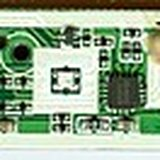 **Hardware (maquinari)** | Tot allò físic que pots tocar: la placa, els cables, els sensors. | El cos. |
| 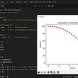 **Software (programari)** | Les instruccions (el programa) que diuen al maquinari què ha de fer. | El pensament que mou el cos. |
| 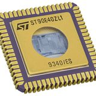 **Microcontrolador** | Petit "cervell" dins la placa que executa el programa. | El xip que pensa. |
| 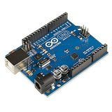 **Placa (board)** | El circuit on hi ha el microcontrolador i els pins. Ex.: Arduino UNO, micro:bit. | La taula de treball del cervell. |
| 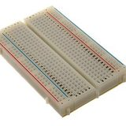 **Pin** | Cada connexió de la placa per on entra o surt un senyal. | Els dits de la placa. |
|  **Codi / programa / *sketch*** | El conjunt d'instruccions que escrius. A Arduino el programa es diu *sketch*. | La recepta de cuina. |
|  **Bug** | Un error al programa. **Depurar** (*debug*) = trobar-lo i arreglar-lo. | Una errada a la recepta que fa cremar el plat. |

---

## SA1 · Introducció a la robòtica i sistemes embeguts

| Terme | Què vol dir | Analogia / exemple |
|---|---|---|
| 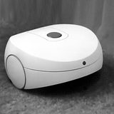 **Robot** | Màquina que **percep** l'entorn, **decideix** i **actua** sobre ell de manera automàtica. | Un Roomba que veu obstacles i els esquiva. |
| 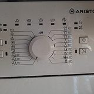 **Sistema embegut** | Ordinador petit i especialitzat amagat dins d'un aparell. | El "cervell" d'una rentadora o d'un microones. |
| 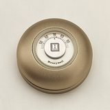 **Entrada → Procés → Sortida (E-P-S)** | El model bàsic: l'entrada **percep**, el procés **decideix**, la sortida **actua**. | Sentir fred (entrada) → decidir abrigar-se (procés) → posar-se el jersei (sortida). |
| 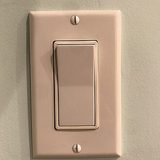 **Senyal digital** | Només dos estats: **0 o 1** (apagat/encès, LOW/HIGH, 0 V o 5 V). | Un interruptor de la llum. |
| 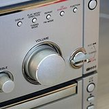 **Senyal analògic** | Molts valors continus entre un mínim i un màxim. | El comandament del volum o un termòmetre. |
| 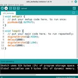 **Arduino IDE** | El programa de l'ordinador on escrius el codi i el carregues a la placa. | El processador de textos del programador. |
| 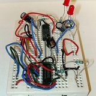 **Tinkercad / Wokwi** | Simuladors: munten i proven circuits **virtualment** abans del muntatge real. | Un videojoc per assajar sense trencar res. |

---

## SA2 · Sortides digitals i PWM

| Terme | Què vol dir | Analogia / exemple |
|---|---|---|
| 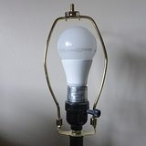 **Sortida digital** | Un pin que la placa posa a **encès (HIGH)** o **apagat (LOW)**. | Encendre/apagar un llum. |
| 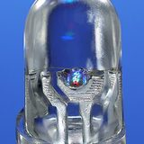 **LED** | Díode que emet llum; té polaritat (pota llarga = +). | Una bombeta petita amb sentit. |
| 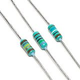 **Resistència** | Component que **limita el corrent** per no cremar el LED. Es mesura en ohms (Ω). | L'aixeta que regula quanta aigua passa. |
| 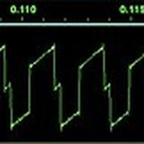 **PWM** (*Pulsewidth modulation*) | Truc per simular valors intermedis encenent i apagant molt ràpid. Pins marcats amb **`~`**. Valors **0–255**. | Pedalejar a intervals per anar "a mitja velocitat". |
| 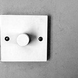 **`analogWrite()`** | Instrucció que aplica PWM a un pin (ex.: brillantor d'un LED). | El regulador d'intensitat (*dimmer*). |
|  **RGB** | LED de tres colors (vermell, verd, blau) que barrejats fan qualsevol color. | La paleta del pintor. |

---

## SA3 · Entrades i sensors

| Terme | Què vol dir | Analogia / exemple |
|---|---|---|
| 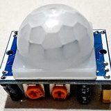 **Sensor** | Component que **mesura** una magnitud de l'entorn i la converteix en senyal. | Els sentits del robot. |
| 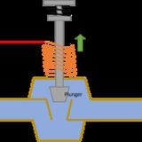 **Actuador** | Component que **fa una acció** física (motor, LED, brunzidor). | Els músculs del robot. |
| 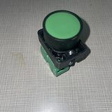 **Polsador (botó)** | Entrada digital: premut = HIGH/LOW. | El timbre de casa. |
| 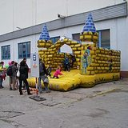 **Rebot (*debounce*)** | Petits "salts" elèctrics en prémer un botó; cal **filtrar-los** per no comptar premudes de més. | Una porta que rebota abans de tancar-se del tot. |
| 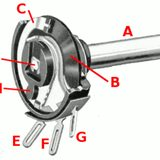 **Potenciòmetre** | Resistència variable: gira i canvia el valor analògic. | El comandament del volum. |
| 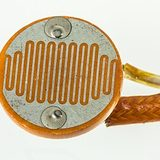 **LDR** | Sensor de **llum** (la seva resistència canvia amb la lluminositat). | L'ull que detecta si és de dia o de nit. |
| 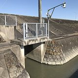 **Sensor d'ultrasons** | Mesura **distàncies** enviant un so i cronometrant l'eco. | El "sonar" dels ratpenats. |
| 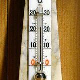 **`analogRead()`** | Llegeix un pin analògic; retorna un valor **0–1023**. | Mirar quant marca el termòmetre. |

---

## SA4 · Moviment: servos, motors i ponts H

| Terme | Què vol dir | Analogia / exemple |
|---|---|---|
| 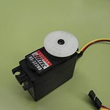 **Servomotor (servo)** | Motor que es mou a un **angle concret** (0°–180°). | El colze que es posa just on vols. |
| 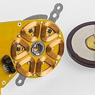 **Motor de corrent continu (DC)** | Motor que **gira** contínuament; controles velocitat i sentit. | La roda d'un cotxe teledirigit. |
| 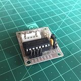 **Pont H** | Circuit que permet **invertir el sentit de gir** d'un motor (endavant/enrere). | La marxa enrere del cotxe. |
| 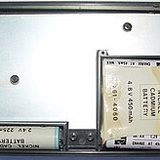 **Alimentació externa** | Font d'energia a part de l'USB perquè els motors tenen prou força. | Endollar l'electrodomèstic en lloc d'anar a piles. |
| 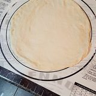 **Llibreria (`#include`)** | Codi ja fet que altres han escrit i tu reutilitzes (ex.: `Servo.h`). | Comprar la massa de pizza feta en lloc d'amassar-la. |

---

## SA5 · micro:bit i MicroPython

| Terme | Què vol dir | Analogia / exemple |
|---|---|---|
| 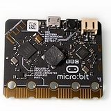 **micro:bit** | Placa educativa amb LEDs, botons i sensors **integrats** (no cal cablejar). | Una navalla suïssa de la robòtica. |
| 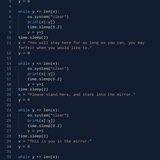 **MicroPython** | Versió reduïda del llenguatge **Python** per a microcontroladors. | El "Python de butxaca". |
| 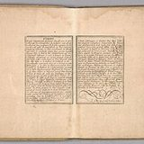 **Indentació** | En Python, els **espais a l'esquerra** marquen quines línies van juntes (substitueixen les claus `{}`). | Els marges d'un esquema amb sagnats. |
| 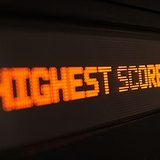 **`display`** | La matriu de 5×5 LEDs del micro:bit per mostrar imatges i text. | Una pantalleta de píxels. |
| 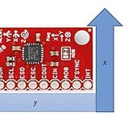 **Acceleròmetre** | Sensor que detecta **moviment i inclinació**. | L'orella interna que et diu si vas de cap per avall. |
| 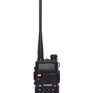 **Ràdio** | Comunicació sense fils entre micro:bits. | Walkie-talkies entre plaques. |

---

## SA6 · Sistemes de control

| Terme | Què vol dir | Analogia / exemple |
|---|---|---|
| 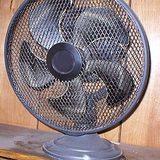 **Llaç obert** | El sistema actua **sense comprovar** el resultat. | Un ventilador a velocitat fixa: no sap quina temperatura fa. |
| 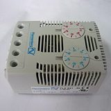 **Llaç tancat (realimentació)** | El sistema **mesura el resultat** i s'ajusta. | L'aire condicionat que mira el termòmetre i s'autoregula. |
| 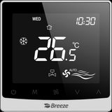 **Consigna (*setpoint*)** | El valor objectiu que volem assolir. | Els 21 °C que poses al termòstat. |
| 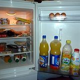 **Histèresi** | Marge entre encendre i apagar per evitar oscil·lacions contínues. | La nevera: arrenca a 6 °C i no para fins a 4 °C. |
| 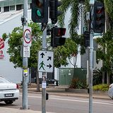 **Màquina d'estats** | Sistema que té diferents **estats** i passa d'un a l'altre segons condicions. | Un semàfor: verd → groc → vermell. |
| 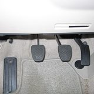 **Control proporcional** | La correcció és **proporcional** a com de lluny estàs de la consigna. | Trepitjar més fort el fre com més de pressa vas. |

---

## SA7 · Robòtica mòbil

| Terme | Què vol dir | Analogia / exemple |
|---|---|---|
| 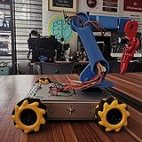 **Robot mòbil** | Robot que **es desplaça** per l'entorn. | Un cotxe autònom. |
| 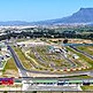 **Trajectòria** | El recorregut que segueix el robot. | El traçat d'un circuit. |
| 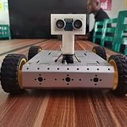 **Evitar obstacles** | Comportament: detectar amb sensors i canviar de rumb. | Esquivar la gent pel passadís. |
| 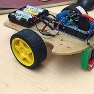 **Seguidor de línia** | Robot que segueix una línia pintada amb sensors infrarojos. | Caminar seguint la ratlla del terra. |
| 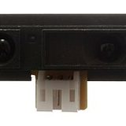 **Sensor infraroig (IR)** | Detecta el contrast clar/fosc del terra. | L'ull que distingeix la línia negra del blanc. |

---

## SA8 · IoT i Intel·ligència Artificial

| Terme | Què vol dir | Analogia / exemple |
|---|---|---|
| 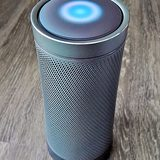 **IoT (Internet de les coses)** | Objectes connectats que envien i reben dades per la xarxa. | Una bàscula que envia el pes al mòbil. |
| 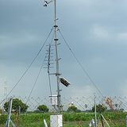 **Telemetria** | Enviar **mesures a distància** des d'un sensor. | L'estació meteorològica que reporta dades al núvol. |
| 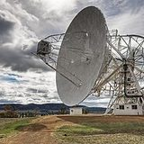 **Emissor / Receptor** | Qui **envia** dades i qui les **rep**. | Qui parla i qui escolta per walkie-talkie. |
|  **Intel·ligència Artificial (IA)** | Sistemes que prenen decisions o fan prediccions; o bé amb **regles** que escrivim, o bé **aprenent** de dades. | Reconèixer un gest o una cara. |
|  **Regles fetes a mà** | La persona escriu les condicions (`if valor > X`). | Una recepta amb passos fixos. |
|  **Aprenentatge automàtic (ML)** | En lloc d'escriure les regles, donem **exemples** i el sistema les **dedueix sol**. | Aprendre a distingir gossos i gats veient-ne molts. |
|  **Dades d'entrenament** | Els exemples amb què "ensenyem" el model. | Les fotos amb què estudies per a un examen visual. |
|  **Model** | El resultat d'entrenar: el que fa la predicció/classificació. | L'expert ja format. |
|  **Classificació** | Decidir a quina **categoria** pertany una cosa. | Dir si un correu és spam o no. |
|  **Biaix** | Error sistemàtic perquè les **dades** eren parcials. | Un jurat que només ha vist un tipus de cas. |
|  **IA generativa** | IA que **crea** text/imatges predient el següent tros (ChatGPT…). Pot **inventar** amb seguretat. | Un loro molt llegit que continua frases. |
|  **Assistent de codi** | IA que ajuda a programar/depurar (ChatGPT, Copilot…). Cal fer-ne un **ús honest**: t'ha d'ajudar a aprendre, no a copiar. Vegeu `00_IA_a_la_materia.md`. | Un company que et dona pistes, no la resposta. |
|  **ESP32** | Microcontrolador amb **WiFi/Bluetooth** integrat (opcional/avançat). | Un Arduino amb connexió a internet. |

---

## SA9 · Projecte final integrador

| Terme | Què vol dir | Analogia / exemple |
|---|---|---|
|  **Projecte** | Repte obert que integra tot l'après: del problema al prototip. | Construir alguna cosa de cap a peus. |
|  **Metodologia àgil** | Treballar per **passos curts** (sprints), provant i millorant sovint. | Cuinar tastant i corregint a cada pas. |
|  **Prototip** | Primera versió que funciona, encara que sigui imperfecta. | L'esborrany d'una redacció. |
|  **Iteració** | Repetir el cicle millorant cada vegada. | Tornar a tirar el tret després d'apuntar millor. |
|  **Dossier tècnic** | Document que recull el procés, decisions i resultats. | El diari de bord del viatge. |

---

## El mètode de projecte (el fil de tot el curs)

A **totes** les SA treballem amb el mateix cicle d'enginyeria. Tingue'l sempre present:

| Fase | Pregunta clau |
|---|---|
| **1. Analitzar** | Quin problema tinc? Què necessito? |
| **2. Dissenyar** | Com el penso resoldre **abans** de fer-ho? |
| **3. Prototipar** | Construeixo una primera versió. |
| **4. Provar** | Funciona? On falla? |
| **5. Millorar** | Com ho faig millor? |

> Aquest és també l'esquema del teu **quadern tècnic**. → Per aprendre a programar la placa, ves a **[`SA0_guia_programacio.md`](SA0_guia_programacio.md)**.

---

## Crèdits d'imatges

Fotos de **Wikimedia Commons**, reutilitzades sota la seva llicència (CC0 / domini públic / CC BY / CC BY-SA), compatible amb la del curs (CC BY-SA 4.0). Enllaç i autoria de cadascuna:

- **Hardware (maquinari)** — [Alex P. Kok · Wikimedia Commons](https://commons.wikimedia.org/wiki/File:Printed_circuit_board_of_Vaptio_Cosmo_2_electronic_cigarette.jpg) · CC BY-SA 4.0
- **Software (programari)** — [MikeRun · Wikimedia Commons](https://commons.wikimedia.org/wiki/File:Screen-python-code-matplotlib-physics-simulation.jpg) · CC BY-SA 4.0
- **Microcontrolador** — [Mister rf · Wikimedia Commons](https://commons.wikimedia.org/wiki/File:ST90E40ZL1_(2).png) · CC BY-SA 4.0
- **Placa (board)** — [SparkFun Electronics from Boulder, USA · Wikimedia Commons](https://commons.wikimedia.org/wiki/File:Arduino_Uno_-_R3.jpg) · CC BY 2.0
- **Pin** — [oomlout · Wikimedia Commons](https://commons.wikimedia.org/wiki/File:400_points_breadboard.jpg) · CC BY-SA 2.0
- **Codi / sketch** — [Martin Vorel · Wikimedia Commons](https://commons.wikimedia.org/wiki/File:Programming_code.jpg) · CC BY-SA 4.0
- **Bug** — [Stephan Sprinz · Wikimedia Commons](https://commons.wikimedia.org/wiki/File:Siebenpunkt-Marienk%C3%A4fer_(Coccinella_septempunctata)_auf_Bl%C3%BCte_im_FFH-Gebiet_%22Viernheimer_Waldheide_und_angrenzende_Fl%C3%A4chen%22.jpg) · CC BY 4.0
- **Robot** — [TiHa · Wikimedia Commons](https://commons.wikimedia.org/wiki/File:Robot_vacuum_cleaner_concept_study_1994.jpg) · CC BY-SA 4.0
- **Sistema embegut** — [LUIAHM GEEAH · Wikimedia Commons](https://commons.wikimedia.org/wiki/File:HK_ARISTON_washing_machine_control_panel_March_2021_SS2_01.jpg) · CC BY-SA 4.0
- **Entrada-proces-sortida** — [Cooper Hewitt, Smithsonian Design Museum · Wikimedia Commons](https://commons.wikimedia.org/wiki/File:T-86_Round_Thermostat,_1953.jpg) · Public domain
- **Senyal digital** — [DemonDays64 · Wikimedia Commons](https://commons.wikimedia.org/wiki/File:Rocker_light_switch.jpg) · CC BY-SA 4.0
- **Senyal analogic** — [Santeri Viinamäki · Wikimedia Commons](https://commons.wikimedia.org/wiki/File:Radio_volume_knob_20180320.jpg) · CC BY-SA 4.0
- **Arduino IDE** — [Edwiyanto · Wikimedia Commons](https://commons.wikimedia.org/wiki/File:Select_upload_Arduino_IDE.png) · CC BY-SA 4.0
- **Tinkercad / Wokwi** — [en:User:LukeSurl · Wikimedia Commons](https://commons.wikimedia.org/wiki/File:Breadboard.JPG) · CC BY-SA 3.0
- **Sortida digital** — [Verne Equinox · Wikimedia Commons](https://commons.wikimedia.org/wiki/File:Lamp_harp_with_LED_bulb.jpg) · CC BY-SA 4.0
- **LED** — [Mister rf · Wikimedia Commons](https://commons.wikimedia.org/wiki/File:RGB_LED_5mm.jpg) · CC BY-SA 4.0
- **Resistencia** — [Afrank99 · Wikimedia Commons](https://commons.wikimedia.org/wiki/File:3_Resistors.jpg) · CC BY-SA 2.5
- **PWM** — [Trumpetrep · Wikimedia Commons](https://commons.wikimedia.org/wiki/File:Closeup_oscilloscope_of_Waveform_2.jpg) · CC BY-SA 4.0
- **analogWrite()** — [Paolomarco · Wikimedia Commons](https://commons.wikimedia.org/wiki/File:Dimmer_Light_Switch.jpg) · CC BY-SA 4.0
- **RGB** — [Mister rf · Wikimedia Commons](https://commons.wikimedia.org/wiki/File:RGB_LED_5mm.jpg) · CC BY-SA 4.0
- **Sensor** — [Nowforever · Wikimedia Commons](https://commons.wikimedia.org/wiki/File:PIR_sensor_for_arduino.jpg) · CC BY-SA 4.0
- **Actuador** — [User:Sparpo · Wikimedia Commons](https://commons.wikimedia.org/wiki/File:Solenoid_Valve_Open.png) · CC BY-SA 4.0
- **Polsador (boto)** — [Mithilrkadam · Wikimedia Commons](https://commons.wikimedia.org/wiki/File:Push_button_switch_Green.jpg) · CC BY-SA 4.0
- **Rebot (debounce)** — [ŠJů (cs:ŠJů) · Wikimedia Commons](https://commons.wikimedia.org/wiki/File:DOD_DOZ_Hostiva%C5%99,_sk%C3%A1kac%C3%AD_hrad.jpg) · CC BY-SA 3.0
- **Potenciometre** — [Original work: Unknown Altered work: Chetvorno · Wikimedia Commons](https://commons.wikimedia.org/wiki/File:Potentiometer_cutaway_drawing.png) · Public domain
- **LDR** — [Raimond Spekking · Wikimedia Commons](https://commons.wikimedia.org/wiki/File:Photoresistor_with_orange_background-7536.jpg) · CC BY-SA 4.0
- **Sensor d'ultrasons** — [Peka · Wikimedia Commons](https://commons.wikimedia.org/wiki/File:Ultrasonic_water_level_sensor_at_levee_in_Kashima,_Saga.jpg) · CC BY-SA 4.0
- **analogRead()** — [Anonimski · Wikimedia Commons](https://commons.wikimedia.org/wiki/File:Mercury_Thermometer.jpg) · CC BY-SA 3.0
- **Servomotor** — [José Luis Gálvez (Digigalos) · Wikimedia Commons](https://commons.wikimedia.org/wiki/File:Servomotor_01.jpg) · CC BY-SA 2.5
- **Motor DC** — [Raimond Spekking · Wikimedia Commons](https://commons.wikimedia.org/wiki/File:HP_StorageWorks_DAT_72_USB_-_Tape_Drive_Capstans,_brushless_DC_electric_motor-92900.jpg) · CC BY-SA 4.0
- **Pont H** — [Kushagra Keshari · Wikimedia Commons](https://commons.wikimedia.org/wiki/File:ULN2003_unioplar_stepper_motor_driver_module.jpg) · CC BY-SA 4.0
- **Alimentacio externa** — [Mister rf · Wikimedia Commons](https://commons.wikimedia.org/wiki/File:Canon_Pocketronic_Nickel-Cadmium_battery_packs.jpg) · CC BY-SA 4.0
- **Llibreria (#include)** — [terri_bateman · Wikimedia Commons](https://commons.wikimedia.org/wiki/File:Pizza_night-_dough_is_ready_(33502053445).jpg) · CC BY 2.0
- **micro:bit** — [SimonWaldherr · Wikimedia Commons](https://commons.wikimedia.org/wiki/File:BBC_micro_bit_v2.jpg) · CC BY 4.0
- **MicroPython** — [Thraea19 · Wikimedia Commons](https://commons.wikimedia.org/wiki/File:Python_Code.png) · CC BY-SA 4.0
- **Indentacio** — [Fer, Nicolas de, 1646-1720 · Wikimedia Commons](https://commons.wikimedia.org/wiki/File:(Text_Page_to_)_Europe._De_Fer_..._(to_accompany)_._Petit_et_Nouveau_Atlas._A_Paris,1697._(IA_dr_text-page-to-europe-de-fer-to-accompany-petit-et-nouveau-atlas-13012007).jpg) · Public domain
- **display** — [ElHeineken · Wikimedia Commons](https://commons.wikimedia.org/wiki/File:Pinball_Dot_Matrix_Display_-_Demolition_Man.JPG) · CC BY 3.0
- **Accelerometre** — [Victor H. Rodriguez, Carlos T. Medrano, and Inmaculada Plaza · Wikimedia Commons](https://commons.wikimedia.org/wiki/File:Diagram_of_an_IMU9150_sensor_orientation_(Rodriguez_et_al,_2018).jpg) · CC BY 4.0
- **Radio** — [Варвара Каминская · Wikimedia Commons](https://commons.wikimedia.org/wiki/File:Baofeng_UV-5R_transceiver.jpg) · CC BY-SA 4.0
- **Llac obert** — [Rfc1394(talk) · Wikimedia Commons](https://commons.wikimedia.org/wiki/File:Electric_Fan_240x355.jpg) · Public domain
- **Llac tancat** — [FearChild · Wikimedia Commons](https://commons.wikimedia.org/wiki/File:Thermostat.jpg) · Public domain
- **Consigna (setpoint)** — [Ayla Yang · Wikimedia Commons](https://commons.wikimedia.org/wiki/File:Bc105_thermostat_front_view.png) · CC0
- **Histeresi** — [Bretwa · Wikimedia Commons](https://commons.wikimedia.org/wiki/File:Food_into_a_refrigerator_-_20111002.jpg) · CC0
- **Maquina d'estats** — [Dietmar Rabich · Wikimedia Commons](https://commons.wikimedia.org/wiki/File:Darwin_(AU),_Knuckey_St-Mitchell_St,_Traffic_Light_--_2019_--_4328.jpg) · CC BY-SA 4.0
- **Control proporcional** — [Tckma at English Wikipedia · Wikimedia Commons](https://commons.wikimedia.org/wiki/File:Pedal_Locations_in_2007_Subaru_Legacy.jpg) · Public domain
- **Robot mobil** — [Anani A. George · Wikimedia Commons](https://commons.wikimedia.org/wiki/File:Mecanum_Wheel_Robot_with_an_Arm.jpg) · CC0
- **Trajectoria** — [SkyPixels · Wikimedia Commons](https://commons.wikimedia.org/wiki/File:Killarney_Race_Track_in_Tableview_Cape_Town.jpg) · CC BY-SA 4.0
- **Evitar obstacles** — [Anani A. George · Wikimedia Commons](https://commons.wikimedia.org/wiki/File:Obstacle_avoidance_robot_car.jpg) · CC0
- **Seguidor de linia** — [Gsparr86 · Wikimedia Commons](https://commons.wikimedia.org/wiki/File:Line_following_robot_final_product.JPG) · CC BY-SA 4.0
- **Sensor infraroig (IR)** — [Sharp_GP2Y0A21YK_IR_proximity_sensor.jpg: oomlout derivative work: Bomazi · Wikimedia Commons](https://commons.wikimedia.org/wiki/File:Sharp_GP2Y0A21YK_IR_proximity_sensor_cropped.jpg) · CC BY-SA 2.0
- **IoT** — [Jdubman · Wikimedia Commons](https://commons.wikimedia.org/wiki/File:Harman_Kardon_Invoke_Speaker_-_aerial.jpg) · CC BY-SA 4.0
- **Telemetria** — [Delince · Wikimedia Commons](https://commons.wikimedia.org/wiki/File:AWS(Automatic_Weather_station).JPG) · CC BY-SA 3.0
- **Emissor / Receptor** — [Noodle snacks · Wikimedia Commons](https://commons.wikimedia.org/wiki/File:Mount_Pleasant_Radio_Telescope.jpg) · CC BY-SA 3.0
- **Intel.ligencia Artificial** — [Sergei Magel/HNF · Wikimedia Commons](https://commons.wikimedia.org/wiki/File:Artificial_Intelligence_(AI)_and_Robotics_exhibition_at_the_Heinz_Nixdorf_MuseumsForum.jpg) · CC BY-SA 4.0
- **Regles fetes a ma** — [Unoquha · Wikimedia Commons](https://commons.wikimedia.org/wiki/File:Recipe_book_of_Margaret_Countess_of_Moray.jpg) · CC0
- **Aprenentatge automatic (ML)** — [SeanT313 · Wikimedia Commons](https://commons.wikimedia.org/wiki/File:Cat_and_Dog_Cuddling.jpg) · CC BY-SA 4.0
- **Dades d'entrenament** — [Unknown authorUnknown author · Wikimedia Commons](https://commons.wikimedia.org/wiki/File:Hungarian_family_photo_album,_page_40.jpg) · Public domain
- **Model** — [Harrison Keely · Wikimedia Commons](https://commons.wikimedia.org/wiki/File:A_public_high_school_teacher_in_a_classroom_in_the_United_States_08.jpg) · CC BY 4.0
- **Classificacio** — [Frank Bond · Wikimedia Commons](https://commons.wikimedia.org/wiki/File:Mail_Room_Crew_Sorts_Letters_(BOND_0603).jpg) · Public domain
- **Biaix** — [Pearson Scott Foresman · Wikimedia Commons](https://commons.wikimedia.org/wiki/File:Balance_-_Scales_of_Justice_(PSF).png) · Public domain
- **IA generativa** — [Luc Viatour · Wikimedia Commons](https://commons.wikimedia.org/wiki/File:Ara_ararauna_Luc_Viatour.jpg) · CC BY 2.0
- **Assistent de codi** — [USFWS/Southeast · Wikimedia Commons](https://commons.wikimedia.org/wiki/File:Student_pair_identifying_macroinvertebrates_(26477703186).jpg) · Public domain
- **ESP32** — [Edwiyanto · Wikimedia Commons](https://commons.wikimedia.org/wiki/File:ESP32.jpg) · CC BY-SA 4.0
- **Projecte** — [Photograph by Mike Peel (www.mikepeel.net). · Wikimedia Commons](https://commons.wikimedia.org/wiki/File:One_World_Trade_Center_under_construction,_2012_02.jpg) · CC BY-SA 4.0
- **Metodologia agil** — [Dev Jadiya · Wikimedia Commons](https://commons.wikimedia.org/wiki/File:Wiki_Club_SATI_Board_Meeting_Sticky_Notes.jpg) · CC BY 4.0
- **Prototip** — [Tea Point · Wikimedia Commons](https://commons.wikimedia.org/wiki/File:Cardboard_Prototype_of_an_Automobile.jpg) · CC BY-SA 4.0
- **Iteracio** — [Bernard Gagnon · Wikimedia Commons](https://commons.wikimedia.org/wiki/File:Changlimithang_Archery_Ground,_Thimphu_08.jpg) · CC BY-SA 4.0
- **Dossier tecnic** — [Jairus Monilla · Wikimedia Commons](https://commons.wikimedia.org/wiki/File:Notebook_writing.jpg) · Public domain
