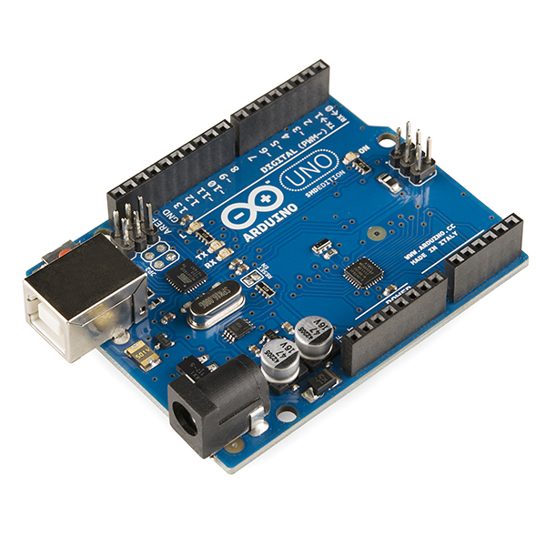

# SA1 · Què és un robot? Sistemes embeguts i mètode de projecte

Primera situació d'aprenentatge del curs (**6 h · 3 sessions**, 1r trimestre). Introdueix el concepte de **robot** i **sistema embegut**, el model **entrada → procés → sortida**, l'arquitectura d'**Arduino UNO**, les **normes de seguretat** i el primer programa (`Blink`). Maquinari: Arduino UNO (demostració) + simulador **Tinkercad**. Programació oficial: [`Programació didàctica/10_SA1_Introduccio_robotica.md`](../../Programació%20didàctica/10_SA1_Introduccio_robotica.md).

> *Fotografia: Arduino Uno R3, per [SparkFun Electronics](https://commons.wikimedia.org/wiki/File:Arduino_Uno_-_R3.jpg) — llicència [CC BY 2.0](https://creativecommons.org/licenses/by/2.0/).*

## 📦 Què has d'entregar

| Quan | Lliurable | On es lliura |
|---|---|---|
| S1 | [Activitat 1 · Entrada, procés, sortida](SA1_fitxa_alumnat.md#1-entrada-proces-sortida) i la [prova diagnòstica](https://classroom.google.com/c/ODY4ODU4Njk0NTEy/a/ODcwNTM2NzE0Njcx/details) (no qualifica) | [Tasca de Classroom](https://classroom.google.com/c/ODY4ODU4Njk0NTEy/a/ODcwNTEwOTcwMDE1/details) |
| S2 | [Activitat 2 · La placa Arduino UNO](SA1_fitxa_alumnat.md#2-la-placa-arduino-uno) i [Activitat 3 · Normes de seguretat](SA1_fitxa_alumnat.md#3-normes-de-seguretat) (signades) | Mateixa tasca de Classroom |
| S3 | [Activitat 4 · El teu primer programa (Blink)](SA1_fitxa_alumnat.md#4-el-teu-primer-programa-blink-primm) i la [fitxa-pòster](SA1_poster_robot_plantilla.md) (el producte de la SA — es comença avui i s'entrega a la mateixa tasca) | Mateixa tasca de Classroom |
| ⭐ | [Repte triat (A, B o C)](../../Reptes/Reptes_SA1.md) | El docent el valida i pinteu l'estrella al [tauler de reptes](../00_General/00_Tauler_reptes.md) |
| 📓 | Full del quadern tècnic de cada sessió | En paper, en acabar la sessió |

## Itinerari per sessions

> La teva feina és a la **[fitxa base](SA1_fitxa_alumnat.md)**. Aquesta ruta et diu què toca fer a cada sessió i què necessites en aquell moment. Les respostes de la fitxa es lliuren a la **[tasca de Classroom](https://classroom.google.com/c/ODY4ODU4Njk0NTEy/a/ODcwNTEwOTcwMDE1/details)**.

1. **Sessió 1 · Què és un robot?** — fes l'[Activitat 1 de la fitxa](SA1_fitxa_alumnat.md#1-entrada-proces-sortida) i respon la **[prova diagnòstica (Google Classroom)](https://classroom.google.com/c/ODY4ODU4Njk0NTEy/a/ODcwNTM2NzE0Njcx/details)** (no qualifica).
2. **Sessió 2 · La placa i la seguretat** — fes l'[Activitat 2](SA1_fitxa_alumnat.md#2-la-placa-arduino-uno) amb els [esquemes de la placa](SA1_esquemes_connexions.md), i fes l'[Activitat 3](SA1_fitxa_alumnat.md#3-normes-de-seguretat): llegeix i signa les [normes de seguretat](SA1_normes_seguretat.md).
3. **Sessió 3 · El teu primer programa** — fes l'[Activitat 4](SA1_fitxa_alumnat.md#4-el-teu-primer-programa-blink-primm) amb el [diagrama de flux del batec](SA1_diagrama_flux.md) i el [codi](codi/), i comença la [fitxa-pòster](SA1_poster_robot_plantilla.md) (el producte de la SA).
4. **Abans d'entregar** — repassa [el meu checklist](SA1_checklist_alumnat.md).

### Si vols més

- [Fitxa ampliada](SA1_fitxa_ampliada.md) — rols, coavaluació, ODS i ampliacions.
- [Qüestionari de conceptes](SA1_questionari_conceptes.md) — per repassar.
- [Reptes de la SA1](../../Reptes/Reptes_SA1.md) — tria el teu context.

## Producte i avaluació

- **Producte:** [`SA1_poster_robot_plantilla.md`](SA1_poster_robot_plantilla.md) (anàlisi d'un robot real + dilema ètic) i primeres entrades del quadern tècnic.
- **Rúbriques:** **R4** (documentació) i **R5** (actitud). La prova diagnòstica **no** qualifica.

<!-- web:only-github -->
## Tots els documents

| Fitxer | Descripció |
|---|---|
| [`SA1_guia_docent.md`](SA1_guia_docent.md) | Guia del professorat: objectius, seqüència de les 3 sessions, punts clau, errors freqüents i avaluació. |
| [`SA1_fitxa_alumnat.md`](SA1_fitxa_alumnat.md) | **Fitxa base** (nucli d'una cara, per a tot l'alumnat): Activitats 1-4 + quadern. |
| [`SA1_fitxa_ampliada.md`](SA1_fitxa_ampliada.md) | **Versió ampliada** (aprofundiment): totes les rutines (rols, coavaluació, exit ticket, ODS, PC) i ampliacions. |
| [`SA1_checklist_docent.md`](SA1_checklist_docent.md) | **Checklist docent** (una cara): logística prèvia, punts de control per sessió, avaluació i diversitat. |
| [`SA1_checklist_alumnat.md`](SA1_checklist_alumnat.md) | **Checklist alumnat** (una cara): què he de fer/lliurar + autoavaluació amb semàfor. |
| [`SA1_esquemes_connexions.md`](SA1_esquemes_connexions.md) | Anatomia de la placa UNO (etiquetada + muda per a l'Activitat 2) i circuit del `Blink`. |
| [`SA1_prova_diagnostica.md`](SA1_prova_diagnostica.md) | Prova inicial de coneixements previs (no qualifica): es respon al **Google Form autocorrectiu** publicat a Classroom. |
| [`SA1_normes_seguretat.md`](SA1_normes_seguretat.md) | Full de normes de seguretat del laboratori, **per signar**. |
| [`SA1_poster_robot_plantilla.md`](SA1_poster_robot_plantilla.md) | Plantilla del **producte de la SA**: fitxa-pòster d'anàlisi d'un robot real. |
| [`SA1_questionari_conceptes.md`](SA1_questionari_conceptes.md) | Qüestionari de conceptes (robot, sistema embegut i placa UNO): repàs formatiu o prova curta qualificable (10 preguntes). |
| [`SA1_questionari_conceptes_solucions.md`](SA1_questionari_conceptes_solucions.md) | Clau de correcció i versió Google Forms del qüestionari (material del docent). |
| `codi/` | Sketches d'Arduino (vegeu la taula següent). |

### Codi (`codi/`)

| Sketch | Nivell | Què mostra |
|---|---|---|
| [`blink/blink.ino`](codi/blink/blink.ino) | Base | El primer programa: `setup()`, `loop()`, `pinMode`, `digitalWrite`, `delay`. |
| [`blink_repte/blink_repte.ino`](codi/blink_repte/blink_repte.ino) | Repte | Bucle `for` i variables per als temps (3 parpellejos + pausa), amb esquelet «Si t'encalles» a la seva pàgina. |
| [`blink_millis/blink_millis.ino`](codi/blink_millis/blink_millis.ino) | Ampliació | Temporització **no bloquejant** amb `millis()` (sense `delay()`). |
| [`sos_morse/sos_morse.ino`](codi/sos_morse/sos_morse.ino) | Ampliació | **Funcions** pròpies (`punt()`, `ratlla()`) per emetre SOS en Morse. |

Cada sketch té la seva **pàgina de pràctica** a la web (per què es fa + codi explicat per blocs); a GitHub, l'explicació és a l'`EXPLICACIO.md` de la carpeta del sketch.
<!-- /web:only-github -->
