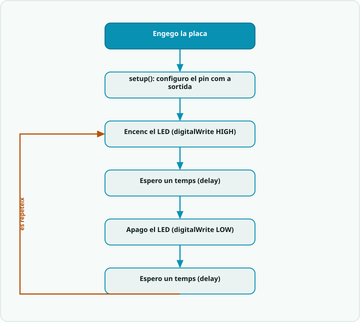

# SA1 · Diagrama de flux — el batec d'un robot (`setup` un cop, `loop` per sempre)

> **Per a qui és?** Alumnat. És el mateix que fa el programa, però **dibuixat**. Mira'l **abans de programar** per tenir el pla al cap; després l'exemple resolt i el codi.

## El flux

## Llegenda
- Caixa **fosca** = **inici**.
- Caixa **teal** `[ ... ]` = una **acció** (una instrucció o bloc de codi).
- **Rombe ambre** `< ... ? >` = una **decisió** (`if`): en surt una branca per cada cas.
- **Fletxa ambre** = **bucle**: torna enrere i es repeteix.

## Del diagrama al codi
- **Configurar el pin com a SORTIDA** → `pinMode(LED, OUTPUT);` dins de `setup()` (només un cop).
- **Encendre / Apagar el LED** → `digitalWrite(LED, HIGH);` i `digitalWrite(LED, LOW);`.
- **Esperar 100 ms / 2000 ms** → `delay(100);` i `delay(2000);` (el batec surt de fer els dos temps **diferents**).
- **El retorn NO** és el `loop()`: en acabar, torna a dalt i el batec no s'atura mai (el robot dona «senyal de vida»).
