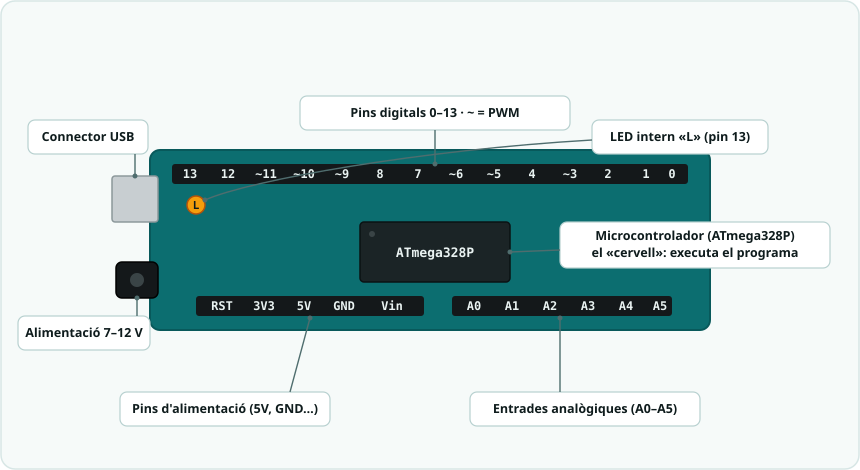
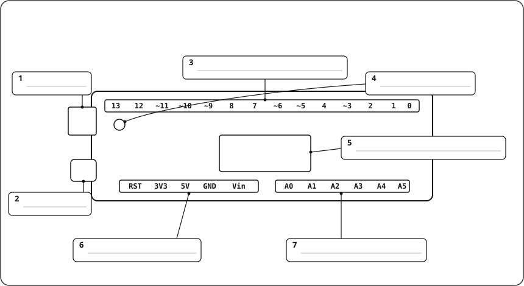

# SA1 · Esquemes i connexions

> Tot reproduïble a **Tinkercad Circuits** (tinkercad.com) o **Wokwi** (wokwi.com). A la SA1 només es necessita **un LED**; si s'usa el LED **intern** (pin 13) no cal cap component extern. El LED **extern** sempre porta una **resistència de 220 Ω** en sèrie i el càtode (pota curta / costat pla) va a **GND**.

---

## 1. Anatomia de la placa Arduino UNO (Activitat 2)

Aquest apartat dona suport a l'**Activitat 2** de la fitxa. Es projecta primer la **versió etiquetada** (model) i, després, l'alumnat etiqueta la **versió muda**.


> *Fotografia: Arduino Uno R3, per [SparkFun Electronics](https://commons.wikimedia.org/wiki/File:Arduino_Uno_-_R3.jpg) — llicència [CC BY 2.0](https://creativecommons.org/licenses/by/2.0/).*

### 1.1. Versió etiquetada (model del docent)



| Part | Funció |
|---|---|
| **Microcontrolador (ATmega328P)** | El "cervell": executa el programa i pren decisions (procés). |
| **Pins digitals (0-13)** | Entrades/sortides de **dos estats** (LOW/HIGH). Els marcats amb `~` fan **PWM**. |
| **Pins analògics (A0-A5)** | **Entrades** de valors continus (0-5 V → 0-1023). |
| **Pins d'alimentació (5V, 3V3, GND, Vin)** | Donen corrent als components. **GND** = referència 0 V. |
| **Connector USB** | Puja el programa des de l'ordinador i alimenta la placa. |
| **Connector d'alimentació (jack)** | Alimentació externa 7-12 V (piles/transformador). |
| **LED intern (L)** | LED de la placa connectat al **pin 13**: ideal per al primer `Blink` sense cablejar res. |

### 1.2. Versió muda (per imprimir / projectar)

L'alumnat escriu el nom de cada part al requadre numerat corresponent.



> **Solució (per al docent):** 1 · Connector USB · 2 · Connector d'alimentació (7-12 V) · 3 · Pins digitals 0-13 (`~` = PWM) · 4 · LED intern «L» (pin 13) · 5 · Microcontrolador (ATmega328P) · 6 · Pins d'alimentació (5V, GND…) · 7 · Entrades analògiques (A0-A5).

---

## 2. Circuit del primer programa (`Blink`)

### 2.1. Opció A — LED intern (recomanada per començar)

No cal cap component: el LED marcat amb **L** ja està connectat internament al **pin 13**. N'hi ha prou de pujar `blink.ino`.

```
[ Placa Arduino UNO ] ── USB ── [ Ordinador ]
        │
   LED intern "L" (pin 13)  → parpelleja
```

### 2.2. Opció B — LED extern al pin 13

| Component | Pin Arduino | Notes |
|---|---|---|
| LED (ànode +) | Pin 13 → 220 Ω → ànode | Pota **llarga** = + |
| LED (càtode −) | GND | Pota **curta** / costat pla |


> ⚠️ **Sempre** la resistència de 220 Ω en sèrie: sense ella el LED rep massa corrent i es pot fondre.
> El mateix esquema serveix per als sketches d'ampliació `blink_millis` i `sos_morse`.

---

## 3. Comprovació ràpida (abans de pujar el codi)

- [ ] Placa seleccionada: **Eines → Placa → Arduino UNO**.
- [ ] **Port** correcte seleccionat (Eines → Port).
- [ ] Si és LED extern: pota llarga cap a la resistència, pota curta a GND.
- [ ] Cap curtcircuit entre **5V** i **GND**.

> Reproducció en simulador: a **Tinkercad** arrossega *Arduino UNO* + *LED* + *resistència de 220 Ω*, cabla com a l'esquema i prem **Iniciar simulació**.

---

## Simulació interactiva (Wokwi)

- ▶ **Simulació interactiva (Blink, LED intern):** <https://wokwi.com/projects/468012800918599681>
- **Projecte al repositori:** [`Simulacions/Wokwi/SA1_blink/`](../../Simulacions/Wokwi/SA1_blink/) (`diagram.json` + `sketch.ino`).

> Obre l'enllaç i prem **▶**: el LED intern (pin 13) parpelleja.
