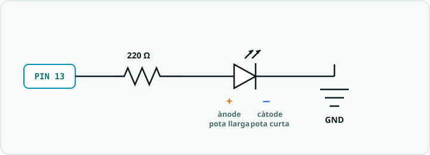

# SA1 · Exemple resolt (model «jo ho faig») — Analitzo un aspirador robot i li poso un batec

> 🧑‍🎓 **Quan toca mirar-lo?** Després del teu **primer intent** amb la taula E-P-S de l'**Activitat 1 (S1)** i amb el `blink.ino` de l'**Activitat 4 (S3)** — mai abans. És un problema **anàleg** per veure *com es pensa*, no una solució per copiar: el pòster l'has de fer amb el **teu** robot.

> **Nota docent:** mostra'l **després del primer intent** amb l'Activitat 1 (taula E-P-S) i amb
> `blink.ino`, mai abans. No és la solució del pòster (que cada alumne/a fa amb el **seu** robot):
> és un problema **anàleg** resolt pas a pas perquè l'alumnat vegi *com es pensa* un sistema, no
> què s'ha de copiar. Comenta en veu alta el pas «🧭 Com ho penso» (descomposició abans d'escriure,
> predicció PRIMM abans d'executar) i el «⚠️ Contraexemple».

---



## 🔑 El repte model

> Agafo un robot quotidià —un **aspirador robot**— i l'**analitzo amb el model entrada → procés →
> sortida**: què *percep*, què *decideix* i què *fa*. Després, com que tot robot dona un **senyal
> de vida** amb un LED, **predic** què farà un `Blink` senzill que faci un **batec** (una llumeta
> curta i una pausa llarga, com un cor) i l'anoto línia a línia.

Fa servir només conceptes de la SA1: el model **E-P-S**, la diferència **digital/analògic**, l'anatomia
de la placa i el primer programa (`setup`, `loop`, `pinMode`, `digitalWrite`, `delay`). El circuit és el
més simple de tots: el **LED intern (pin 13)**, sense cablejar res.

---

## 🧭 Com ho penso (abans d'escriure res)

1. **Analitzo (descomposició):** un aspirador robot sembla «màgic», però és un sistema automàtic com
   la rentadora o el semàfor de l'Activitat 1. Si el parteixo en **tres caixes** (SENSOR → CERVELL →
   ACTUADOR) deixa de ser màgic i el puc entendre.
2. **Ompo les caixes preguntant-me tres coses:**
   - **Què percep?** (entrada) → sensors de xoc, sensor de precipici (per no caure de l'escala),
     sensor de brutícia, botó d'engegada.
   - **Què decideix?** (procés) → el microcontrolador: *«si topo → giro», «si detecto precipici →
     recular»*. És el «cervell», com l'ATmega328P de l'Arduino.
   - **Què fa?** (sortida) → motors de les rodes, motor de l'aspiració, **LED** d'estat, so d'avís.
3. **Classifico els senyals (digital vs analògic):** el botó d'engegada és **digital** (premut / no
   premut, dos estats). El sensor de brutícia dona **molts valors** (poc / mig / molt) → **analògic**.
   Mateixa idea que a la placa: pins digitals (0/5 V) vs entrades A0–A5.
4. **🔮 PREDIU (fes-ho tu abans de llegir el codi):** el LED d'estat de baix consum sovint fa un
   **batec**: s'encén poc temps i s'apaga molt més. Amb `digitalWrite(LED, HIGH); delay(100);` i
   després `digitalWrite(LED, LOW); delay(2000);`, el LED estarà… ☐ sempre encès ☐ **un instant encès
   i molta estona apagat** ☐ parpellejant simètric. I `setup()` s'executarà… ☐ **un sol cop** ☐ per sempre.

---

## 💡 La solució anotada

**Primer, l'anàlisi E-P-S de l'aspirador (el que hauria d'anar al pòster, amb el *meu* raonament):**

| | Entrada (sensors) | Procés (decisió) | Sortida (actuadors) |
|---|---|---|---|
| **Aspirador robot** | Sensor de xoc, sensor de precipici, sensor de brutícia, botó d'engegada | Microcontrolador: seguir la ruta, esquivar obstacles, tornar a la base a carregar | Motors de rodes, motor d'aspiració, **LED d'estat**, avís sonor |

> **Dilema ètic (el plantejo, no cal resoldre'l):** un aspirador amb càmera i mapa de casa és molt
> còmode… però *on van les dades del plànol del meu pis?* Comoditat vs privacitat.

**I ara el «senyal de vida»: el batec del LED d'estat, anotat línia a línia.**

```cpp
/*
  SA1 - exemple_batec.ino  (EXEMPLE MODEL, no es el producte)
  "Senyal de vida" d'un robot: un batec (llum curta + pausa llarga),
  com el LED d'estat d'un aspirador en repos.
  Maquinari: LED intern de la placa (pin 13). No cal cablejar res.
*/

const int LED = 13;         // El LED intern ja esta connectat al pin 13 (constant: no canvia)

void setup() {
  // setup() s'executa UNA SOLA VEGADA en encendre o reiniciar la placa.
  pinMode(LED, OUTPUT);     // El pin 13 sera SORTIDA (l'usem per encendre el LED)
}

void loop() {
  // loop() es repeteix per sempre: aixo fa que el batec no s'aturi mai.
  digitalWrite(LED, HIGH);  // Encen el LED (posa 5 V al pin) = estat digital HIGH
  delay(100);               // ...pero nomes 100 ms (un instant): el "batec" es curt
  digitalWrite(LED, LOW);   // Apaga el LED (0 V) = estat digital LOW
  delay(2000);              // ...i espera 2000 ms = 2 s abans del seguent batec
}
```

**Per què està escrit així (🌟):**
- **`digitalWrite` només té dos valors** (`HIGH`/`LOW`): és perfecte per a un LED d'estat, que és un
  senyal **digital** (encès o apagat). No cal res «analògic» aquí.
- El batec surt de fer **`delay` diferents**: 100 ms encès + 2000 ms apagat. Canviant només aquests
  dos números canvio tot el comportament, sense tocar la resta.
- **`setup` un cop, `loop` per sempre:** configuro el pin **una vegada** i el batec viu dins del `loop`.
  Aquesta és l'estructura de *tots* els programes d'Arduino del curs.

---

## 🔬 Provo i mesuro

- **Predicció ✔:** el LED fa un **flaix curt i una pausa llarga** (batec), no un parpelleig simètric.
  I `setup()` s'executa **un sol cop** (si sembla que es repeteix, és perquè el `loop` torna a començar).
- **Sense maquinari:** tot es reprodueix a **Tinkercad**/**Wokwi** amb el LED intern; no cal cablejar res.
- **Experimento amb els temps:** si vull un batec **més viu** com el d'un cor de veritat, canvio a
  `delay(80)` + `delay(900)`. Si l'apago del tot (`delay(2000)` → molt llarg), sembla que el robot
  «dorm». **Un número, un comportament.**

---

## ⚠️ Contraexemple (errors típics i com es detecten)

- **Confonc entrada amb sortida:** poso el LED o el motor a la columna «entrada». *Error:* un LED és un
  **actuador** (sortida), no un sensor. **Pista:** *percep* → entrada; *fa/actua* → sortida.
- **Crec que `setup()` es repeteix:** espero que el pin es reconfiguri a cada volta. *No:* `setup()`
  corre **una sola vegada**; el que es repeteix és el `loop()`. Per això el `pinMode` va a `setup`.
- **El LED no s'encén amb un LED extern:** l'he posat **al revés** (càtode al pin) o **sense resistència
  de 220 Ω**. Revisa la **polaritat** (pota llarga = +) i posa sempre la resistència en sèrie. *(Amb el
  LED intern del pin 13 aquest error no pot passar.)*
- **«Port not found» en pujar:** no he seleccionat la placa/port. **Eines → Placa: Arduino UNO** i el
  **Port** correcte.

---

## 📔 Diari de bord (entrada model, 1a persona)

> **Sessió 1–3:** He après que un robot és un **sistema embegut** i que qualsevol automatisme es pot
> partir en **entrada → procés → sortida**. He analitzat un **aspirador robot**: percep amb sensors de
> xoc i precipici (entrada), decideix la ruta amb el microcontrolador (procés) i actua amb els motors i
> el LED d'estat (sortida). He entès la diferència **digital** (botó: 0/5 V) i **analògic** (sensor de
> brutícia: molts valors). Al `Blink` vaig **predir** que el batec seria curt-encès i llarg-apagat, i
> es va complir. Al principi vaig posar el LED a la columna d'entrada: l'error va ser confondre
> **sensor** (percep) amb **actuador** (fa). **Evidència:** taula E-P-S de l'aspirador + captura del LED
> intern parpellejant a Tinkercad.

**Per què és una bona entrada:** usa el **vocabulari clau** (sistema embegut, E-P-S, digital/analògic,
`setup`/`loop`), explica *el com*, i és **honesta amb la dificultat** (entrada vs sortida) i com es va resoldre.

---

*Exemple resolt de la SA1. Model de treball per a l'alumnat (alliberament gradual: es mostra després
del primer intent). Es recolza en `codi/blink` i `SA1_esquemes_connexions.md`. El pòster real l'has de
fer amb el **teu** robot, no amb aquest. Llicència CC BY-SA 4.0.*
