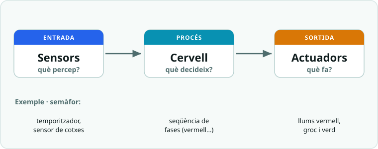

# SA1 · Qüestionari de conceptes (què és un robot i la placa Arduino UNO)

> **Ús.** Comprovació breu dels conceptes clau de la SA1: robot, sistema embegut,
> model entrada-procés-sortida, anatomia de la placa Arduino UNO i mètode de projecte.
> Es pot fer servir com a **repàs formatiu** o com a **prova curta qualificable**
> (10 preguntes × 1 punt = **nota 0-10**). Durada orientativa: **15-20 min**, individual.

**Nom:** ______________________  **Grup:** __________  **Data:** __________

---

## Preguntes (tria una resposta)

1. Què distingeix un **robot** d'una màquina qualsevol (per exemple, un martell)?
   - a) **Que percep l'entorn, decideix i hi actua** (té sensors, un "cervell" i actuadors).
   - b) Que és més gran i pesa més.
   - c) Que sempre té forma humana.
   - d) Que funciona sense electricitat.

2. En el model **entrada → procés → sortida**, un **sensor** correspon a…
   - a) La sortida (la placa actua).
   - b) El procés (la placa decideix).
   - c) **L'entrada** (la placa percep l'entorn).
   - d) L'alimentació de la placa.

3. Un **sistema embegut** és…
   - a) Un ordinador de sobretaula amb pantalla i teclat.
   - b) Un tipus de bateria recarregable.
   - c) Un programa que només funciona a internet.
   - d) **Un petit ordinador integrat dins un aparell per controlar-lo** (rentadora, dron, semàfor).

4. Quin d'aquests elements és un **actuador** (sortida)?
   - a) Un sensor de temperatura.
   - b) **Un motor que fa girar una roda.**
   - c) Un botó polsador.
   - d) Un sensor de llum.

5. Dins la placa Arduino UNO, quina part fa de **"cervell"** i executa el programa (el procés)?
   - a) **El microcontrolador (`ATmega328P`).**
   - b) El connector USB.
   - c) La resistència.
   - d) El LED intern.

6. Quina és la diferència entre un senyal **digital** i un d'**analògic**?
   - a) El digital és més car que l'analògic.
   - b) L'analògic només val per als motors.
   - c) **El digital té dos estats (0 o 5 V, com un interruptor); l'analògic pren molts valors intermedis.**
   - d) No hi ha cap diferència.

7. Els pins marcats **`A0`–`A5`** de la placa Arduino UNO serveixen per a…
   - a) Alimentar la placa amb 5 V.
   - b) **Llegir entrades analògiques** (valors continus, com un sensor de llum).
   - c) Connectar la placa a internet.
   - d) Pujar el programa des de l'ordinador.

8. En un pin digital, el símbol **`~`** (titlla) al costat del número indica que aquell pin…
   - a) Està espatllat.
   - b) És una entrada analògica.
   - c) És el pin de terra (GND).
   - d) **Pot fer `PWM`** (graduar la sortida, com la brillantor d'un LED).

9. Què representa el pin **`GND`** de la placa?
   - a) L'entrada de dades des de l'ordinador.
   - b) Un pin que dona 12 V.
   - c) **La referència de 0 V** (el retorn del corrent del circuit).
   - d) El microcontrolador.

10. El **mètode de projecte** que farem servir tot el curs segueix aquest ordre de fases:
    - a) Provar → millorar → analitzar → dissenyar → prototipar.
    - b) **Analitzar → dissenyar → prototipar → provar → millorar.**
    - c) Prototipar → analitzar → provar → dissenyar → millorar.
    - d) Dissenyar → provar → analitzar → millorar → prototipar.

---

## Pregunta oberta (opcional)

11. Tria un aparell que tinguis a casa (rentadora, robot aspirador, ascensor, caixer…) i
    analitza'l amb el model **entrada → procés → sortida**: digues quin **sensor** (entrada)
    fa servir, què **decideix** (procés) i quin **actuador** (sortida) mou.

___________________________________________________________________

___________________________________________________________________

---

## Clau de correcció (ús del professorat)

| Pregunta | 1 | 2 | 3 | 4 | 5 | 6 | 7 | 8 | 9 | 10 |
|---|---|---|---|---|---|---|---|---|---|---|
| **Resposta** | a | c | d | b | a | c | b | d | c | b |

> **Barem orientatiu:** 10 preguntes × 1 punt = 10. La pregunta 11 pot pujar nota
> (aplicació) o quedar fora del còmput.

---

## Versió Google Forms (llesta per copiar)

> Crea un formulari nou a **Google Forms**, activa **"Convertir en qüestionari"** i marca
> la resposta correcta de cada pregunta. Assigna **1 punt** a les preguntes 1-10.

**Títol:** `SA1 · Conceptes — Què és un robot i la placa Arduino UNO`
**Descripció:** `Comprovació dels conceptes clau de la SA1: robot, sistema embegut, entrada-procés-sortida, anatomia de la placa i mètode de projecte.`

**Camps inicials**
- Nom i cognoms — *Resposta curta* (obligatori).
- Grup/classe — *Resposta curta*.

**Preguntes 1-10** (tipus: *Opció múltiple*; **1 punt** cadascuna; correcta en **negreta**)
1. Què distingeix un robot d'una màquina? → **Percep, decideix i actua** / Més gran / Forma humana / Sense electricitat.
2. Un sensor, en el model E-P-S → Sortida / Procés / **Entrada** / Alimentació.
3. Un sistema embegut és… → Ordinador de sobretaula / Bateria / Programa d'internet / **Petit ordinador integrat dins un aparell**.
4. Quin és un actuador? → Sensor de temperatura / **Motor que fa girar una roda** / Botó polsador / Sensor de llum.
5. El "cervell" de la placa → **Microcontrolador `ATmega328P`** / Connector USB / Resistència / LED intern.
6. Digital vs analògic → Més car / Analògic només motors / **Digital = dos estats; analògic = molts valors** / Cap diferència.
7. Els pins `A0`–`A5` serveixen per… → Alimentar 5 V / **Llegir entrades analògiques** / Internet / Pujar el programa.
8. El símbol `~` en un pin digital → Espatllat / Entrada analògica / Pin de terra / **Pot fer `PWM`**.
9. El pin `GND` és… → Entrada de dades / Dona 12 V / **Referència de 0 V** / El microcontrolador.
10. Ordre del mètode de projecte → Provar-millorar-analitzar… / **Analitzar → dissenyar → prototipar → provar → millorar** / Prototipar primer / Dissenyar-provar primer.

**Pregunta 11** (tipus: *Paràgraf*; sense puntuació) — analitzar un aparell de casa amb el model entrada-procés-sortida.

> **Recollida:** Respostes → full de càlcul vinculat, amb la nota de l'1 al 10 autocalculada.

---

*Qüestionari de conceptes de la SA1. Es recolza en `SA1_fitxa_alumnat.md`, `SA1_esquemes_connexions.md`
i el vocabulari de `../SA0/SA0_vocabulari_essencial.md`. Llicència CC BY-SA 4.0.*
