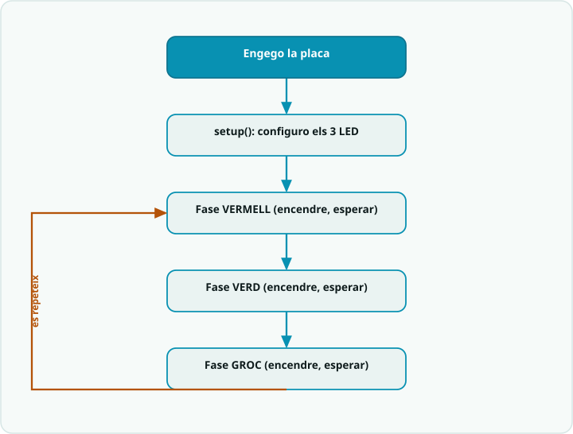

# SA2 · Diagrama de flux — Llum que respira amb PWM (bucle *fade*)

> **Per a qui és?** Alumnat. És el programa del *fade* de l'**Activitat 3 · PWM (S3)**, però **dibuixat**. Mira'l **abans de programar** aquella activitat; després l'exemple resolt i el codi. A les sessions 1 i 2 encara no et cal: segueix l'itinerari de la portada.

## El flux

## Llegenda
- Caixa **fosca** = **inici**.
- Caixa **teal** `[ ... ]` = una **acció** (una instrucció o bloc de codi).
- **Rombe ambre** `< ... ? >` = una **decisió** (`if`): en surt una branca per cada cas.
- **Fletxa ambre** = **bucle**: torna enrere i es repeteix.

## Del diagrama al codi
- Cada caixa **PUJA / BAIXA** és un bucle `for`: `for (int v = 0; v <= 255; v += PAS)` i `for (int v = 255; v >= 0; v -= PAS)`.
- La decisió `< v <= 255 ? >` és la **condició** del `for`: mentre és SÍ, repeteix; quan és NO, surt.
- L'acció `[ analogWrite(LED, v); delay(ESPERA); ]` gradua la **intensitat** (0–255) i espera entre passos perquè es vegi suau.
- Un **semàfor** és el mateix esquelet però amb accions `[ digitalWrite(PIN, HIGH); delay(...) ]` en seqüència (vermell → verd → groc), sense el bucle `for`.
