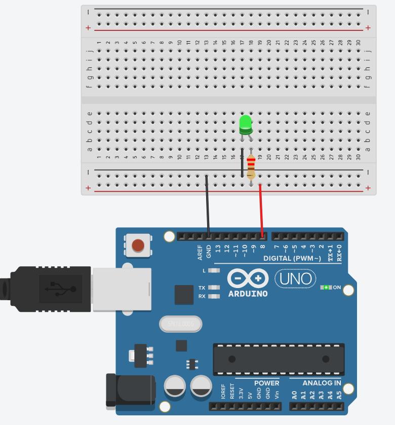
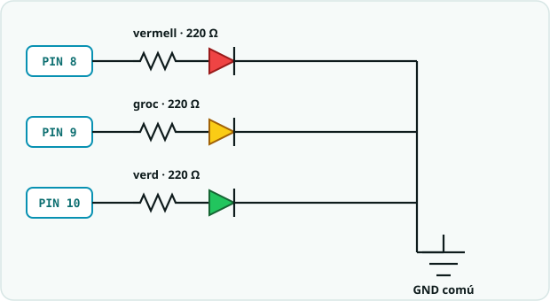
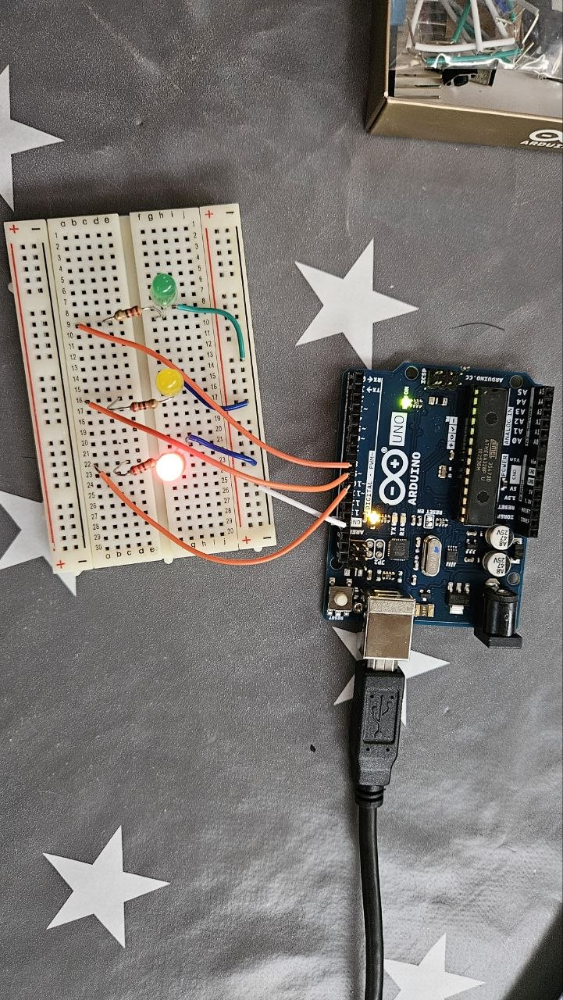
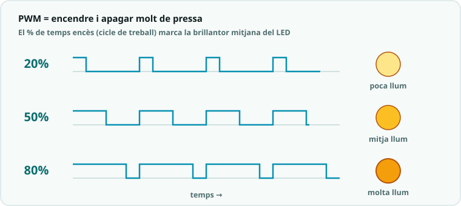
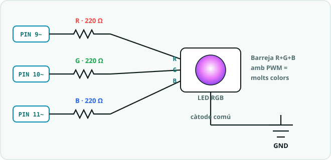

# SA2 · Esquemes i connexions

> 🧑‍🎓 **Quan toca?** Tingues aquesta pàgina oberta **mentre muntes** cada circuit. Correspondència amb la fitxa: **§1** → Activitat 1 (S1) · **§2** → Activitat 2 (S2) · **§3–§4** → Activitat 3 (S3) · **§5** → Activitat 4, el producte (S4).

> Reproduïbles a **Tinkercad Circuits** o **Wokwi**. Tots els LED porten **resistència de 220 Ω** en sèrie; el càtode (pota curta) va a **GND**.

---

## 1. LED bàsic (`01_led_basic.ino`)

| Pin | Component | Via | Cap a |
|---|---|---|---|
| 8 | LED | 220 Ω | GND |

> Mateix circuit d'un LED que a la SA1 (pin → 220 Ω → ànode; càtode → GND), i **exactament al pin 8** com aquí.
> ▶ Pots obrir-lo fet a **Tinkercad** (*Copy and Tinker* per modificar-lo): <https://www.tinkercad.com/things/frRjKG3t65m-sa1blinkinternledopciob?sharecode=GAxNpImV4w6b7voAyfgleBhy6jWHl5doUDeHF35HlTc>

---

## 2. Semàfor (`02_semafor.ino`)

| Pin | Component | Via | Cap a |
|---|---|---|---|
| 8 | LED vermell | 220 Ω | GND |
| 9 | LED groc | 220 Ω | GND |
| 10 | LED verd | 220 Ω | GND |

**El mateix circuit, muntat a la protoboard:**

**Al simulador i amb components reals:**

▶ **Obre la simulació a Tinkercad** (pots fer *Copy and Tinker* per modificar-la): <https://www.tinkercad.com/things/aYZvUenzQ6c-sa2-semafor?sharecode=RK48gLo9I5cgj1lBzIenLJUhcTMZFcBzePUGJtUvltU>

> Fixa-t'hi: al muntatge real els colors dels cables no importen (aquí taronja i blanc), però **el camí elèctric és idèntic** al del diagrama: pin digital → resistència → ànode del LED → càtode → GND.

---

## 3. Fade PWM (`03_fade_pwm.ino`)

Cal un pin amb `~` (PWM). El **PWM** encén i apaga la sortida molt de pressa: el **percentatge de temps encès** (cicle de treball) marca la brillantor mitjana.

| Pin | Component | Via | Cap a |
|---|---|---|---|
| 9 ~ | LED | 220 Ω | GND |

> Circuit igual que un LED bàsic, però el pin **ha de tenir `~`** (3, 5, 6, 9, 10, 11) per fer `analogWrite`.

**Al simulador:**

▶ **Obre la simulació a Tinkercad** (pots fer *Copy and Tinker* per modificar-la): <https://www.tinkercad.com/things/c4frTqo45MQ-sa2-fade-pwm?sharecode=uEsFwkit-32KF6Z7yrBhDhUSFmkHnfpc53kKWrXdrfc>

---

## 4. LED RGB — càtode comú (`04_rgb.ino`)

| Pin (PWM) | Canal | Via | Cap a |
|---|---|---|---|
| 9 | Vermell (R) | 220 Ω | càtode comú |
| 10 | Verd (G) | 220 Ω | càtode comú |
| 11 | Blau (B) | 220 Ω | càtode comú |

> Si el teu LED RGB és d'**ànode comú**, el comú va a **5 V** i els valors PWM s'inverteixen (255 = apagat).

**Com es munta — variant A, el mòdul del kit (Keyestudio KS0312):**

El que tens al **Kit 3** és un **mòdul** amb els pins ja etiquetats: no cal protoboard. Quatre cables dupont directes:

| Pin del mòdul | Cap a l'Arduino |
|---|---|
| R | ~9 |
| G | ~10 |
| B | ~11 |
| − (o GND) | GND |

> El mòdul ja porta l'electrònica de suport a la placa; si tens dubtes de si porta resistències incorporades, afegir-hi les 220 Ω en sèrie **no fa cap mal** (només una mica menys de brillantor).

**Com es munta — variant B, LED RGB discret de 4 potes (el de Tinkercad):**

El camí elèctric és el mateix del semàfor, però **tres vegades dins d'un sol component**: cada canal fa pin PWM → 220 Ω → pota del seu color, i tots tres comparteixen el **càtode comú** (la **pota més llarga**), que va al carril de massa i torna a GND. Les quatre potes van a **quatre columnes diferents** de la protoboard; l'ordre habitual és **R · càtode · G · B**, amb el càtode com a segona pota des del costat pla.

**Al simulador:**

▶ **Obre la simulació a Tinkercad** (pots fer *Copy and Tinker* per modificar-la): <https://www.tinkercad.com/things/9LwYhmKU7cE-sa2-led-rgb?sharecode=t-A5r44qV1flQMonUG_rtQFte36syN3U8sCEPQt7ruo>

---

## 5. Panell de senyalització (`05_panell_senyalitzacio.ino`)

| Pin | Component | Via | Cap a |
|---|---|---|---|
| 9 / 10 / 11 | LED RGB (R/G/B) | 220 Ω c/u | càtode comú a GND |
| 6 | Brunzidor piezo (+) | — | (−) a GND |
| 7 | Mòdul relé (IN) | — | VCC=5 V, GND=GND del mòdul |

> Combina el LED RGB (apartat 4) amb un brunzidor piezo al pin 6 i un mòdul relé al pin 7.
> ⚠️ El relé permet controlar càrregues; a l'aula es connecta a **baixa tensió** (LED de 5 V, petit motor). **No** connectar 230 V.

**Al simulador:**

▶ **Obre la simulació a Tinkercad** (pots fer *Copy and Tinker* per modificar-la): <https://www.tinkercad.com/things/3eQhVzZTaCk-sa2-panell-de-senyalitzacio?sharecode=mfYAeNXK_DMBMN2YTYYJx3SthfZXTAW_xf2isvFoPWg>

---

## Simulació interactiva (Wokwi)

El circuit del **semàfor** (apartat 2) es pot **simular en viu**:

- ▶ **Simulació interactiva:** <https://wokwi.com/projects/468009961823220737>
- **Projecte al repositori:** [`Simulacions/Wokwi/SA2_semafor/`](../../Simulacions/Wokwi/SA2_semafor/) (`diagram.json` + `sketch.ino`), per editar-lo o tornar-lo a carregar.

> Obre l'enllaç i prem **▶**: veuràs el semàfor funcionant (verd → groc → vermell).
