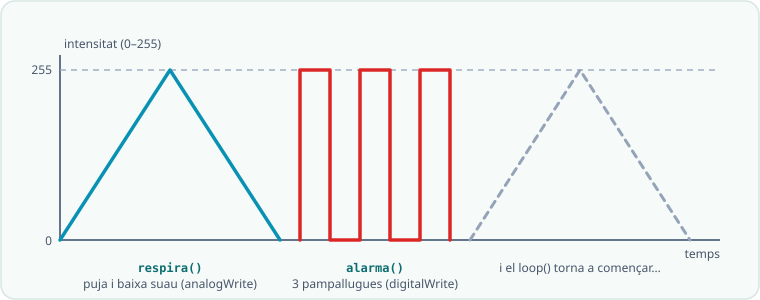
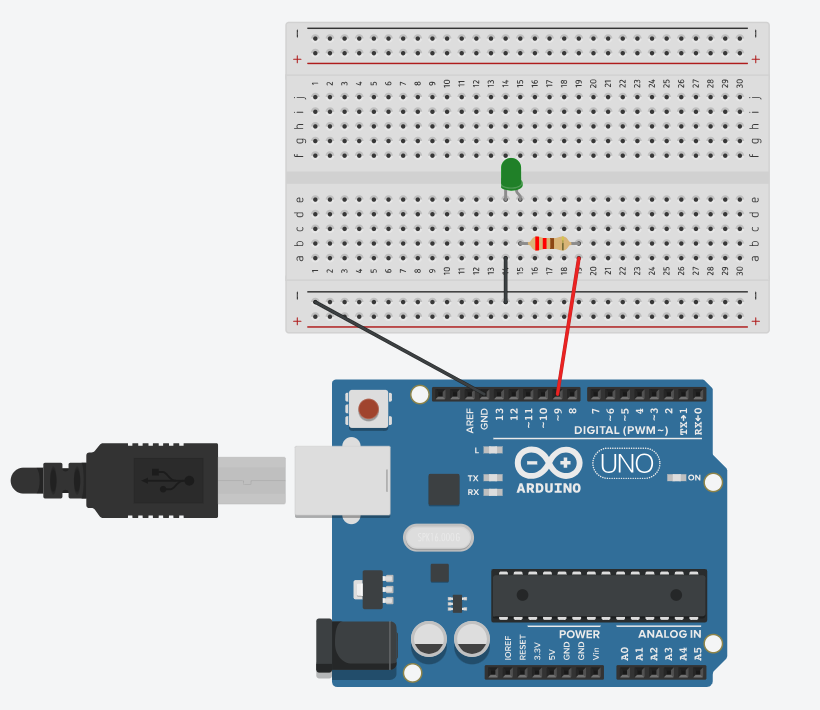

# SA2 · Exemple resolt (model «jo ho faig») — Llum de posició que respira

> 🧑‍🎓 **Quan toca mirar-lo?** Després del teu **primer intent** amb el *fade* de l'**Activitat 3 (S3)** — mai abans. És un problema **anàleg** per veure *com es pensa*, no la solució del panell de la S4.

> 🔗 **D'on ve i on va.** Aquest exemple és el **bessó comentat** de la pràctica [El fade: graduar la intensitat amb PWM](codi/03_fade_pwm/EXPLICACIO.md): la mateixa idea (graduar la intensitat amb `for` + `analogWrite`) amb un context expressament diferent — un llum de posició amb mode alarma en lloc del *fade* — perquè vegis **com es pensa**, no per copiar-lo. Quan l'hagis entès, torna a la pàgina de la pràctica i fes-la teva.

> 🗺️ **Com es llegeix per apartats:** **🔑 El repte model** primer, per situar-te · **🧭 Com ho penso** abans d'escriure el **teu** codi (és l'apartat més important: el raonament) · **💡 La solució anotada** només **després del teu intent**, per comparar · **🔬 Provo i mesuro** quan provis el teu: copia'n el **mètode**, no el resultat · **⚠️ Contraexemple** quan una cosa no rutlli — i com a repàs abans d'entregar · **📔 Diari de bord** quan escriguis la teva entrada del quadern.

> **Nota docent:** mostra'l **després del primer intent** amb `03_fade_pwm.ino`, mai abans.
> No és la solució del panell (S4): és un problema **anàleg** resolt pas a pas perquè
> l'alumnat vegi *com es pensa*, no què s'ha de copiar. Comenta en veu alta el pas «🧭 Com ho
> penso» (predicció abans de codi, PRIMM) i el «⚠️ Contraexemple».

---



## 🔑 El repte model

> Fer una **llum de posició** (un LED blanc/vermell) que **respiri suaument** (s'encén i
> s'apaga de mica en mica, com un far en repòs) i que, en mode **alarma**, faci **3 pampallugues
> ràpides** i torni a respirar.

Fa servir només conceptes de la SA2: `const`, `for`, `digitalWrite`/`analogWrite` (PWM), `delay`.
El circuit és el mateix que el *fade*: **Pin 9 (`~`) → [220 Ω] → LED(+) → LED(−) → GND**.



▶ **Obre la simulació a Tinkercad** (pots fer *Copy and Tinker* per modificar-la): <https://www.tinkercad.com/things/c4frTqo45MQ-sa2-fade-pwm?sharecode=uEsFwkit-32KF6Z7yrBhDhUSFmkHnfpc53kKWrXdrfc>

---

## 🧭 Com ho penso (abans d'escriure codi)

1. **Analitzo:** hi ha **dos comportaments** (respirar / alarma). Respirar = pujar i baixar la
   intensitat → això ja ho sé fer amb un `for` i `analogWrite` (0→255→0). Pampallugues =
   encendre/apagar del tot → `digitalWrite` dins d'un `for` que repeteixi 3 cops.
2. **Descomponc:** faré **una funció per comportament** (`respira()`, `alarma()`), com al panell.
   Així el `loop()` queda net i puc reutilitzar-les.
3. **🔮 PREDIU (fes-ho tu abans de llegir el codi):** amb `analogWrite(LED, 128)`, el LED es
   veurà… ☐ apagat ☐ **a mitja intensitat** ☐ a màxima. I `analogWrite(LED, 255)` equival a…
   `digitalWrite(LED, ____)`.

---

## 💡 La solució anotada

```cpp
/*
  SA2 - exemple_llum_posicio.ino  (EXEMPLE MODEL, no es el producte)
  Llum que "respira" amb PWM i que en alarma fa 3 pampallugues rapides.
  Circuit: Pin 9 (~PWM) -> [220 ohm] -> LED(+) ; LED(-) -> GND
*/

const int LED = 9;        // ha de ser un pin PWM (~): 3, 5, 6, 9, 10, 11
const int PAS = 5;        // com mes gran, mes rapida la respiracio
const int ESPERA = 12;    // ms entre passos: regula la suavitat

void respira() {
  // Puja: com que fem servir analogWrite, controlem la INTENSITAT (0-255)
  for (int v = 0; v <= 255; v += PAS) {
    analogWrite(LED, v);
    delay(ESPERA);
  }
  // Baixa fins a apagar-se del tot
  for (int v = 255; v >= 0; v -= PAS) {
    analogWrite(LED, v);
    delay(ESPERA);
  }
}

void alarma() {
  // Pampallugues: aqui NO cal PWM, encendre/apagar del tot es digitalWrite
  for (int i = 0; i < 3; i++) {   // repeteix 3 cops
    digitalWrite(LED, HIGH);
    delay(120);
    digitalWrite(LED, LOW);
    delay(120);
  }
}

void setup() {
  pinMode(LED, OUTPUT);
}

void loop() {
  respira();   // comportament normal
  alarma();    // despres, avis
}
```

**Per què està escrit així (🌟):**
- **Constants amb nom** (`PAS`, `ESPERA`) en lloc de números solts: canvio la velocitat en **un sol lloc**.
- **Una funció per comportament**: el `loop()` es llegeix com una frase (`respira()` i després `alarma()`).
- Faig servir `analogWrite` **només** on cal graduar (respirar) i `digitalWrite` per encendre/apagar del tot (pampallugues): trio l'eina segons el que necessito.

<details markdown="1"><summary>🧒 Explica-m'ho com si tingués 5 anys</summary>

Imagina que el LED és una **llumeta que dorm i somia**. 🌙

**Les tres notes a la nevera** (les constants de dalt). Abans de començar, deixem tres notes apuntades perquè no se'ns oblidin:

- **On viu la llumeta?** A la porta número 9. És una porta màgica (té una titlla `~`) que sap fer llum forta, fluixeta i mitjana. Les portes normals només saben encendre i apagar del tot.
- **Com de gran és cada passet?** 5. Passets petits = respira a poc a poc; passets grans = respira de pressa.
- **Quanta estona ens quedem a cada passet?** 12 «momentets» (mil·lisegons). És com comptar «un…» abans de fer el passet següent.

**`respira()` — la llumeta agafa aire.** 😮‍💨 El primer bucle fa pujar la llum passet a passet, del 0 (adormida del tot) fins al 255 (ben desperta i brillant). Com quan infles un globus: buf, buf, buf… cada `analogWrite` és una mica més d'aire, i el `delay` és esperar un momentet entre buf i buf. El segon bucle fa el mateix però al revés: desinfla el globus a poc a poc fins que la llum s'apaga del tot. Pujar + baixar = **una respiració sencera**, com quan dorms: agafes aire… el deixes anar…

**`alarma()` — la llumeta s'espanta!** 🚨 Aquí no cal fer-ho suau: la llumeta fa **3 picades d'ullet ben ràpides**. Encesa del tot! Apagada! Encesa! Apagada! Encesa! Apagada! El `for` amb `i < 3` és qui compta: «una, dues i tres — prou». I com que és tot-o-res, fem servir `digitalWrite` (l'interruptor normal), no cal la porta màgica.

**`setup()` — preparar-se.** Només passa una vegada, en endollar: diem a l'Arduino «la porta 9 és per **treure** llum» (`OUTPUT`), no per escoltar.

**`loop()` — el conte que no s'acaba mai.** L'Arduino és molt obedient però una mica tossut: fa la llista i torna a començar, per sempre: respira tranquil·la… 😴 s'espanta i fa 3 pampallugues! 😱 i torna a començar. Així fins que el desendolles.

**El truc de màgia de debò** (per si preguntes «com fa la mitja llum?»): la porta 9 en realitat només sap encendre i apagar — però ho fa **tan i tan de pressa** (centenars de cops per segon) que els teus ulls es deixen enganyar. Si està encesa la meitat del temps, tu veus mitja llum. Com quan mous la mà molt ràpid i sembla que hi hagi boira: això és el **PWM**.

</details>

---

## 🔬 Provo i mesuro

- **Predicció ✔:** `analogWrite(LED, 255)` fa el mateix que `digitalWrite(LED, HIGH)` (màxima intensitat).
- **Racó de mesura (multímetre):** amb el LED a mitja intensitat (`128`), la tensió mitjana al LED
  és **menor** que a plena intensitat — el PWM encén i apaga molt de pressa i l'ull ho veu com a «mig encès».
- Si la respiració va massa ràpida → apujo `ESPERA`; si vull que respiri més de pressa → apujo `PAS`.

---

## ⚠️ Contraexemple (errors típics i com es detecten)

- **Poso el LED al pin 8** (sense `~`) i faig `analogWrite` → el LED **no gradua**: es veu encès o apagat de cop. *Causa:* el pin 8 no té PWM. **Solució:** pin 3, 5, 6, 9, 10 o 11.
- **Oblido la resistència de 220 Ω** → el LED llueix molt fort un moment i **es crema** (o forço la placa). Sempre resistència en sèrie.
- **Escric `analogWrite(LED, 300)`** → el valor màxim és **255**; per sobre no fa res de nou (satura). El rang del PWM és **0–255**, no 0–1023 (això és `analogRead`).
- **Poso el LED al revés** (càtode al `~`) → no s'encén. Revisa la **polaritat** (pota llarga = +).

---

## 📔 Diari de bord (entrada model, 1a persona)

> **Sessió 3:** He fet una llum que respira amb **PWM** (`analogWrite`, 0–255) i que en alarma
> parpelleja amb `digitalWrite`. Al principi el LED no graduava: l'havia posat al **pin 8, que no
> és `~`**. En canviar-lo al pin 9 ja va anar. He entès que **`analogWrite` regula la intensitat i
> `digitalWrite` només encén o apaga**. He separat el codi en dues funcions per tenir-lo net.
> **Evidència:** foto del muntatge + vídeo curt de la respiració.

**Per què és una bona entrada:** usa el **vocabulari clau** (PWM, intensitat, pin `~`), explica *el com*,
i és **honesta amb la dificultat** (el pin 8) i com es va resoldre.

---

*Exemple resolt de la SA2. Model de treball per a l'alumnat (alliberament gradual: es mostra
després del primer intent). Es recolza en `codi/03_fade_pwm` i `codi/05_panell_senyalitzacio`.
Llicència CC BY-SA 4.0.*
