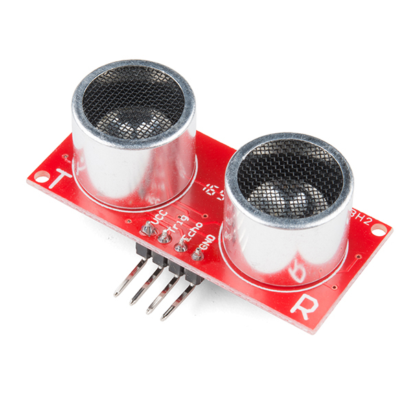

# SA3 · Entrades i sensors: el robot percep

Tercera situació d'aprenentatge (**8 h · 4 sessions**, 1r trimestre). El sistema comença a **percebre l'entorn**: entrades digitals (polsador amb *pull-up* i antirebot), entrades analògiques (potenciòmetre, LDR), sensor d'ultrasons i **funcions** pròpies, amb depuració pel monitor/traçador sèrie. Maquinari: Arduino UNO + Keyestudio. Programació oficial: [`Programació didàctica/12_SA3_Entrades_sensors.md`](../../Programació%20didàctica/12_SA3_Entrades_sensors.md).

> *Fotografia: HC-SR04, per [SparkFun Electronics](https://commons.wikimedia.org/wiki/File:SparkFun_HC-SR04_Ultrasonic-Sensor_13959-01a.jpg) — llicència [CC BY 2.0](https://creativecommons.org/licenses/by/2.0/).*

## 📦 Què has d'entregar

| Quan | Lliurable | On es lliura |
|---|---|---|
| S1 | [Activitat 1 · Polsador i monitor sèrie](SA3_fitxa_alumnat.md#1-polsador-i-monitor-serie-s1) | [Tasca de Classroom](https://classroom.google.com/c/ODY4ODU4Njk0NTEy/a/ODcwNTE4MDEwMzM3/details) |
| S2 | [Activitat 2 · Entrades analògiques](SA3_fitxa_alumnat.md#2-entrades-analogiques-s2) | Mateixa tasca de Classroom |
| S3 | [Activitat 3 · Ultrasons, funcions i producte: alarma/aparcament](SA3_fitxa_alumnat.md#3-ultrasons-funcions-i-producte-alarma--aparcament-s3) | Mateixa tasca de Classroom |
| S4 | **Prova pràctica T1 (individual)** | A l'aula, sessió sencera |
| ⭐ | [Repte triat (A, B o C)](../../Reptes/Reptes_SA3.md) | El docent el valida i pinteu l'estrella al [tauler de reptes](../00_General/00_Tauler_reptes.md) |
| 📓 | Full del quadern tècnic de cada sessió | En paper, en acabar la sessió |
| 🤖 | La mascota muntada amb ≥3 reaccions (el producte de la SA, es tanca a la S3) | Es presenta amb la resta del producte: [dossier de la mascota](../00_General/00_Projecte_T1_Mascota.md) |

## Itinerari per sessions

> La teva feina és a la **[fitxa base](SA3_fitxa_alumnat.md)**. Aquesta ruta et diu què toca fer a cada sessió i què necessites en aquell moment. Les respostes de la fitxa es lliuren a la **[tasca de Classroom](https://classroom.google.com/c/ODY4ODU4Njk0NTEy/a/ODcwNTE4MDEwMzM3/details)**.

1. **Sessió 1 · Entrades digitals i monitor sèrie** — fes l'[Activitat 1 de la fitxa](SA3_fitxa_alumnat.md#1-polsador-i-monitor-serie-s1).
2. **Sessió 2 · Entrades analògiques** — fes l'[Activitat 2](SA3_fitxa_alumnat.md#2-entrades-analogiques-s2), amb el [diagrama de flux de la decisió per llindar](SA3_diagrama_flux.md).
3. **Sessió 3 · Funcions + Producte: alarma/aparcament** — fes l'[Activitat 3](SA3_fitxa_alumnat.md#3-ultrasons-funcions-i-producte-alarma--aparcament-s3), amb els [esquemes de connexió](SA3_esquemes_connexions.md) i el [codi](codi/). El producte s'avalua amb R1 (codi) + R2 (circuit) i **es tanca avui**.
4. **Sessió 4 · Prova pràctica T1** — individual, la sessió sencera; pots consultar el teu quadern i els esquemes.
5. **Abans d'entregar** — repassa [el meu checklist](SA3_checklist_alumnat.md).

### Si vols més

- [Fitxa ampliada](SA3_fitxa_ampliada.md) — aprofundiment i ampliacions.
- [Reptes de la SA3](../../Reptes/Reptes_SA3.md) — tria el teu context.

<!-- web:only-github -->
## Contingut

| Fitxer | Descripció |
|---|---|
| [`SA3_guia_docent.md`](SA3_guia_docent.md) | Guia del professorat: objectius, 4 sessions, mètode de projecte, mapa d'avaluació i errors freqüents. |
| [`SA3_fitxa_alumnat.md`](SA3_fitxa_alumnat.md) | **Fitxa base** (nucli d'una cara, per a tot l'alumnat): Activitats 1-4 + quadern. |
| [`SA3_fitxa_ampliada.md`](SA3_fitxa_ampliada.md) | **Versió ampliada** (aprofundiment): totes les rutines (rols, coavaluació, exit ticket, ODS, PC) i ampliacions. |
| [`SA3_checklist_docent.md`](SA3_checklist_docent.md) | **Checklist docent** (una cara): logística prèvia, punts de control per sessió, avaluació i diversitat. |
| [`SA3_checklist_alumnat.md`](SA3_checklist_alumnat.md) | **Checklist alumnat** (una cara): què he de fer/lliurar + autoavaluació amb semàfor. |
| [`SA3_esquemes_connexions.md`](SA3_esquemes_connexions.md) | Esquemes i connexions (polsador, divisor de tensió, ultrasons…). |
| `codi/` | Sketches d'Arduino (vegeu la taula següent). |

### Codi (`codi/`)

| Sketch | Què mostra |
|---|---|
| `01_polsador_debounce.ino` | Entrada digital amb `INPUT_PULLUP` i antirebot; comptador per sèrie. |
| `02_potenciometre_ldr.ino` | Entrades analògiques (`analogRead`), `map()` i llum automàtic. |
| `03_ultrasons_funcio.ino` | Funció `mesuraDistancia()` i Serial Plotter. |
| `04_alarma_aparcament.ino` | Producte: sensor → actuador segons distància. |

Cada sketch té la seva **pàgina de pràctica** a la web (per què es fa + codi explicat per blocs); a GitHub, l'explicació és a l'`EXPLICACIO.md` de la carpeta del sketch.

<!-- /web:only-github -->

## Producte i avaluació

- **Producte:** sistema sensor → actuador (alarma de proximitat o llum automàtic) amb codi modular (funcions). **Es tanca a la S3.**
- **Prova T1:** la S4 sencera, individual (`Avaluació/Prova_practica_T1.md`).
- **Criteris:** CA1.1, CA2.1, CA2.2 · **Rúbriques:** **R1** (codi) i **R2** (circuit); prova amb R1, R2, R4.

## Continuïtat

Ve de la **SA2** (sortides i actuadors) i porta a la **SA4** (moviment): un cop el sistema **percep** (sensors), farem que la percepció **mogui** servos i motors.
