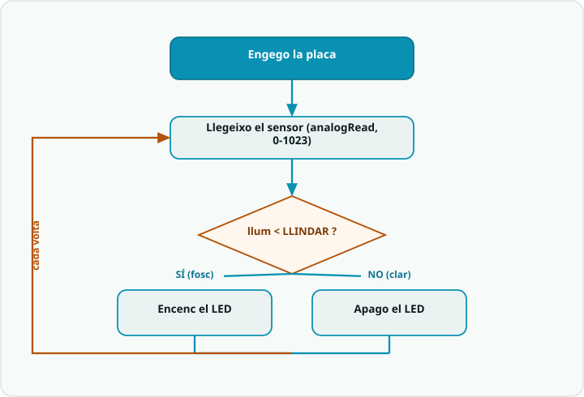

# SA3 · Diagrama de flux — Decisió per llindar (llegir → comparar → actuar)

> **Per a qui és?** Alumnat. És el mateix que fa el programa, però **dibuixat**. Mira'l **abans de programar**; després l'exemple resolt i el codi.

## El flux

## Llegenda
- Caixa **fosca** = **inici**.
- Caixa **teal** `[ ... ]` = una **acció** (una instrucció o bloc de codi).
- **Rombe ambre** `< ... ? >` = una **decisió** (`if`): en surt una branca per cada cas.
- **Fletxa ambre** = **bucle**: torna enrere i es repeteix.

## Del diagrama al codi
- `[ llum = analogRead(LDR) ]` → `int llum = llegeixLlum();` (la funció fa `analogRead`, dona 0..1023).
- `< llum < LLINDAR ? >` → `if (llum < LLINDAR) { ... } else { ... }` — **el cor de la SA**: la decisió per llindar.
- Branca **SÍ** → `digitalWrite(LED, HIGH);` (fosc: encén). Branca **NO** → `digitalWrite(LED, LOW);` (clar: apaga).
- El bucle és el `loop()`: llegeix → mostra → decideix → `delay(100)` → torna a començar.
