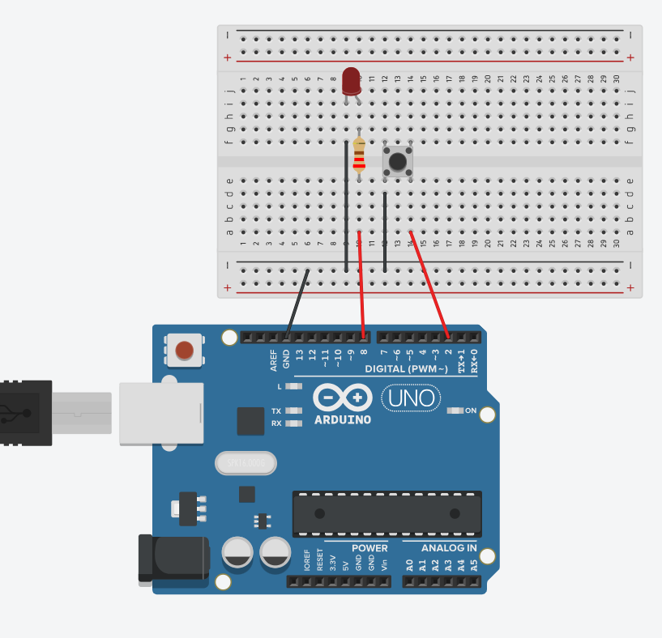
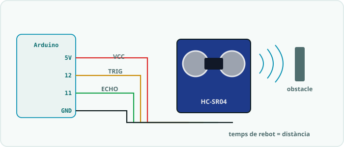

# SA3 · Esquemes i connexions

> 🧑‍🎓 **Quan toca?** Tingues aquesta pàgina oberta **mentre muntes** cada circuit. Correspondència amb la fitxa: **§1** → Activitat 1 (S1) · **§2** → Activitat 2 (S2) · **§3–§4** → Activitat 3 i el producte (S3).

> Reproduïbles a **Tinkercad** o **Wokwi**.

---

## 1. Polsador amb pull-up intern (`01_polsador_debounce.ino`)

| Pin | Component | Cap a | Notes |
|---|---|---|---|
| 2 | Polsador (pota A) | — | configurat `INPUT_PULLUP` |
| GND | Polsador (pota B) | — | |
| 8 | LED (opcional) | 220 Ω → GND | feedback |

> Amb `INPUT_PULLUP` no cal resistència externa: el pin està a **HIGH** en repòs i passa a **LOW** en prémer. El LED de feedback (pin 8) és un LED bàsic com el de la SA1.

▶ **Obre la simulació a Tinkercad** (pots fer *Copy and Tinker* per modificar-la): <https://www.tinkercad.com/things/2RzxM2OPQiw-sa3-el-polsador-inputpullup-i-antirebot?sharecode=L4a37gBBrMnhaVjzk_PbVFSgNMSZDXq0M9WjclVEmUM>

---

## 2. Potenciòmetre + LDR (`02_potenciometre_ldr.ino`)

**Potenciòmetre** (3 potes):
| Pota | Cap a |
|---|---|
| Extrem 1 | 5 V |
| Extrem 2 | GND |
| Central (cursor) | A0 |

**LDR** (divisor de tensió amb 10 kΩ):

**Sortida:** LED bàsic al pin **9~** (com el de la SA1) per regular-ne la intensitat amb PWM.

---

## 3. Sensor d'ultrasons HC-SR04 (`03_ultrasons_funcio.ino`)

> *Fotografia: HC-SR04, per [SparkFun Electronics](https://commons.wikimedia.org/wiki/File:SparkFun_HC-SR04_Ultrasonic-Sensor_13959-01a.jpg) — llicència [CC BY 2.0](https://creativecommons.org/licenses/by/2.0/).*

| Pin sensor | Pin Arduino |
|---|---|
| VCC | 5 V |
| GND | GND |
| TRIG | 12 (sortida) |
| ECHO | 11 (entrada) |

---

## 4. Alarma / aparcament (`04_alarma_aparcament.ino`)

| Pin | Component | Via | Cap a |
|---|---|---|---|
| 12 / 11 | HC-SR04 TRIG / ECHO | — | (VCC=5V, GND=GND) |
| 8 | LED indicador | 220 Ω | GND |
| 6 | Brunzidor piezo (+) | — | (−) a GND |

> Combina el sensor d'ultrasons (apartat 3) amb un LED (pin 8) i un brunzidor piezo (pin 6) com a sortides.
> El codi tracta la lectura **0** (sense eco) com a "molt lluny" (retorna 400) per evitar falses alarmes.

---

## Simulació interactiva (Wokwi)

- ▶ **Simulació (Alarma d'aparcament: HC-SR04 + LED + brunzidor):** <https://wokwi.com/projects/468087916595757057>
- **Projecte al repositori:** [`Simulacions/Wokwi/SA3_alarma_aparcament/`](../../Simulacions/Wokwi/SA3_alarma_aparcament/) (`diagram.json` + `sketch.ino`).

> Obre l'enllaç i prem **▶**. Clica el sensor **HC-SR04** i mou el control de distància: el LED i el brunzidor s'acceleren a mesura que t'hi acostes.
