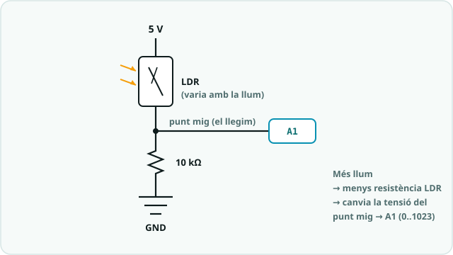

# SA3 · Exemple resolt (model «jo ho faig») — Llum de nit automàtica

> 🧑‍🎓 **Quan toca mirar-lo?** Després del teu **primer intent** amb el potenciòmetre i la LDR de l'**Activitat 2 (S2)** — mai abans. És un problema **anàleg** per veure *com es pensa*, no la solució de l'alarma/aparcament de la S3 (però el **mètode** és el mateix).

> 🔗 **D'on ve i on va.** Aquest exemple és el **bessó comentat** de la pràctica [Entrades analògiques: potenciòmetre i LDR](codi/02_potenciometre_ldr/EXPLICACIO.md): el mateix mètode (llegir → calibrar amb el Monitor → decidir per llindar) amb un muntatge i un context expressament diferents — perquè vegis **com es pensa**, no per copiar-lo. Quan l'hagis entès, torna a la pàgina de la pràctica i fes-la teva.

> 🗺️ **Com es llegeix per apartats:** **🔑 El repte model** primer, per situar-te · **🧭 Com ho penso** abans d'escriure el **teu** codi (és l'apartat més important: el raonament) · **💡 La solució anotada** només **després del teu intent**, per comparar · **🔬 Provo i mesuro** quan provis el teu: copia'n el **mètode**, no el resultat · **⚠️ Contraexemple** quan una cosa no rutlli — i com a repàs abans d'entregar · **📔 Diari de bord** quan escriguis la teva entrada del quadern.

> **Nota docent:** mostra'l **després del primer intent** amb `02_potenciometre_ldr.ino`, mai abans.
> No és la solució del producte (l'alarma/aparcament de la S3): és un problema **anàleg** resolt pas
> a pas perquè l'alumnat vegi *com es pensa* un sistema que **percep i decideix**, no què s'ha de
> copiar. Comenta en veu alta el pas «🧭 Com ho penso» (predicció abans de codi, PRIMM) i el
> «⚠️ Contraexemple». El **mètode** (llegir → calibrar amb el monitor → decidir per llindar →
> encapsular en una funció) és **el mateix** que necessitaran per a l'alarma d'ultrasons.

---



## 🔑 El repte model

> Fer una **llum de nit automàtica**: un LED que **s'encén sol quan es fa fosc** i s'apaga quan
> torna a haver-hi llum. El sistema ha de **llegir la llum ambiental** amb una LDR, **comparar-la
> amb un llindar** i **decidir** si encendre.

Fa servir només conceptes de la SA3: `analogRead` (0–1023), **llindar** amb `if/else`, el
**Monitor sèrie** per calibrar i una **funció pròpia** que retorna un valor. El circuit és el
mateix divisor de la S2: **LDR + 10 kΩ en sèrie entre 5 V i GND, punt mig → A1**; sortida
**LED → [220 Ω] → pin 9 (`~`) → GND**.

---

## 🧭 Com ho penso (abans d'escriure codi)

1. **Analitzo:** el sistema té una **entrada** (quanta llum hi ha → LDR) i una **sortida**
   (LED encès/apagat). No és HIGH/LOW com un polsador: la llum té **molts valors** → és una
   entrada **analògica** → `analogRead`, que em dona un nombre de **0 a 1023**.
2. **Descomponc:** primer he de **saber quin valor dona la LDR** a les fosques i amb llum
   (ho miro al **Monitor sèrie**); després **trio un llindar** entremig; i finalment **decideixo**
   amb un `if`. Encapsularé la lectura en una **funció** `llegeixLlum()` (com faré amb
   `mesuraDistancia()` al producte): així el `loop()` queda net i el codi es llegeix sol.
3. **🔮 PREDIU (fes-ho tu abans de llegir el codi):** al muntatge d'aquesta SA, quan **tapo** la
   LDR (fosc), el valor de `analogRead` … ☐ **baixa** ☐ puja ☐ no canvia. I `analogRead` retorna
   un nombre entre ____ i ____ (no 0–255: això és el `analogWrite`).

---

## 💡 La solució anotada

```cpp
/*
  SA3 - exemple_llum_nit.ino  (EXEMPLE MODEL, no es el producte)
  Llum de nit automatica: encen un LED quan la LDR detecta foscor.
  Metode: llegir analogic -> comparar amb llindar -> decidir.
  Circuit: LDR en divisor amb 10k -> A1 ; LED -> [220 ohm] -> pin 9 (~) -> GND
*/

const int LDR = A1;        // entrada analogica (punt mig del divisor)
const int LED = 9;         // sortida (pin ~ per si despres vull graduar-lo)
const int LLINDAR = 400;   // per SOTA d'aquest valor considerem "fosc"
                           // (ajusta'l mirant el Monitor serie al teu muntatge)

// Funcio propia: llegeix i RETORNA la llum ambiental (0..1023)
int llegeixLlum() {
  return analogRead(LDR);
}

void setup() {
  pinMode(LED, OUTPUT);
  Serial.begin(9600);      // obre Eines > Serial Monitor per calibrar el llindar
}

void loop() {
  int llum = llegeixLlum();   // 0 = molt fosc ... 1023 = molt clar

  // Mostra la lectura per poder triar be el llindar
  Serial.print("Llum: ");
  Serial.println(llum);

  // Decisio per llindar: fa fosc -> encen ; hi ha llum -> apaga
  if (llum < LLINDAR) {
    digitalWrite(LED, HIGH);   // fosc: llum encesa
  } else {
    digitalWrite(LED, LOW);    // clar: llum apagada
  }

  delay(100);
}
```

**Per què està escrit així (🌟):**
- **Constant amb nom** (`LLINDAR`) en lloc d'un número solt: quan calibri, canvio el valor en
  **un sol lloc** i el codi segueix explicant-se.
- **La lectura, en una funció** (`llegeixLlum()`): el `loop()` es llegeix com una frase
  («llegeix la llum, mostra-la, decideix»). És el mateix patró que `mesuraDistancia()` del producte.
- Trio l'eina segons el senyal: la llum és **analògica** → `analogRead` (0–1023); la sortida és
  encendre/apagar del tot → `digitalWrite`. No confonc els dos rangs.
- **`Serial.println`** no és decoració: és la meva **eina de calibratge** (la E d'*Examina* de DEPURA).

---

## 🔬 Provo i mesuro

- **Predicció ✔:** en tapar la LDR, la lectura **baixa** (al divisor d'aquesta SA, menys llum →
  valor més petit); `analogRead` es mou entre **0 i 1023**.
- **Racó de mesura (multímetre):** poso el multímetre al punt mig del divisor. Amb llum,
  la tensió és, p. ex., ~3 V; en tapar la LDR baixa. Comprovo que quadra: `lectura/1023 · 5 V ≈ V`
  (si el programa marca 600 → 600/1023 · 5 ≈ **2,9 V**). L'ADC converteix **tensió en nombre**.
- **Calibro el llindar de veritat:** miro el Monitor amb llum (p. ex. ~650) i a les fosques
  (p. ex. ~180) i poso `LLINDAR` **entremig** (~400). No l'endevino: el **mesuro**.
- **Millora (ampliació):** si el LED **parpelleja** just al llindar (quan la llum queda a la vora),
  afegeixo **histèresi**: encendre per sota de 380 i apagar per sobre de 420, amb dos llindars.
  Així no oscil·la a la frontera.

---

## ⚠️ Contraexemple (errors típics i com es detecten)

- **La LDR mal connectada** (falta la resistència de 10 kΩ o el punt mig no va a A1) → el Monitor
  marca **sempre 0 o sempre 1023** i no canvia en tapar-la. *Causa:* el divisor no està fet.
  **Solució:** LDR i 10 kΩ **en sèrie** entre 5 V i GND, i el **punt mig** a A1.
- **Comparo amb 255** (`if (llum < 255)`) pensant en el rang del PWM → gairebé mai s'encén.
  *Causa:* `analogRead` va de **0 a 1023**, no de 0 a 255 (això és `analogWrite`). Ajusta el llindar a l'escala 0–1023.
- **Oblido `Serial.begin(9600)`** (o el *baud* del Monitor no coincideix) → surten **caràcters
  estranys** o res, i no puc calibrar. Sempre `Serial.begin(9600)` al `setup()` i el mateix 9600 al Monitor.
- **Poso el LED al revés** (càtode al pin 9) o **sense la resistència de 220 Ω** → no s'encén, o
  llueix massa i es força. Revisa **polaritat** (pota llarga = +) i **resistència en sèrie**.

---

## 📔 Diari de bord (entrada model, 1a persona)

> **Sessió 2:** He fet una **llum de nit automàtica** amb una **LDR**. La llum és una entrada
> **analògica**, així que he fet servir `analogRead` (0–1023) i **no** `digitalRead`. Al principi
> el LED estava sempre encès: el meu llindar (255) estava **fora d'escala**, perquè em pensava que
> el rang era 0–255 com el PWM. He obert el **Monitor sèrie**, he vist que amb llum marcava ~650 i
> a les fosques ~180, i he posat el `LLINDAR` a **400** (entremig). He ficat la lectura en una
> **funció** `llegeixLlum()` per tenir el `loop()` net. **Evidència:** captura del Monitor amb les
> dues lectures + vídeo tapant la LDR.

**Per què és una bona entrada:** usa el **vocabulari clau** (analògic, `analogRead`, 0–1023,
llindar, funció), explica *el com* (calibrar amb el Monitor), i és **honesta amb la dificultat**
(el llindar fora d'escala) i com es va resoldre.

---

*Exemple resolt de la SA3. Model de treball per a l'alumnat (alliberament gradual: es mostra
després del primer intent). Es recolza en `codi/02_potenciometre_ldr` i, com a pont cap al
producte, en `codi/03_ultrasons_funcio`. Llicència CC BY-SA 4.0.*
