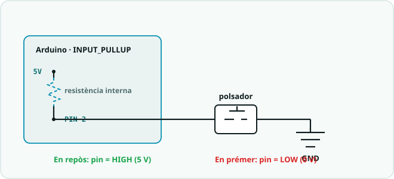

# SA3 · Qüestionari de conceptes (entrades i sensors)

> **Ús.** Comprovació breu dels conceptes d'entrades digitals i analògiques, sensors i
> funcions de la SA3. Es pot fer servir com a **repàs formatiu** o com a **prova curta
> qualificable** (10 preguntes × 1 punt = **nota 0-10**). Durada orientativa: **15-20 min**,
> individual.

> **📲 Fes-lo al Classroom.** Aquest qüestionari és una **tasca
> autocorrectiva** al Google Classroom del curs:
> **[obre «SA3 · Qüestionari de conceptes»](https://classroom.google.com/c/ODY4ODU4Njk0NTEy/a/ODcwNzE4MzAzMDM1/details)**
> (cal el compte del centre). Aquesta pàgina és la versió per repassar
> o fer en paper; les solucions són al full del docent.

**Nom:** ______________________  **Grup:** __________  **Data:** __________

---

## Preguntes (tria una resposta)

1. Per llegir l'estat d'una **entrada digital** (un polsador) s'escriu…
   - a) `digitalRead(PIN);`
   - b) `digitalWrite(PIN, HIGH);`
   - c) `analogWrite(PIN, 255);`
   - d) `pinMode(PIN, OUTPUT);`

2. Per llegir un **sensor analògic** (potenciòmetre, LDR) s'escriu…
   - a) `digitalRead(PIN);`
   - b) `Serial.begin(PIN);`
   - c) `analogRead(PIN);`
   - d) `delay(PIN);`

3. La funció `analogRead()` en un Arduino UNO retorna un valor dins del rang…
   - a) 0 a 255.
   - b) 0 a 100.
   - c) 0 a 5.
   - d) 0 a 1023.

4. Amb `pinMode(2, INPUT_PULLUP);`, quan el polsador **NO** està premut, el pin llegeix…
   - a) `LOW` (en repòs).
   - b) `HIGH` (en repòs).
   - c) Un valor entre 0 i 1023.
   - d) Res, cal esperar a prémer.

5. Quin avantatge té fer servir `INPUT_PULLUP`?
   - a) Estalvia haver de posar una resistència externa al polsador.
   - b) Fa que el LED brilli més.
   - c) Converteix el pin en una sortida PWM.
   - d) Accelera el `loop()`.

6. Per què cal l'**antirebot** (*debounce*) en un polsador?
   - a) Perquè el polsador consumeixi menys corrent.
   - b) Perquè el pin passi a analògic.
   - c) Perquè una sola premuda no es compti diverses vegades (el contacte "rebota").
   - d) No serveix per a res.

7. La LDR es connecta en un **divisor de tensió** amb una resistència de 10 kΩ. Per què?
   - a) Per limitar el corrent i que no es cremi.
   - b) Per convertir la resistència variable de la LDR en una tensió que el pin analògic pot mesurar.
   - c) Per augmentar la brillantor del LED.
   - d) Perquè la LDR necessita 10 kΩ per encendre's.

8. Vols passar una lectura de `analogRead` (0-1023) al rang de `analogWrite` (0-255). Quina funció ho fa?
   - a) `delay()`
   - b) `Serial.begin()`
   - c) `pinMode()`
   - d) `map()`

9. En un sensor d'ultrasons HC-SR04, si intercanvies els pins **TRIG** i **ECHO**…
   - a) El sensor mesura amb més precisió.
   - b) El LED s'encén sol.
   - c) La distància surt sempre 0 o un valor molt gran (no funciona bé).
   - d) No passa res, són intercanviables.

10. Què vol dir que una **funció** com `mesuraDistancia()` **retorna** un valor?
    - a) Que apaga la placa en acabar.
    - b) Que en acabar dona un resultat que el programa pot fer servir (p. ex. la distància en cm).
    - c) Que es repeteix infinitament.
    - d) Que només es pot cridar una vegada.

---

## Pregunta oberta (opcional)

11. Explica (en paraules o amb pseudocodi) com faries un **llum automàtic**: llegir la LDR i,
    segons un **llindar**, encendre o apagar un LED. Indica quines instruccions faries servir:

___________________________________________________________________

___________________________________________________________________

---

*Qüestionari de conceptes de la SA3. Es recolza en el material d'entrades i sensors de la SA3
(`SA3_fitxa_alumnat.md`, `SA3_esquemes_connexions.md`) i en `../SA0/SA0_guia_programacio.md`.
Llicència CC BY-SA 4.0.*
