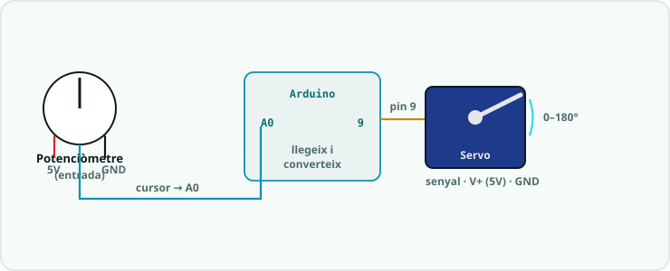

# SA4 · Moviment: servos, motors i ponts H

Quarta situació d'aprenentatge (**8 h · 4 sessions**, 2n trimestre). El sistema **es mou**: control de posició amb **servomotor**, control de velocitat i direcció d'un **motor DC** amb **driver/pont H** i alimentació externa, i integració sensor → moviment. Maquinari: Arduino UNO + servo SG90 + motor DC + L298N. Programació oficial: [`Programació didàctica/13_SA4_Moviment_servos_motors.md`](../../Programació%20didàctica/13_SA4_Moviment_servos_motors.md).

## 📦 Què has d'entregar

| Quan | Lliurable | On es lliura |
|---|---|---|
| S1 | [Activitat 1 · Servomotor](SA4_fitxa_alumnat.md#1-servomotor-s1) | [Tasca de Classroom](https://classroom.google.com/c/ODY4ODU4Njk0NTEy/a/ODcwNTEzNjkxNjIy/details) |
| S2 | [Activitat 2 · Motor DC i pont H](SA4_fitxa_alumnat.md#2-motor-dc-i-pont-h-s2) | Mateixa tasca de Classroom |
| S3 | [Activitat 3 · Del sensor al moviment](SA4_fitxa_alumnat.md#3-del-sensor-al-moviment-s3) | Mateixa tasca de Classroom |
| S4 | [Activitat 4 · Producte: barrera automàtica](SA4_fitxa_alumnat.md#4-producte-barrera-automatica-s4) | Mateixa tasca de Classroom |
| ⭐ | [Repte triat (A, B o C)](../../Reptes/Reptes_SA4.md) | El docent el valida i pinteu l'estrella al [tauler de reptes](../00_General/00_Tauler_reptes.md) |
| 📓 | Full del quadern tècnic de cada sessió | En paper, en acabar la sessió |
| 🤖 | Les articulacions del braç (control de servos amb potenciòmetres) | Es reaprofiten al robot del trimestre: [dossier del braç](../00_General/00_Projecte_T2_Brac.md) |

## Itinerari per sessions

> La teva feina és a la **[fitxa base](SA4_fitxa_alumnat.md)**. Aquesta ruta et diu què toca fer a cada sessió i què necessites en aquell moment. Les respostes de la fitxa es lliuren a la **[tasca de Classroom](https://classroom.google.com/c/ODY4ODU4Njk0NTEy/a/ODcwNTEzNjkxNjIy/details)**.

1. **Sessió 1 · El servomotor** — fes l'[Activitat 1 de la fitxa](SA4_fitxa_alumnat.md#1-servomotor-s1).
2. **Sessió 2 · Motor DC i pont H** — fes l'[Activitat 2](SA4_fitxa_alumnat.md#2-motor-dc-i-pont-h-s2), amb els [esquemes de connexió](SA4_esquemes_connexions.md) (compte amb la massa comuna!).
3. **Sessió 3 · Del sensor al moviment** — fes l'[Activitat 3](SA4_fitxa_alumnat.md#3-del-sensor-al-moviment-s3), amb el [codi](codi/).
4. **Sessió 4 · Producte: barrera automàtica** — fes l'[Activitat 4](SA4_fitxa_alumnat.md#4-producte-barrera-automatica-s4) (s'avalua amb R1, R2, R3 parcial).
5. **Abans d'entregar** — repassa [el meu checklist](SA4_checklist_alumnat.md).

### Si vols més

- [Fitxa ampliada](SA4_fitxa_ampliada.md) — aprofundiment i ampliacions.
- [Reptes de la SA4](../../Reptes/Reptes_SA4.md) — tria el teu context.

<!-- web:only-github -->
## Contingut

| Fitxer | Descripció |
|---|---|
| [`SA4_guia_docent.md`](SA4_guia_docent.md) | Guia del professorat: objectius, 4 sessions, mètode de projecte, mapa d'avaluació i errors freqüents. |
| [`SA4_fitxa_alumnat.md`](SA4_fitxa_alumnat.md) | **Fitxa base** (nucli d'una cara, per a tot l'alumnat): Activitats 1-4 + quadern. |
| [`SA4_fitxa_ampliada.md`](SA4_fitxa_ampliada.md) | **Versió ampliada** (aprofundiment): totes les rutines (rols, coavaluació, exit ticket, ODS, PC) i ampliacions. |
| [`SA4_checklist_docent.md`](SA4_checklist_docent.md) | **Checklist docent** (una cara): logística prèvia, punts de control per sessió, avaluació i diversitat. |
| [`SA4_checklist_alumnat.md`](SA4_checklist_alumnat.md) | **Checklist alumnat** (una cara): què he de fer/lliurar + autoavaluació amb semàfor. |
| [`SA4_esquemes_connexions.md`](SA4_esquemes_connexions.md) | Esquemes i connexions (servo, L298N, massa comuna, alimentació externa). |
| `codi/` | Sketches d'Arduino (vegeu la taula següent). |

### Codi (`codi/`)

| Sketch | Què mostra |
|---|---|
| `01_servo_potenciometre.ino` | Llibreria `Servo.h`; posició 0-180° controlada per potenciòmetre. |
| `02_motor_pont_h.ino` | Motor DC: direcció (`IN1`/`IN2`) i velocitat (PWM a `ENA`). |
| `03_sensor_velocitat.ino` | Ultrasons regula la velocitat del motor (percepció → moviment). |
| `04_barrera_automatica.ino` | Producte: barrera amb servo activada per sensor. |
| [`05_dos_leds_millis/05_dos_leds_millis.ino`](codi/05_dos_leds_millis/05_dos_leds_millis.ino) | **Bastida (opcional, 10')**: dos LEDs a ritmes diferents **sense `delay()`** (patró `millis()`). Prepara la **màquina d'estats de la SA6**. |

<!-- /web:only-github -->

## Producte i avaluació

- **Producte:** mecanisme motoritzat controlat per sensor (barrera, braç o ventilador regulable).
- **Criteris:** CA1.1, CA2.1, CA3.1 · **Rúbriques:** **R1** (codi), **R2** (circuit), **R3** parcial (control).

## Continuïtat

Ve de la **SA3** (sensors) i porta a la **SA5** (micro:bit i MicroPython, **canvi de plataforma i llenguatge**). El control sensor → moviment d'aquí és la llavor del **control** (SA6) i de la **robòtica mòbil** (SA7).

> 🧩 **Pont cap a SA6 (recomanat):** si queda marge, fes la mini-pràctica [`05_dos_leds_millis`](codi/05_dos_leds_millis/05_dos_leds_millis.ino) (10') perquè l'alumnat **practiqui `millis()` no bloquejant abans** de la màquina d'estats de la SA6.
