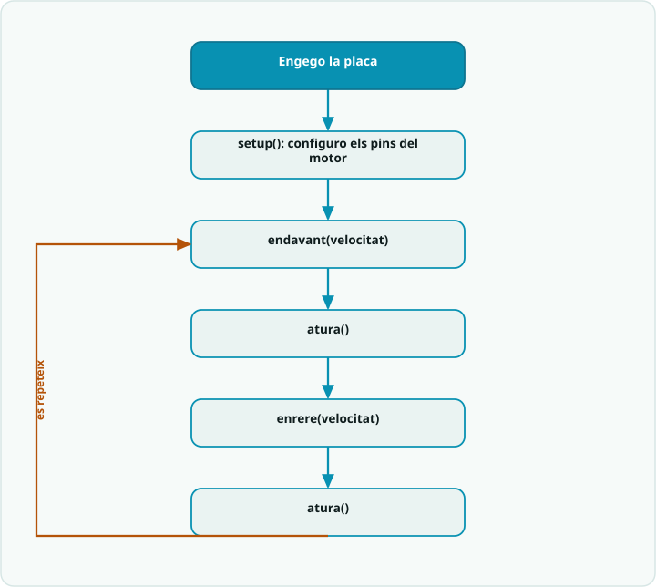

# SA4 · Diagrama de flux — seqüència de moviment amb funcions (una funció per gest)

> **Per a qui és?** Alumnat. Són les **funcions de moviment del pont H** (`endavant`, `enrere`, `atura`) de l'**Activitat 2 (S2)**, però **dibuixades** — la base del producte de la S4. Mira'l **abans de programar** aquella activitat per tenir el pla al cap; després l'exemple resolt i el codi.

## El flux

> **El truc del pont H:** `endavant()` i `enrere()` només es diferencien en **quin pin va a HIGH**. Intercanviar `IN1`/`IN2` inverteix el **sentit**; `analogWrite(ENA, …)` regula la **velocitat**. Tota la màgia del pont H és aquesta.

## Llegenda
- Caixa **fosca** = **inici**.
- Caixa **teal** `[ ... ]` = una **acció** (una instrucció o bloc de codi).
- **Rombe ambre** `< ... ? >` = una **decisió** (`if`): en surt una branca per cada cas.
- **Fletxa ambre** = **bucle**: torna enrere i es repeteix.

## Del diagrama al codi
- **Configurar ENA, IN1, IN2 com a SORTIDA** → `pinMode(ENA, OUTPUT);` `pinMode(IN1, OUTPUT);` `pinMode(IN2, OUTPUT);` dins de `setup()` (només un cop).
- **endavant() / enrere()** → `digitalWrite(IN1, …);` `digitalWrite(IN2, …);` per al **sentit** + `analogWrite(ENA, velocitat);` per a la **velocitat** (PWM, 0–255).
- **atura()** → `IN1=LOW`, `IN2=LOW` i `analogWrite(ENA, 0);` (frena el motor del tot).
- **El retorn NO** és el `loop()`: en acabar, encadena els gestos una altra vegada. Cada **caixa és una funció**, i el `loop()` es llegeix com una frase (**abstracció**: una funció per gest).
