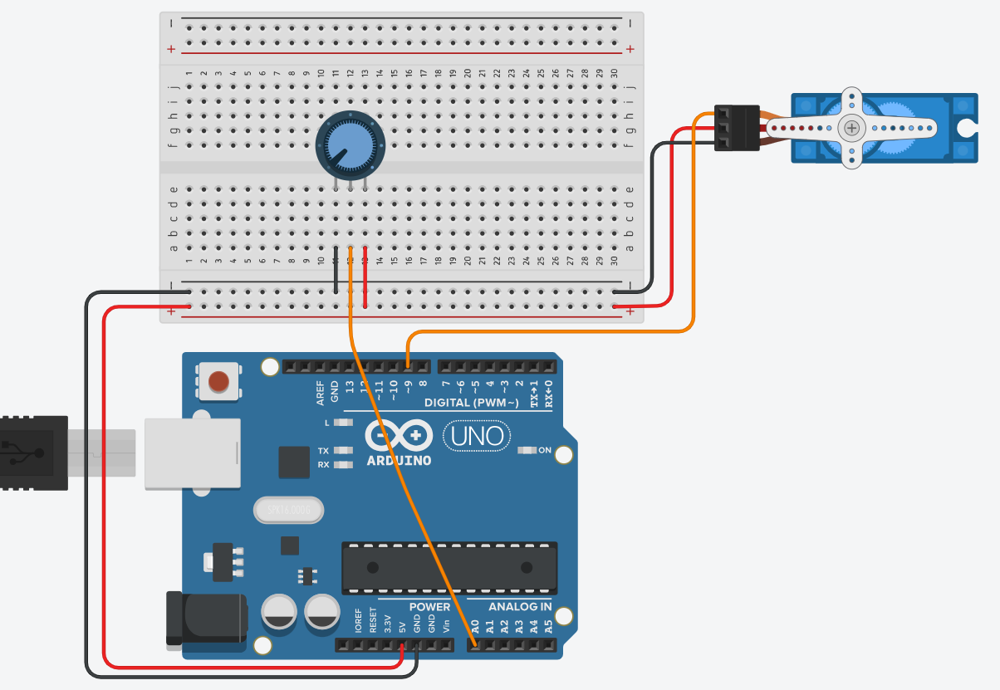
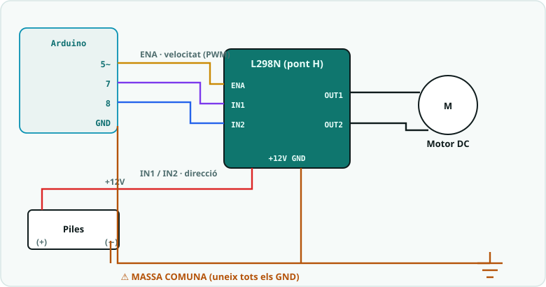
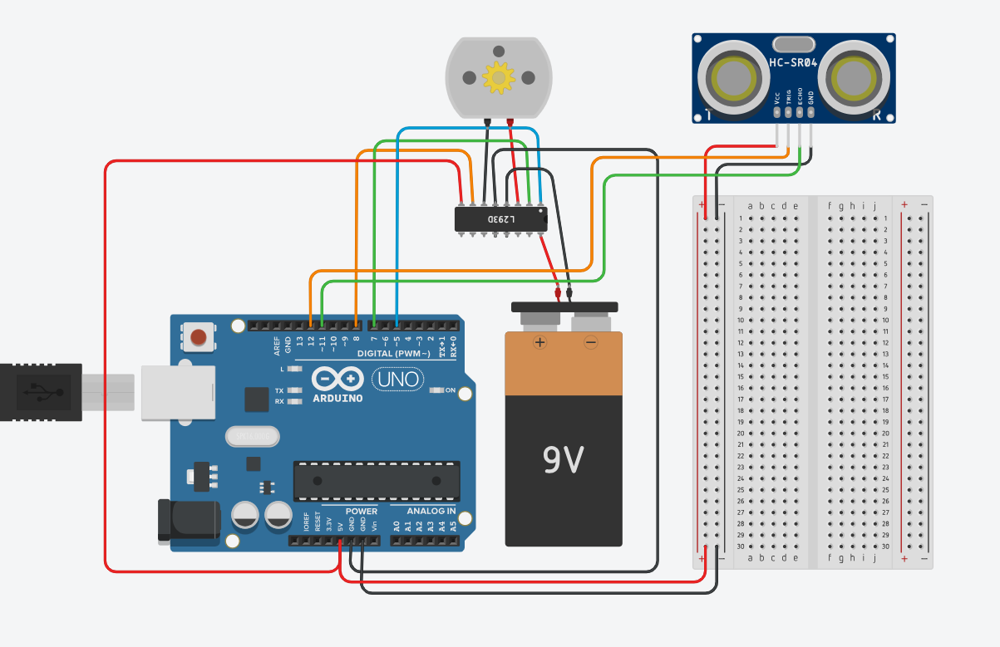

# SA4 · Esquemes i connexions

> 🧑‍🎓 **Quan toca?** Tingues aquesta pàgina oberta **mentre muntes** cada circuit. Correspondència amb la fitxa: **§1** → Activitat 1 (S1) · **§2** → Activitat 2 (S2) · **§3** → Activitat 3 (S3) · **§4** → Activitat 4, el producte (S4).

> ⚠️ **Regla d'or:** **massa comuna** (uneix el GND de l'Arduino amb el GND de l'alimentació del motor) i **mai** alimentis motors/servos des del pin 5V de l'Arduino si en mous més d'un.

---

## 1. Servo controlat per potenciòmetre (`01_servo_potenciometre.ino`)

**Servo SG90:**

| Cable servo | Cap a |
|---|---|
| Marró/negre (GND) | GND |
| Vermell (V+) | 5 V (o alimentació externa) |
| Taronja/groc (senyal) | Pin 9 |

**Potenciòmetre:** extrems a 5 V i GND; cursor a **A0**.

▶ **Obre la simulació a Tinkercad** (pots fer *Copy and Tinker* per modificar-la): <https://www.tinkercad.com/things/dVZLRyR1UDN-sa4-servo-amb-potenciometre-posicio-amb-una-llibreria?sharecode=5KXEzbtaibn7wJtSscbtm_MyxRrX9pmtmsQFqcmA0YY>

---

## 2. Motor DC amb pont H L298N (`02_motor_pont_h.ino`)

| L298N | Cap a |
|---|---|
| ENA | Pin 5 ~ (PWM, velocitat) |
| IN1 | Pin 7 (direcció) |
| IN2 | Pin 8 (direcció) |
| OUT1 / OUT2 | Bornes del motor DC |
| +12V (VS) | + alimentació externa (piles) |
| GND | GND piles **i** GND Arduino (massa comuna) |

**Variant Tinkercad (xip L293D):** Tinkercad no té el mòdul L298N; fes servir el xip **L293D** (encapsulat de 16 potes). El codi és exactament el mateix — només canvia on van a parar els cables:

| L293D (pota) | Cap a |
|---|---|
| 1 · EN1,2 | Pin 5 ~ Arduino (velocitat PWM, fa el paper d'ENA) |
| 2 · IN1 | Pin 7 |
| 7 · IN2 | Pin 8 |
| 3 · OUT1 i 6 · OUT2 | Bornes del motor |
| 8 · VCC2 (potència del motor) | + de la pila de 9 V |
| 16 · VCC1 (lògica) | **5 V de l'Arduino** (sense això el xip no fa res!) |
| 4, 5, 12, 13 · GND | − de la pila **i** GND de l'Arduino (massa comuna) |

> ⚠️ Tres errors típics amb el L293D: (1) oblidar el **5 V a la pota 16** — el xip té dues alimentacions, no una; (2) punxar el motor a OUT3/OUT4 (costat dret) mentre controles IN1/IN2 (costat esquerre) — motor i senyals han d'anar al **mateix costat** del xip; (3) comptar les potes amb el xip girat — l'**osca** (mitja lluna) marca on és la pota 1. A Tinkercad, passa el ratolí per sobre de cada pota per veure'n el nom.

▶ **Obre la simulació a Tinkercad** (pots fer *Copy and Tinker* per modificar-la): <https://www.tinkercad.com/things/1YK0190RWyx-sa4-practica-2-motor-dc-i-pont-h?sharecode=cOGf37CfyJpL0QQMgr96N_um7FE44uY_b6kexNjqEOI>

---

## 3. Sensor regula velocitat (`03_sensor_velocitat.ino`)

Igual que el muntatge 2 **+** sensor d'ultrasons:

| HC-SR04 | Cap a |
|---|---|
| TRIG / ECHO | Pin 12 / Pin 11 |
| VCC / GND | 5V / GND |

> La resta és com el muntatge 2 (pont H + motor + massa comuna). El sensor d'ultrasons es connecta com a la SA3.

▶ **Obre la simulació a Tinkercad** (pots fer *Copy and Tinker* per modificar-la): <https://www.tinkercad.com/things/f9fDLDlCYFB-sa4-practica-3-del-sensor-al-moviment?sharecode=FStYfzag9z_QXOcLOy5IaBwlAf1yQ-cGMPcKX2Z_K1w>

---

## 4. Barrera automàtica (`04_barrera_automatica.ino`)

| Pin | Component | Via | Cap a |
|---|---|---|---|
| 9 | Servo (senyal) | — | (V+ i GND amb alimentació adequada) |
| 12 / 11 | HC-SR04 TRIG / ECHO | — | VCC=5V, GND=GND |
| 8 | LED indicador | 220 Ω | GND |

> Combina el servo (apartat 1) amb el sensor d'ultrasons (pin 12/11) i un LED indicador bàsic (pin 8).

---

## Simulació interactiva (Wokwi)

- ▶ **Simulació (Servo controlat amb potenciòmetre):** <https://wokwi.com/projects/468088128427008001>
- **Projecte al repositori:** [`Simulacions/Wokwi/SA4_servo_potenciometre/`](../../Simulacions/Wokwi/SA4_servo_potenciometre/) (`diagram.json` + `sketch.ino` + `libraries.txt`).

> Obre l'enllaç i prem **▶**. Gira el **potenciòmetre** per moure el servo de 0 a 180°. La llibreria **Servo** s'instal·la sola amb el botó *Install "Servo" library* que apareix en compilar (pont H i motors DC no es porten a Wokwi).
