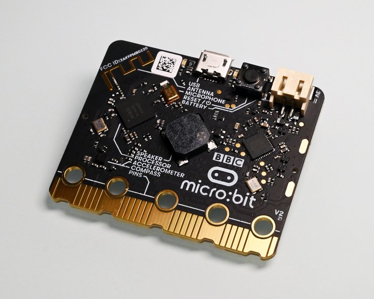

# SA5 · micro:bit i MicroPython: un altre paradigma

Cinquena situació d'aprenentatge (**6 h · 3 sessions** + 4a opcional d'ampliació, 2n trimestre). **Canvi de plataforma i de llenguatge**: de l'Arduino (C/C++) a la **micro:bit** amb **MicroPython**. Es treballen la matriu LED i els botons, els sensors integrats (acceleròmetre, llum), la **comunicació per ràdio** entre plaques i una **comparació explícita C/C++ ↔ Python**. Programació oficial: [`Programació didàctica/14_SA5_microbit_micropython.md`](../../Programació%20didàctica/14_SA5_microbit_micropython.md).

> *Fotografia: micro:bit, per [SimonWaldherr](https://commons.wikimedia.org/wiki/File:Bbc_micro_bit.jpg) — llicència [CC BY-SA 4.0](https://creativecommons.org/licenses/by-sa/4.0/).*

## 📦 Què has d'entregar

| Quan | Lliurable | On es lliura |
|---|---|---|
| S1 | [Activitat 1 · Name badge](SA5_fitxa_alumnat.md#1-name-badge-s1) | [Tasca de Classroom](https://classroom.google.com/c/ODY4ODU4Njk0NTEy/a/ODcwNTE3NDYxNTQy/details) |
| S2 | [Activitat 2 · Sensors integrats](SA5_fitxa_alumnat.md#2-sensors-integrats-s2) | Mateixa tasca de Classroom |
| S3 | [Activitat 3 · Ràdio](SA5_fitxa_alumnat.md#3-radio-s3) i [Activitat 4 · Producte: comparació C++/Python](SA5_fitxa_alumnat.md#4-producte-comparacio-c-python) (es tanca dins la S3) | Mateixa tasca de Classroom |
| ⭐ | [Repte triat (A, B o C)](../../Reptes/Reptes_SA5.md) | El docent el valida i pinteu l'estrella al [tauler de reptes](../00_General/00_Tauler_reptes.md) |
| 📓 | Full del quadern tècnic de cada sessió | En paper, en acabar la sessió |
| 🤖 | El comandament per ràdio del braç (les dues micro:bit de la parella) | Es reaprofita al robot del trimestre: [dossier del braç](../00_General/00_Projecte_T2_Brac.md) |

## Itinerari per sessions

> La teva feina és a la **[fitxa base](SA5_fitxa_alumnat.md)**. Aquesta ruta et diu què toca fer a cada sessió i què necessites en aquell moment. Les respostes de la fitxa es lliuren a la **[tasca de Classroom](https://classroom.google.com/c/ODY4ODU4Njk0NTEy/a/ODcwNTE3NDYxNTQy/details)**.

1. **Sessió 1 · Primers passos amb MicroPython** — obre l'editor **[python.microbit.org](https://python.microbit.org)** (en línia, amb simulador; tot el detall a [connexions i entorn](SA5_connexions.md)) i fes l'[Activitat 1 de la fitxa](SA5_fitxa_alumnat.md#1-name-badge-s1).
2. **Sessió 2 · Sensors integrats** — fes l'[Activitat 2](SA5_fitxa_alumnat.md#2-sensors-integrats-s2).
3. **Sessió 3 · Ràdio i comparació de paradigmes** — fes l'[Activitat 3](SA5_fitxa_alumnat.md#3-radio-s3), amb el [diagrama de flux del sentinella per ràdio](SA5_diagrama_flux.md) i el [codi](codi/).
4. **Producte · comparació C++/Python** — fes l'[Activitat 4](SA5_fitxa_alumnat.md#4-producte-comparacio-c-python) (s'avalua amb R1 codi + R4 documentació).
5. **Abans d'entregar** — repassa [el meu checklist](SA5_checklist_alumnat.md).

### Si vols més

- [Fitxa ampliada](SA5_fitxa_ampliada.md) — aprofundiment i ampliacions.
- [Reptes de la SA5](../../Reptes/Reptes_SA5.md) — tria el teu context.

<!-- web:only-github -->
## Contingut

| Fitxer | Descripció |
|---|---|
| [`SA5_guia_docent.md`](SA5_guia_docent.md) | Guia del professorat: objectius, sessions, mètode de projecte, mapa d'avaluació i errors freqüents. |
| [`SA5_fitxa_alumnat.md`](SA5_fitxa_alumnat.md) | **Fitxa base** (nucli d'una cara, per a tot l'alumnat): Activitats 1-4 + quadern. |
| [`SA5_fitxa_ampliada.md`](SA5_fitxa_ampliada.md) | **Versió ampliada** (aprofundiment): totes les rutines (rols, coavaluació, exit ticket, ODS, PC) i ampliacions. |
| [`SA5_checklist_docent.md`](SA5_checklist_docent.md) | **Checklist docent** (una cara): logística prèvia, punts de control per sessió, avaluació i diversitat. |
| [`SA5_checklist_alumnat.md`](SA5_checklist_alumnat.md) | **Checklist alumnat** (una cara): què he de fer/lliurar + autoavaluació amb semàfor. |
| [`SA5_connexions.md`](SA5_connexions.md) | Connexions de la micro:bit i perifèrics via Micro:shield. |
| `codi/` | Programes MicroPython (vegeu la taula següent). |

### Codi (`codi/`)

| Programa | Què mostra |
|---|---|
| [`01_name_badge.py`](codi/01_name_badge.py) | Matriu LED, botons i imatges; indentació de Python. |
| [`02_passes.py`](codi/02_passes.py) | Comptapassos amb l'acceleròmetre (llindar + antirebot). |
| [`03_nightlight.py`](codi/03_nightlight.py) | Llum automàtic amb el sensor de llum (amb esquelet «Si t'encalles» a la seva pàgina). |
| [`04_radio_dau.py`](codi/04_radio_dau.py) | Dau digital + comunicació per ràdio entre dues plaques. |

Cada programa té la seva **pàgina de pràctica** a la web (per què es fa + codi explicat per blocs); a GitHub, l'explicació és al `<nom>_EXPLICACIO.md` del costat de cada `.py`.

<!-- /web:only-github -->

## Producte i avaluació

- **Producte:** aplicació amb micro:bit (comptapassos, nightlight o joc per ràdio) + **taula comparativa C++/Python**.
- **Criteris:** CA1.2 (MicroPython i comparació amb C/C++), CA3.1 · **Rúbriques:** **R1** (codi) i **R4** (documentació/comparativa).

## Continuïtat

Ve de la **SA4** (Arduino/C++, moviment) i porta a la **SA6** (control, torna a Arduino). Aquí s'obre el **fil dels dos llenguatges**: els mateixos conceptes (variables, funcions, sensors, bucles) en **dos paradigmes**. Aquest fil es reprendrà a la **SA8** (telemetria i IA amb micro:bit/Python).
