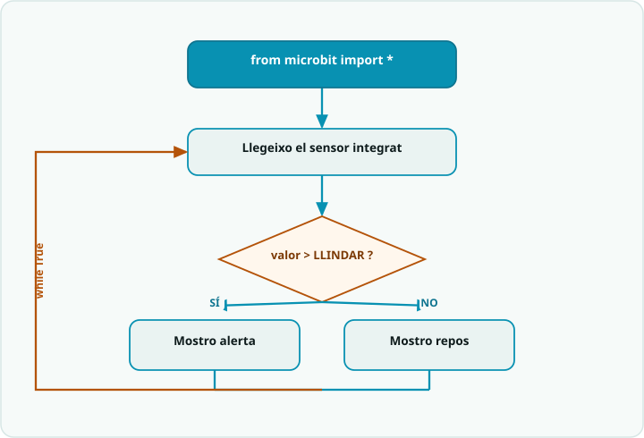

# SA5 · Diagrama de flux — Sentinella de sensor per ràdio (micro:bit + MicroPython)

> **Per a qui és?** Alumnat. És el **sentinella de sensor per ràdio** de l'**Activitat 3 (S3)**, però **dibuixat**. Mira'l **abans de programar** aquella activitat; després l'exemple resolt i el codi. A les sessions 1 i 2 encara no et cal: segueix l'itinerari de la portada.

## El flux

## Llegenda
- Caixa **fosca** = **inici**.
- Caixa **teal** `[ ... ]` = una **acció** (una instrucció o bloc de codi).
- **Rombe ambre** `< ... ? >` = una **decisió** (`if`): en surt una branca per cada cas.
- **Fletxa ambre** = **bucle**: torna enrere i es repeteix.

## Del diagrama al codi
- **Engegar la ràdio (fora del bucle)** → `radio.on()` i `radio.config(group=GROUP)`, **abans** del `while True:` (només cal una vegada).
- **while True:** → el bucle infinit; tot el que es repeteix va **indentat a dins** (4 espais = la sintaxi de Python).
- **Llegir sensor + decisió** → `graus = temperature()` i `if graus >= LLINDAR:` … `else:` (mostrar amb `display.show`).
- **Enviar / rebre** → `radio.send("!")` dins l'alerta; `missatge = radio.receive()` i `if missatge == "!":` per reaccionar a l'altra placa.
