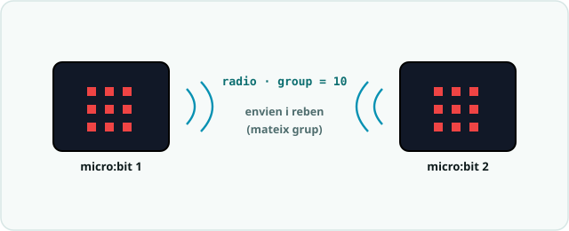

# SA5 · Exemple resolt (model «jo ho faig») — Sentinella de temperatura per ràdio

> 🧑‍🎓 **Quan toca mirar-lo?** Després del teu **primer intent** amb els sensors de l'**Activitat 2 (S2)** i la ràdio de l'**Activitat 3 (S3)** — mai abans. És un problema **anàleg** per veure *com es pensa* en Python, no la solució del teu producte.

> 🔗 **D'on ve i on va.** Aquest exemple és el **bessó comentat** de la pràctica [Dau per ràdio: dues plaques que es parlen](codi/04_radio_dau_EXPLICACIO.md) — amb el patró de llindar del [comptapassos](codi/02_passes_EXPLICACIO.md) a dins: la mateixa idea (dues plaques amb el mateix `group` que envien i escolten dins del mateix bucle) amb un sensor i un context expressament diferents. Serveix per veure **com es pensa**, no per copiar-lo. Quan l'hagis entès, torna a la pàgina de la pràctica i fes-la teva.

> 🗺️ **Com es llegeix per apartats:** **🔑 El repte model** primer, per situar-te · **🧭 Com ho penso** abans d'escriure el **teu** codi (és l'apartat més important: el raonament) · **💡 La solució anotada** només **després del teu intent**, per comparar · **🔬 Provo i mesuro** quan provis el teu: copia'n el **mètode**, no el resultat · **⚠️ Contraexemple** quan una cosa no rutlli — i com a repàs abans d'entregar · **📔 Diari de bord** quan escriguis la teva entrada del quadern.

> **Nota docent:** mostra'l **després del primer intent** amb `02_passes.py` i `04_radio_dau.py`, mai abans.
> No és la solució del producte (comptapassos, nightlight ni joc per ràdio): és un problema **anàleg**
> resolt pas a pas perquè l'alumnat vegi *com es pensa* en Python, no què s'ha de copiar. Comenta en
> veu alta el pas «🧭 Com ho penso» (predicció abans de codi, PRIMM) i el «⚠️ Contraexemple» (recorda:
> l'error rei d'aquesta SA és l'**indentació**).

---



## 🔑 El repte model

> Fer una **sentinella de temperatura**: la micro:bit mostra la temperatura a la matriu de LED i, quan
> passa d'un **llindar** (fa massa calor), **avisa una segona placa per ràdio**. La placa que rep
> l'avís mostra un símbol d'alerta. En repòs, cada placa ensenya la seva temperatura.

Fa servir només conceptes de la SA5: `from microbit import *`, `while True:` amb **indentació**,
un **sensor integrat** amb **llindar** (`temperature()`, com el `LLINDAR` de `02_passes.py`), la matriu
de LED (`display.show`) i la **ràdio** amb `group` (`radio.on`, `radio.config`, `send`, `receive`,
com a `04_radio_dau.py`). No cal muntatge: només **2 micro:bit** amb el **mateix `group`**.

---

## 🧭 Com ho penso (abans d'escriure codi)

1. **Analitzo:** hi ha **dues feines** a la vegada. (a) *Mesurar i mostrar* la temperatura → llegir el
   sensor i pintar-la a la matriu. (b) *Vigilar el llindar i comunicar* → si em passo de calor, envio
   un avís; i sempre miro si l'altra placa m'ha avisat. Les dues han de conviure dins **el mateix bucle**.
2. **Descomponc:** dins del `while True:` faré **primer** la lectura+llindar (com el patró de
   `02_passes.py`: `if forca > LLINDAR:`) i **després** la part de ràdio (com `04_radio_dau.py`:
   enviar amb `radio.send` i rebre amb `radio.receive`). Poso `radio.on()` i `radio.config(group=...)`
   **una sola vegada, fora del bucle**, perquè només cal encendre la ràdio a l'inici.
3. **🔮 PREDIU (fes-ho tu abans de llegir el codi):**
   - `temperature()` em retorna… ☐ un text ☐ **un número enter** (graus) ☐ un valor de 0 a 255.
   - Si **cap** placa no ha enviat res, `radio.receive()` retorna… ☐ `0` ☐ `""` ☐ **`None`**.
   - En Python el bloc que va **dins** del `if` es marca amb… ☐ `{ }` ☐ **la indentació (4 espais)** ☐ un `;`.

---

## 💡 La solució anotada

```python
# SA5 - exemple_sentinella_temperatura.py  (EXEMPLE MODEL, no es el producte)
# Mostra la temperatura a la matriu i, si passa el llindar, avisa una
# SEGONA placa per radio. La placa que rep l'avis ensenya un simbol d'alerta.
# IMPORTANT: les dues plaques han de compartir el MATEIX group.

from microbit import *   # sensors, matriu LED, botons... tot en un
import radio             # modul de comunicacio sense fils

LLINDAR = 28     # graus a partir dels quals considerem "massa calor"
GROUP = 5        # el MATEIX numero a les dues plaques del teu equip

# La radio s'encen UN sol cop, ABANS del bucle (no cal repetir-ho cada volta)
radio.on()
radio.config(group=GROUP)

while True:
    graus = temperature()              # sensor intern: graus Celsius (enter)

    # (a) Mesuro i decideixo segons el LLINDAR (mateix patro que 02_passes.py)
    if graus >= LLINDAR:
        display.show(Image.ANGRY)      # avis local: fa massa calor
        radio.send("!")                # avisa l'altra placa ("!" = alerta)
        sleep(500)
    else:
        display.show(str(graus % 10))  # en repos: ultima xifra dels graus

    # (b) Miro si l'altra placa m'ha enviat res (com 04_radio_dau.py)
    missatge = radio.receive()         # retorna None si no ha arribat res
    if missatge == "!":
        display.show(Image.SKULL)      # l'altra placa m'avisa: alerta!
        sleep(500)

    sleep(200)                         # ritme del bucle
```

**Per què està escrit així (🌟):**
- **Constants amb nom** (`LLINDAR`, `GROUP`) en lloc de números solts: ajusto la sensibilitat i el
  canal de ràdio en **un sol lloc** (igual com `LLINDAR = 1500` a `02_passes.py`).
- **`radio.on()` i `radio.config()` fora del `while True:`**: només cal encendre la ràdio **una vegada**;
  posar-ho dins del bucle no aporta res i confon.
- **Comparo amb un text** (`missatge == "!"`): la ràdio sempre viatja com a **cadena de text**, per això
  envio `"!"` i el comparo amb `"!"`, no amb el número `1`.
- La **indentació de 4 espais** marca què va dins de cada `if`/`else` i dins del `while`: en Python
  **no és estètica, és la sintaxi** (l'equivalent de les `{ }` de C++).

---

## 🔬 Provo i mesuro

- **Predicció ✔:** `temperature()` retorna un **enter** (graus ºC); `radio.receive()` retorna **`None`**
  quan no ha arribat res (per això el comparo amb `"!"` i no peta).
- **Racó de mesura:** poso el dit sobre el xip un moment i la lectura **puja**; si baixo `LLINDAR` a un
  valor per sota de la temperatura de l'aula, l'alerta salta **tot sol** → confirmo que el llindar mana.
- **Prova de la ràdio:** carrego el **mateix** programa a les **dues** plaques amb el mateix `GROUP`.
  Escalfo una i l'altra ensenya la calavera (`Image.SKULL`) → la comunicació funciona. Si canvio el
  `GROUP` d'una placa, deixen de sentir-se: bona prova que el `group` és el «canal».

---

## ⚠️ Contraexemple (errors típics i com es detecten)

- **Barrejo tabs i espais** (o no indento el bloc del `if`) → `IndentationError` en carregar. *Causa:*
  en Python la indentació és sintaxi. **Solució:** 4 espais coherents a totes les línies del bloc.
- **Poso `radio.receive()` fora del `while True:`** (abans del bucle) → la placa llegeix la ràdio **un
  sol cop** i mai més reacciona. *Causa:* la feina que s'ha de repetir ha d'anar **dins** del bucle.
- **Cada placa té un `group` diferent** (una `group=5` i l'altra `group=7`) → s'envien missatges però
  **no en reben cap**. *Causa:* el `group` és el canal; han de compartir-lo. **Solució:** mateix número.
- **Oblido `radio.on()`** → `radio.send`/`receive` **no fan res** (la ràdio està apagada). Sempre
  `radio.on()` a l'inici, abans del bucle.

---

## 📔 Diari de bord (entrada model, 1a persona)

> **Sessió 3:** He fet una **sentinella de temperatura** que mostra els graus amb `temperature()` i,
> quan passa el **`LLINDAR`**, avisa l'altra placa amb `radio.send("!")`. Al principi la segona placa no
> reaccionava: tenia un **`group` diferent** (jo `5`, la parella `7`); en posar el mateix número ja es
> van sentir. També em va sortir un **`IndentationError`** perquè havia barrejat un tab amb espais dins
> del `if`. He entès que en Python la **indentació és la sintaxi** (el que a Arduino són les `{ }`) i que
> la ràdio viatja com a **text**, per això comparo amb `"!"` i no amb `1`.
> **Evidència:** vídeo de les dues plaques (una escalfada → l'altra mostra la calavera) + fila de la
> taula comparativa C++ ↔ Python.

**Per què és una bona entrada:** usa el **vocabulari clau** (llindar, `group`, indentació, `None`),
explica *el com*, i és **honesta amb la dificultat** (el `group` i l'`IndentationError`) i com es va resoldre.

---

*Exemple resolt de la SA5. Model de treball per a l'alumnat (alliberament gradual: es mostra
després del primer intent). Es recolza en `codi/02_passes.py` (llindar de sensor) i
`codi/04_radio_dau.py` (ràdio amb `group`). Llicència CC BY-SA 4.0.*
