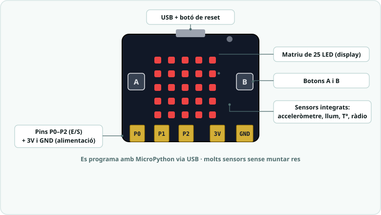

# SA5 · Qüestionari de conceptes (micro:bit i MicroPython)

> **Ús.** Comprovació breu dels conceptes de MicroPython, sensors integrats i ràdio de la SA5.
> Es pot fer servir com a **repàs formatiu** o com a **prova curta qualificable**
> (10 preguntes × 1 punt = **nota 0-10**). Durada orientativa: **15-20 min**, individual.

**Nom:** ______________________  **Grup:** __________  **Data:** __________

---

## Preguntes (tria una resposta)

1. En MicroPython, la línia que dona accés a la matriu de LED, els botons i els sensors de la micro:bit és…
   - a) **`from microbit import *`**
   - b) `#include <microbit.h>`
   - c) `import Arduino`
   - d) `void setup()`

2. En Python, la **indentació** (els espais al principi de línia)…
   - a) És només estètica i es pot ometre.
   - b) Substitueix el punt i coma `;`.
   - c) **És sintaxi: marca quins blocs de codi van junts i és obligatòria.**
   - d) Només cal dins de `setup()`.

3. Si barreges tabuladors i espais o sagnes malament una línia, l'error típic de Python és…
   - a) `digitalWrite error`
   - b) `radio not found`
   - c) `SyntaxError: missing ;`
   - d) **`IndentationError`**

4. Quina diferència hi ha entre `display.show("Hola")` i `display.scroll("Hola")`?
   - a) Cap, són sinònims.
   - b) **`show()` mostra el contingut fix i `scroll()` el fa desplaçar per la matriu.**
   - c) `show()` només val per a números i `scroll()` per a lletres.
   - d) `scroll()` apaga la placa.

5. En un programa de MicroPython per a la micro:bit, el codi que s'ha de repetir contínuament es posa dins de…
   - a) **`while True:`**
   - b) `void loop()`
   - c) `setup()`
   - d) `if button_a:`

6. Per fer un **comptapassos** o detectar que sacsegem la placa, quin sensor integrat s'utilitza?
   - a) El sensor de llum.
   - b) La ràdio.
   - c) **L'acceleròmetre** (p. ex. `accelerometer.was_gesture("shake")`).
   - d) El termòmetre.

7. La instrucció `display.read_light_level()` retorna un valor dins del rang…
   - a) 0 a 1023.
   - b) **0 a 255.**
   - c) 0 a 5.
   - d) `HIGH` o `LOW`.

8. Perquè dues micro:bit es comuniquin per **ràdio**, la condició imprescindible és que…
   - a) Estiguin connectades pel cable USB.
   - b) Facin servir `Serial.begin()`.
   - c) Tinguin el mateix nom d'alumne.
   - d) **Comparteixin el mateix `group`** (p. ex. `radio.config(group=10)` a totes dues).

9. En el codi de la ràdio, quines instruccions **envien** i **reben** un missatge, respectivament?
   - a) `display.show()` i `display.scroll()`
   - b) `radio.on()` i `radio.off()`
   - c) **`radio.send()` i `radio.receive()`**
   - d) `send()` i `print()`

10. Comparant Arduino (C/C++) i micro:bit (Python), quina equivalència és **correcta**?
    - a) En Python cada instrucció acaba amb `;` com en C++.
    - b) **On C++ delimita els blocs amb `{ }`, Python els delimita amb la indentació.**
    - c) `while True:` de Python equival a `setup()` de C++.
    - d) En Python els blocs es tanquen amb `END`.

---

## Pregunta oberta (opcional)

11. Explica (o escriu) un programa senzill de MicroPython que, dins d'un `while True:`, **mostri un cor**
    a la matriu de LED i, quan es premi el botó A, **desplaci el teu nom**. Indica quines instruccions
    faries servir:

___________________________________________________________________

___________________________________________________________________

---

## Clau de correcció (ús del professorat)

| Pregunta | 1 | 2 | 3 | 4 | 5 | 6 | 7 | 8 | 9 | 10 |
|---|---|---|---|---|---|---|---|---|---|---|
| **Resposta** | a | c | d | b | a | c | b | d | c | b |

> **Barem orientatiu:** 10 preguntes × 1 punt = 10. La pregunta 11 pot pujar nota
> (aplicació) o quedar fora del còmput.

---

## Versió Google Forms (llesta per copiar)

> Crea un formulari nou a **Google Forms**, activa **"Convertir en qüestionari"** i marca
> la resposta correcta de cada pregunta. Assigna **1 punt** a les preguntes 1-10.

**Títol:** `SA5 · Conceptes — micro:bit i MicroPython`
**Descripció:** `Comprovació dels conceptes de MicroPython, sensors integrats i ràdio de la SA5.`

**Camps inicials**
- Nom i cognoms — *Resposta curta* (obligatori).
- Grup/classe — *Resposta curta*.

**Preguntes 1-10** (tipus: *Opció múltiple*; **1 punt** cadascuna; correcta en **negreta**)
1. Accés a LED/botons/sensors → **`from microbit import *`** / `#include <microbit.h>` / `import Arduino` / `void setup()`.
2. La indentació en Python… → És estètica / Substitueix el `;` / **És sintaxi i obligatòria** / Només dins `setup()`.
3. Error per sagnar malament → `digitalWrite error` / `radio not found` / `SyntaxError: missing ;` / **`IndentationError`**.
4. `show()` vs `scroll()` → Són iguals / **`show()` fix i `scroll()` desplaça** / Un per números i l'altre per lletres / `scroll()` apaga la placa.
5. Codi que es repeteix sempre → **`while True:`** / `void loop()` / `setup()` / `if button_a:`.
6. Sensor per comptapassos/sacsejar → Llum / Ràdio / **Acceleròmetre** / Termòmetre.
7. Rang de `read_light_level()` → 0-1023 / **0-255** / 0-5 / `HIGH`/`LOW`.
8. Condició per a la ràdio → Cable USB / `Serial.begin()` / Mateix nom d'alumne / **Mateix `group`**.
9. Enviar i rebre per ràdio → `show()`/`scroll()` / `radio.on()`/`radio.off()` / **`radio.send()`/`radio.receive()`** / `send()`/`print()`.
10. Equivalència C++ ↔ Python → Python acaba amb `;` / **`{ }` de C++ ↔ indentació de Python** / `while True:` ↔ `setup()` / Python tanca amb `END`.

**Pregunta 11** (tipus: *Paràgraf*; sense puntuació) — descriure un `while True:` amb cor + desplaçar el nom amb el botó A.

> **Recollida:** Respostes → full de càlcul vinculat, amb la nota de l'1 al 10 autocalculada.

---

*Qüestionari de conceptes de la SA5. Es recolza en `../SA0/SA0_guia_programacio.md` (Part B i C) i el
material de MicroPython, sensors i ràdio de la SA5. Llicència CC BY-SA 4.0.*
