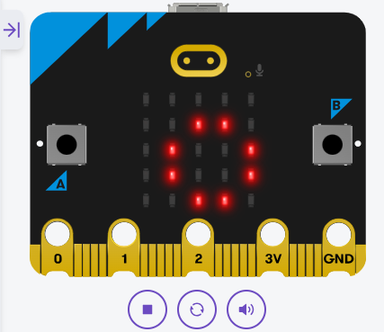

# Pràctica 1 · Name badge: benvingut a Python

**Quan es fa:** Sessió 1 (modelatge) · **Fitxer:** `01_name_badge.py` · **Entorn:** [python.microbit.org](https://python.microbit.org) · [connexions i entorn](../SA5_connexions.md) (no cal muntatge)

> ✍️ **Kata primer!** No llegeixis encara el codi: el docent projecta el kata d'aquesta pràctica i tens **10 minuts** per escriure el teu bloc (apunts permesos). Després torna aquí i **compara**.

## 🎯 Per què fem aquesta pràctica

Canvi de plataforma i de llenguatge: deixes l'Arduino i el C++ i passes a la **micro:bit** amb **Python**. Aquest primer programa és curt a propòsit, perquè el protagonista no és el *què* fa (una xapa identificativa amb la matriu de LED i els botons) sinó el *com* està escrit: **en Python la indentació no és estètica, és sintaxi**. No hi ha `;` al final de les línies ni claus `{}` per marcar els blocs — el que a C++ feien les claus, aquí ho fan els **espais del començament de cada línia**.

Posa'l al costat d'un sketch d'Arduino i compara'ls: la idea és la mateixa (un bucle infinit que mira els botons i respon), però la pell és tota una altra. Aquesta comparació és el fil de tota la SA, i la primera fila de la **taula comparativa C++ ↔ Python** surt d'aquí.

## 🔮 Abans d'executar: prediu

Mira el codi complet (a baix de tot, plegat) **sense executar-lo**. Què mostrarà la matriu quan no toquis res? I si mantens premut el botó A? I el B? Escriu la predicció a l'Activitat 1 de la [fitxa](../SA5_fitxa_alumnat.md) i comprova-la al [simulador](https://python.microbit.org) o a la placa.



Així es veu al **simulador** una de les tres branques (quina? — si has fet la predicció, ja ho saps). Els botons A i B de la placa virtual **es cliquen amb el ratolí**: pots comprovar les tres respostes sense cap maquinari.

## 🧠 El codi, per blocs

### Bloc 1 — Una sola línia per tenir-ho tot

```python
from microbit import *
```

Aquesta línia importa **tota** la micro:bit: la matriu de LED (`display`), els botons (`button_a`, `button_b`), les imatges (`Image`), els sensors… A Arduino no calia importar res perquè l'IDE ho feia per tu; en Python els mòduls es demanen explícitament.

Fixa't també en el que **no** hi ha: ni `setup()` ni `loop()`. En Python el programa comença a executar-se **des de la primera línia**, de dalt a baix.

### Bloc 2 — El bucle infinit s'escriu a mà

```python
while True:
    if button_a.is_pressed():
        display.scroll("Hola!")        # canvia-ho pel teu nom
```

`while True:` és l'equivalent del `loop()` d'Arduino: un bucle que no s'acaba mai. Però mira bé les dues línies de sota: van **indentades 4 espais**, i això és el que diu a Python que són *dins* del bucle. Si les escrius arran del marge, queden **fora** i el programa no farà el que esperes. Els dos punts `:` al final de `while True:` i de `if ...:` són obligatoris: anuncien que ve un bloc indentat.

`display.scroll()` **desplaça** el text per la matriu (5×5 LED són pocs per a un nom sencer!). Mentre el text es desplaça, el programa està ocupat: no mira els botons.

### Bloc 3 — Decidir amb `if` / `elif` / `else`

```python
    if button_a.is_pressed():
        display.scroll("Hola!")        # canvia-ho pel teu nom
    elif button_b.is_pressed():
        display.show(Image.HAPPY)
    else:
        display.show(Image.HEART)
    sleep(100)
```

La mateixa decisió que ja feies en C++, amb tres canvis de pell: `elif` en lloc de `else if`, la condició **sense parèntesis obligatoris**, i el bloc marcat per la indentació. A cada volta s'executa **només una** de les tres branques: A → nom, B → cara contenta, res → cor.

`display.show()` mostra una **imatge fixa** (o un caràcter) sense desplaçar-la — aquesta és la diferència amb `scroll()`. I `sleep(100)` és el `delay(100)` d'Arduino: una pausa en mil·lisegons (compte: en el Python «normal» d'ordinador, `sleep` va en segons; a la micro:bit, en ms).

## ⚠️ Errors que veuràs segur

| Símptoma | Causa probable |
|---|---|
| `IndentationError` en carregar | Has barrejat tabs i espais, o una línia del bloc no està al mateix nivell que les altres. Usa **4 espais** coherents. |
| El programa no reacciona als botons | La lectura dels botons ha quedat **fora** del `while True:` (mal indentada): s'executa un sol cop i prou. |
| `NameError: name ... is not defined` | Falta `from microbit import *` a dalt, o has escrit malament un nom (`Image.HAPY`). |
| El botó «no respon» mentre passa el text | No és un error: `display.scroll()` **bloqueja** fins que el text acaba de passar (com el `delay()` d'Arduino). |

## 🔗 On ho aplicaràs

- **Repte de la S1:** el badge d'emocions (A: contenta, B: trista) és aquest mateix programa amb altres imatges — i l'animació pròpia, una llista d'imatges a `display.show()`.
- **Tota la SA:** el patró `while True:` + `if` indentat és l'esquelet de **tots** els programes de la SA5: el [comptapassos](02_passes_EXPLICACIO.md), el [llum de nit](03_nightlight_EXPLICACIO.md) i el [dau per ràdio](04_radio_dau_EXPLICACIO.md).
- **Taula comparativa:** ja pots omplir la primera fila (estructura, final d'instrucció, blocs de codi) de l'Activitat 4 de la [fitxa](../SA5_fitxa_alumnat.md).

> ⭐ **Has acabat abans?** Tria un repte a **[Reptes de la SA5](../../../Reptes/Reptes_SA5.md)** i, quan el docent te'l validi, pinta l'estrella al [tauler de reptes](../../00_General/00_Tauler_reptes.md).
