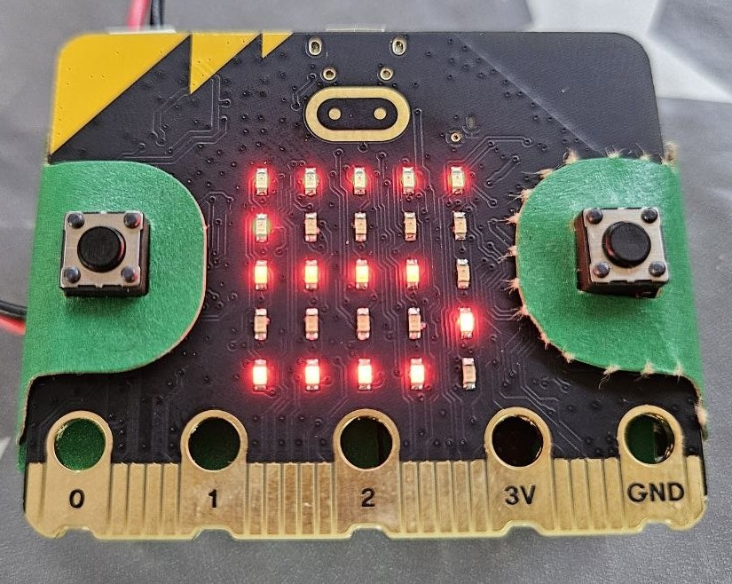

# Pràctica 2 · Comptapassos: sensor, llindar i antirebot

**Quan es fa:** Sessió 2 (modelatge) · **Fitxer:** `02_passes.py` · **Entorn:** [python.microbit.org](https://python.microbit.org) · [connexions i entorn](../SA5_connexions.md) (no cal muntatge)

> ✍️ **Kata primer!** No llegeixis encara el codi: el docent projecta el kata d'aquesta pràctica i tens **10 minuts** per escriure el teu bloc (apunts permesos). Després torna aquí i **compara**.

## 🎯 Per què fem aquesta pràctica

A Arduino, per llegir el món necessitaves muntar un sensor a la protoboard. La micro:bit porta els sensors **integrats**: aquí uses l'**acceleròmetre** per fer un comptapassos de canell, com el d'un *wearable* de debò, **sense connectar ni un cable**. És el gran avantatge d'aquesta placa: del zero al prototip en minuts.

Però la lliçó important és una altra, i ja la coneixes de les SA d'Arduino: un sensor **no dona mai un sí/no net**, dona números que ballen. Per convertir «força que oscil·la» en «un pas», calen les dues eines de sempre: un **llindar** (a partir de quin valor compto?) i un **antirebot** (com evito comptar el mateix pas tres cops?). Mateixos conceptes, altre llenguatge — just el que la SA vol que vegis.

## 🔮 Abans d'executar: prediu

Sense executar el codi (el tens a baix, plegat): què marcarà la matriu amb la placa **quieta sobre la taula**? Què cal fer perquè el número pugi? I què fa el botó B? Apunta-ho a l'Activitat 2 de la [fitxa](../SA5_fitxa_alumnat.md) i comprova-ho.



Així es veu **a la placa real**: la matriu mostra la xifra del comptador. Fixa't que no hi ha ni un cable — l'acceleròmetre és dins de la placa; per fer pujar el número, només cal sacsejar-la.

## 🧠 El codi, per blocs

### Bloc 1 — Una variable i una «constant»

```python
passes = 0
LLINDAR = 1500   # ajusta'l segons la sensibilitat que vulguis
```

`passes` és la variable que anirà creixent. `LLINDAR` fa el paper de les constants d'Arduino, però amb una diferència: **Python no té `const`**. La promesa de «això no es toca» és només una convenció: **nom en MAJÚSCULES**. El compilador no et protegirà — la disciplina és teva. L'avantatge és el de sempre: la sensibilitat del comptapassos s'ajusta canviant **un sol número**.

### Bloc 2 — Llegir l'acceleròmetre

```python
while True:
    forca = accelerometer.get_strength()
```

`accelerometer.get_strength()` retorna la **força total** que nota la placa, en mil·li-g. Amb la placa quieta no val 0: val **~1024**, perquè la gravetat sempre hi és (1 g = 1024). Un pas o un sacseig fan un pic per sobre. Fixa't que la lectura és **dins** del `while True:`: cal repetir-la a cada volta, com l'`analogRead()` dins del `loop()`.

### Bloc 3 — Llindar i antirebot

```python
    if forca > LLINDAR:
        passes = passes + 1
        display.show(str(passes % 10))   # mostra l'ultima xifra
        sleep(300)                       # antirebot: evita comptar de mes
```

Tres coses en quatre línies:

- **El llindar:** només compta si el pic supera `LLINDAR`. Massa baix → compta passos fantasma; massa alt → no compta mai. S'ajusta provant.
- **`str(passes % 10)`:** la matriu només té lloc per a **un** dígit, així que `% 10` (residu de dividir per 10) es queda l'última xifra: 9, 10, 11 → `9`, `0`, `1`. I `str()` converteix el número en text, perquè `display.show()` vol caràcters.
- **L'antirebot:** el `sleep(300)` de després de comptar és el mateix truc que amb els polsadors d'Arduino: un pic dura més d'una volta de bucle, i sense aquesta pausa un sol pas es comptaria 5 o 6 vegades.

### Bloc 4 — Reinici amb el botó B

```python
    # Reinici amb el boto B
    if button_b.is_pressed():
        passes = 0
        display.scroll("0")
    sleep(20)
```

Un segon `if` **independent** (no un `elif`): a cada volta es comprova el llindar **i també** el botó. El `sleep(20)` final marca el ritme del bucle: unes 50 lectures per segon, de sobres per no perdre cap pas.

## ⚠️ Errors que veuràs segur

| Símptoma | Causa probable |
|---|---|
| Compta 4 o 5 passos d'un sol cop | T'has deixat l'antirebot (`sleep(300)`) o el llindar és massa baix. |
| No compta mai res | `LLINDAR` massa alt, o la comparació ha quedat fora del `while True:` (indentació). |
| Al 9 el segueix un 0 | No és un error: `% 10` només mostra l'**última xifra** (la matriu és d'un sol dígit). |
| `IndentationError` en carregar | Línies del bloc a nivells diferents o tabs barrejats amb espais. |

## 🔗 On ho aplicaràs

- **Repte de la S2:** el detector d'inclinació (`get_x()`) i el termòmetre amb avís (`temperature()`) són aquest mateix patró **sensor → llindar → resposta** amb un altre sensor. Si t'hi encalles, tens un esquelet a la [pàgina del llum de nit](03_nightlight_EXPLICACIO.md).
- **Tancament de la S2 (sembra per a la SA8):** anota al quadern els valors reals de `x`, `y` i `get_strength()` en 3-4 postures — a la SA8 seran el punt de partida del classificador de gestos.
- **Exemple resolt:** la [sentinella de temperatura](../SA5_exemple_resolt.md) reutilitza aquest patró de llindar i l'ajunta amb la ràdio de la [Pràctica 4](04_radio_dau_EXPLICACIO.md).

> ⭐ **Has acabat abans?** Tria un repte a **[Reptes de la SA5](../../../Reptes/Reptes_SA5.md)** i, quan el docent te'l validi, pinta l'estrella al [tauler de reptes](../../00_General/00_Tauler_reptes.md).
