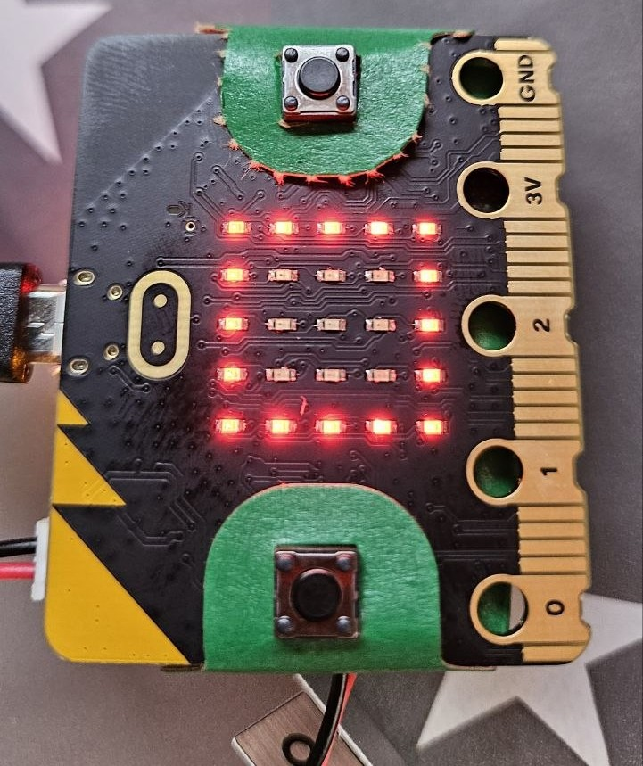

# Pràctica 3 · Llum de nit: decidir amb un llindar

**Quan es fa:** Sessió 2 (modelatge) · **Fitxer:** `03_nightlight.py` · **Entorn:** [python.microbit.org](https://python.microbit.org) · [connexions i entorn](../SA5_connexions.md) (no cal muntatge)

> ✍️ **Kata primer!** Si avui encara no has fet cap kata (ni el mini-check), obre el [kata d'aquesta pràctica](../SA5_katas.md): 10 minuts per escriure el teu bloc abans de llegir aquest codi. Si ja l'has fet, endavant.

## 🎯 Per què fem aquesta pràctica

Un llum que s'encén tot sol quan es fa fosc: la mateixa idea que el semàfor nocturn automàtic de la SA3, però on allà calia una LDR, un divisor de tensió i mitja protoboard, aquí ho fa **la mateixa matriu de LED** — els LED de la micro:bit també saben **mesurar** la llum que els arriba. És l'exemple més net del que dona la placa: sensors integrats → prototip immediat.

I és el programa amb l'estructura més pura de la sessió: **llegir un sensor, comparar-lo amb un llindar, i triar entre dues respostes** (`if`/`else`). Aquest patró de tres passos és la cèl·lula bàsica de gairebé tot sistema automàtic — per això l'esquelet de sota (per al repte de la S2) és exactament aquest programa amb els forats per omplir.

## 🔮 Abans d'executar: prediu

Sense executar el codi (a baix, plegat): què veuràs a la matriu amb la llum de l'aula? I si **tapes la placa amb la mà**? Hi ha algun valor de llum on el comportament sigui dubtós? Apunta les prediccions a l'Activitat 2 de la [fitxa](../SA5_fitxa_alumnat.md) i comprova-les.



Així es veu **a la placa real** quan detecta foscor: el quadrat encès (`Image.SQUARE`). I aquí la volta màgica de la pràctica: els mateixos LED que estàs veient encesos són el **sensor** que ha decidit encendre'ls — la matriu mesura i il·lumina alhora.

## 🧠 El codi, per blocs

### Bloc 1 — El llindar

```python
from microbit import *

LLINDAR = 50   # per sota d'aquest nivell, considerem "fosc"
```

`display.read_light_level()` retorna un valor de **0 (fosc total) a 255 (llum plena)**. El `LLINDAR` és la frontera que tu decideixes: per sota de 50, «és de nit». No hi ha cap número màgic correcte — depèn de la llum de la teva aula, i ajustar-lo és part de la pràctica (per això és una «constant» amb nom, en majúscules: es canvia en un sol lloc).

### Bloc 2 — Llegir i decidir

```python
while True:
    llum = display.read_light_level()
    if llum < LLINDAR:
        display.show(Image.SQUARE)   # "encen" (fa fosc)
    else:
        display.clear()              # apagat (hi ha llum)
    sleep(100)
```

El cor del programa en cinc línies: **llegeix** (el sensor de llum de la matriu), **compara** (`llum < LLINDAR` — fixa't que aquí interessa «per sota»), **respon** (quadrat encès o matriu neta amb `display.clear()`). El `sleep(100)` marca el ritme: 10 comprovacions per segon.

Detall curiós: la matriu fa de sensor **i** d'actuador alhora. Quan el quadrat s'encén, la seva pròpia llum pot apujar una mica la lectura — si el `LLINDAR` és just, el llum pot «dubtar» (encendre's i apagar-se ràpid). La solució de veritat es diu *histèresi* (dos llindars, un per encendre i un per apagar) i la veuràs al control de la SA6; aquí en tens el primer tast.

## ⚠️ Errors que veuràs segur

| Símptoma | Causa probable |
|---|---|
| Sempre encès (o sempre apagat) | `LLINDAR` mal ajustat a la llum real de l'aula: mira quin valor llegeix (`display.scroll(str(llum))` un moment) i posa la frontera al mig. |
| Parpelleja quan la llum és justa | El valor balla al voltant del llindar (i el quadrat encès s'autoil·lumina). No és un bug teu: és el límit del patró d'un sol llindar. |
| No reacciona mai als canvis | La lectura ha quedat **fora** del `while True:` (indentació): es llegeix un sol cop en engegar. |
| `IndentationError` | Tabs barrejats amb espais o línies del bloc a nivells diferents. |

## 🧗 Si t'encalles: l'esquelet del vigilant

El repte de la S2 (detector d'inclinació o termòmetre amb avís) segueix **exactament** el patró d'aquesta pràctica: sensor → llindar → resposta. Si no et surt, no et quedis en blanc: parteix d'aquest esquelet «vigilant». El `from microbit import *`, el `LLINDAR` i el `while True:` amb la seva indentació ja estan fets; tu només omples els `# TODO:` (la lectura del sensor que triïs i les dues respostes a la matriu). S'executa tal qual sense errors; no fa res visible fins que omplis els forats.

<details markdown="1">
<summary>Desplega l'esquelet (còpia'l a un sketch nou)</summary>

```python
# SA5 - vigilant (esquelet per comencar)
#
# El patro dificil ja esta muntat: from microbit import *, la constant amb
# nom (LLINDAR) i el bucle principal while True: amb la seva indentacio.
# Tu nomes has d'OMPLIR els # TODO: la LECTURA del sensor integrat i la
# RESPOSTA a la matriu de LED (mateix patro que 02_passes.py i 03_nightlight.py).
#
# Idea: un "vigilant" que llegeix UN sensor integrat i, si passa el LLINDAR,
# avisa a la matriu; si no, ensenya un estat de repos.

from microbit import *

# Constant amb nom: ajusta la sensibilitat en UN sol lloc (com LLINDAR a 02_passes.py).
LLINDAR = 50   # TODO: tria el numero segons el sensor que facis servir

while True:
    # TODO: llegeix el sensor integrat i guarda'l en la variable "valor".
    #       Tria'n NOMES UN i esborra els altres:
    #         display.read_light_level()  ->  llum de la matriu (0..255)
    #         temperature()               ->  graus Celsius (enter)
    #         accelerometer.get_x()       ->  inclinacio en un eix
    valor = 0   # TODO: substitueix el 0 per la lectura del sensor triat

    if valor > LLINDAR:
        # TODO: RESPOSTA quan es passa el llindar
        #       (p. ex. display.show(Image.YES) o display.scroll("!"))
        pass
    else:
        # TODO: estat de REPOS quan NO es passa el llindar
        #       (p. ex. display.clear() o display.show(Image.HEART))
        pass

    sleep(100)   # ritme del bucle (no bloqueja: es repeteix cada volta)
```

</details>

## 🔗 On ho aplicaràs

- **Repte de la S2:** detector d'inclinació o termòmetre amb avís — el mateix patró amb `accelerometer.get_x()` o `temperature()` (l'esquelet de dalt t'hi porta).
- **Producte de la SA:** el «llum de nit» és una de les tres opcions de producte; la versió completa hi afegeix una segona funció (registre de màxims/mínims, o avís per ràdio com a la [Pràctica 4](04_radio_dau_EXPLICACIO.md)).
- **SA6:** el problema del parpelleig al límit del llindar es resol amb **histèresi** — ho retrobaràs al control on/off del termòstat.

> ⭐ **Has acabat abans?** Tria un repte a **[Reptes de la SA5](../../../Reptes/Reptes_SA5.md)** i, quan el docent te'l validi, pinta l'estrella al [tauler de reptes](../../00_General/00_Tauler_reptes.md).
