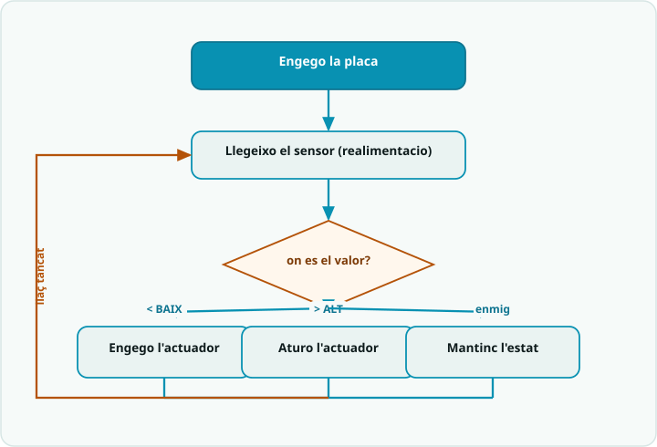

# SA6 · Diagrama de flux — Llaç tancat amb histèresi i màquina d'estats

> **Per a qui és?** Alumnat. És el mateix que fa el programa, però **dibuixat**. Mira'l **abans de programar**; després l'exemple resolt i el codi.

## El flux

## Llegenda
- Caixa **fosca** = **inici**.
- Caixa **teal** `[ ... ]` = una **acció** (una instrucció o bloc de codi).
- **Rombe ambre** `< ... ? >` = una **decisió** (`if`): en surt una branca per cada cas.
- **Fletxa ambre** = **bucle**: torna enrere i es repeteix.

## Del diagrama al codi
- `[ nivell = analogRead(SENSOR) ]` → `int nivell = analogRead(SENSOR);` — la realimentació del **llaç tancat**: es llegeix a cada volta, mai dins d'un `delay` llarg.
- `< en quin ESTAT som? >` → `switch (estat)` amb `enum Estat { REPOS, OMPLINT, ALARMA }` — la **màquina d'estats**: cada estat té la seva acció i les seves transicions.
- **Histèresi (dos llindars, zona morta):** en REPÒS engego **només** `if (nivell < NIVELL_BAIX)`; en OMPLINT aturo **només** `if (nivell > NIVELL_ALT)`. Entre `BAIX` i `ALT` cada estat **manté** el que feia → sense «clic-clic».
- `< massa estona? >` → `if (millis() - tEstat > TEMPS_MAX)` passa a **ALARMA** (patró no bloquejant); del polsador (`INPUT_PULLUP`, premut = `LOW`) es **rearma** cap a REPÒS.
