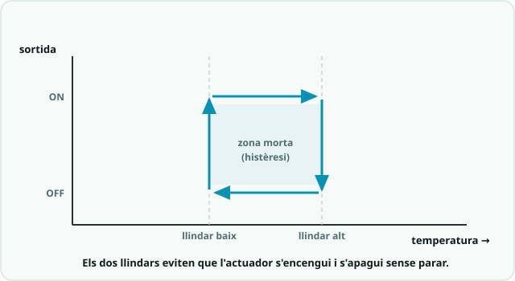

# SA6 · Exemple resolt (model «jo ho faig») — Dipòsit d'aigua que es reomple sol

> 🧑‍🎓 **Quan toca mirar-lo?** Després del teu **primer intent** amb la histèresi de l'**Activitat 2 (S2)** i la màquina d'estats de l'**Activitat 3 (S3)** — mai abans. És un problema **anàleg** per veure *com es pensa* un llaç tancat, no la solució del teu producte.

> 🔗 **D'on ve i on va.** Aquest exemple és el **bessó comentat** de la pràctica [Termòstat amb histèresi: dos llindars contra el clic-clic](codi/02_termostat_histeresi/EXPLICACIO.md) — i hi suma la [màquina d'estats de la Pràctica 3](codi/03_maquina_estats/EXPLICACIO.md): la mateixa histèresi amb la lògica **girada** (la bomba engega quan el sensor **baixa**) i un context expressament diferent. Serveix per veure **com es pensa**, no per copiar-lo. Quan l'hagis entès, torna a la pàgina de la pràctica i fes-la teva.

> 🗺️ **Com es llegeix per apartats:** **🔑 El repte model** primer, per situar-te · **🧭 Com ho penso** abans d'escriure el **teu** codi (és l'apartat més important: el raonament) · **💡 La solució anotada** només **després del teu intent**, per comparar · **🔬 Provo i mesuro** quan provis el teu: copia'n el **mètode**, no el resultat · **⚠️ Contraexemple** quan una cosa no rutlli — i com a repàs abans d'entregar · **📔 Diari de bord** quan escriguis la teva entrada del quadern.

> **Nota docent:** mostra'l **després del primer intent** amb `02_termostat_histeresi.ino`
> i `03_maquina_estats.ino`, mai abans. No és la solució del producte (S3, la prova T2): és un
> problema **anàleg** resolt pas a pas perquè l'alumnat vegi *com es pensa* un llaç tancat, no
> què s'ha de copiar. Comenta en veu alta el pas «🧭 Com ho penso» (predicció abans de codi,
> PRIMM) i el «⚠️ Contraexemple».

---



## 🔑 El repte model

> Controlar el **nivell d'un dipòsit d'aigua**: una **bomba** l'omple quan el nivell baixa
> massa i **s'atura** quan ja és prou ple. La bomba **no ha de fer «clic-clic»** quan el nivell
> queda a prop del punt objectiu (**histèresi**, dos llindars). A més, si la bomba porta massa
> estona en marxa sense que pugi el nivell (potser la font és buida), el sistema entra en
> **ALARMA** i espera que algú el rearmi.

Fa servir només conceptes de la SA6: **llaç tancat** (sensor → decisió → actuador),
**histèresi** amb dos llindars, **màquina d'estats** (`enum`/`switch`) i **`millis()`** sense
bloquejar. El muntatge és el mateix esquema de la SA6: **sensor a A0**, **sortida a 9~**
(bomba via transistor/relé), **LED verd/vermell a 7/8** i **polsador a 2** (`INPUT_PULLUP`).

> ⚠️ Fixa't que la lògica és **al revés** que la del termòstat: aquí la bomba **s'engega quan
> el sensor baixa** (dipòsit buit), no quan puja. Entendre la histèresi és saber-la girar.

---

## 🧭 Com ho penso (abans d'escriure codi)

1. **Analitzo:** és un **llaç tancat**. Mesuro el nivell (A0), el comparo amb el que vull i
   decideixo si la bomba va o no. La realimentació és el sensor de nivell.
2. **Descomponc:** el comportament té **tres situacions clares** → **REPÒS** (ple, bomba
   aturada), **OMPLINT** (bomba en marxa) i **ALARMA** (fallada). Això demana una **màquina
   d'estats** (`enum`/`switch`), com al `03_maquina_estats.ino`.
3. **Evito el «clic-clic»:** si engego i apago al **mateix** valor, prop d'aquest valor la
   bomba vibrarà. Per això faig servir **dos llindars**: engego per sota de `NIVELL_BAIX` i
   només aturo per sobre de `NIVELL_ALT`. Entre els dos hi ha la **zona morta** (histèresi).
4. **No bloquejo:** per vigilar el temps de la bomba **no puc fer `delay(10000)`** (durant el
   `delay` no llegiria el sensor ni el polsador). Uso **`millis()`**, com a la bastida.
5. **🔮 PREDIU (fes-ho tu abans de llegir el codi):** amb `NIVELL_BAIX = 400` i
   `NIVELL_ALT = 600`, si el sensor marca **500** i la bomba estava **aturada**… s'engega?
   ☐ sí ☐ **no** (encara no ha baixat de 400). I si estava **en marxa** a 500? ☐ **segueix**
   ☐ s'atura. *(Pista: dins la zona morta, cada estat manté el que feia.)*

---

## 💡 La solució anotada

```cpp
/*
  SA6 - exemple_diposit_nivell.ino  (EXEMPLE MODEL, no es el producte)
  Control de nivell d'un diposit: la bomba l'omple amb HISTERESI (dos llindars)
  i una MAQUINA D'ESTATS (enum/switch) amb millis() per no bloquejar.
  Circuit (esquema SA6):
    - Sensor de nivell (o potenciometre) a A0   (0-1023: mes valor = mes ple)
    - Bomba a pin 9~  (SEMPRE via transistor o rele, mai directe)
    - LED verd (ple) a 7 ; LED vermell (omplint/alarma) a 8
    - Polsador de rearmament a pin 2 (INPUT_PULLUP)
*/

const int SENSOR   = A0;   // nivell d'aigua
const int BOMBA    = 9;    // sortida cap al transistor/rele
const int LED_VERD = 7;    // diposit prou ple
const int LED_VERM = 8;    // bomba en marxa o alarma
const int POLSADOR = 2;    // rearma l'alarma

// Dos llindars = HISTERESI (zona morta entre 400 i 600)
const int NIVELL_BAIX = 400;   // per sota: cal omplir -> engega bomba
const int NIVELL_ALT  = 600;   // per sobre: ja es prou ple -> atura bomba

// Seguretat: si la bomba porta massa estona omplint sense arribar dalt, alarma
const unsigned long TEMPS_MAX = 10000;  // 10 s en marxa continua

enum Estat { REPOS, OMPLINT, ALARMA };
Estat estat = REPOS;

unsigned long tEstat = 0;   // marca de temps d'entrada a l'estat

void canviaEstat(Estat nou) {
  estat = nou;
  tEstat = millis();        // reinicia el cronometre de l'estat
}

bool polsat() {
  return digitalRead(POLSADOR) == LOW;  // amb INPUT_PULLUP, premut = LOW
}

void setup() {
  pinMode(BOMBA, OUTPUT);
  pinMode(LED_VERD, OUTPUT);
  pinMode(LED_VERM, OUTPUT);
  pinMode(POLSADOR, INPUT_PULLUP);
  Serial.begin(9600);
}

void loop() {
  int nivell = analogRead(SENSOR);   // realimentacio: sempre llegim el sensor

  switch (estat) {

    case REPOS:                          // diposit prou ple, bomba aturada
      digitalWrite(BOMBA, LOW);
      digitalWrite(LED_VERD, HIGH);
      digitalWrite(LED_VERM, LOW);
      // HISTERESI: nomes engego quan baixa del llindar BAIX
      if (nivell < NIVELL_BAIX) canviaEstat(OMPLINT);
      break;

    case OMPLINT:                        // bomba en marxa, omplint
      digitalWrite(BOMBA, HIGH);
      digitalWrite(LED_VERD, LOW);
      digitalWrite(LED_VERM, HIGH);
      // HISTERESI: nomes aturo quan puja del llindar ALT (no del mateix valor)
      if (nivell > NIVELL_ALT) {
        canviaEstat(REPOS);
      } else if (millis() - tEstat > TEMPS_MAX) {
        canviaEstat(ALARMA);             // massa estona sense omplir -> fallada
      }
      break;

    case ALARMA:                         // seguretat: bomba fora, avis
      digitalWrite(BOMBA, LOW);
      digitalWrite(LED_VERD, LOW);
      // parpelleig del vermell sense delay (millis)
      digitalWrite(LED_VERM, (millis() / 300) % 2);
      if (polsat()) { canviaEstat(REPOS); delay(200); }  // rearma
      break;
  }

  // Per al Serial Plotter: nivell i els dos llindars (per veure la zona morta)
  Serial.print(nivell);        Serial.print(" ");
  Serial.print(NIVELL_BAIX);   Serial.print(" ");
  Serial.println(NIVELL_ALT);
  delay(50);
}
```

**Per què està escrit així (🌟):**
- **Dos llindars amb nom** (`NIVELL_BAIX`, `NIVELL_ALT`) en lloc d'un sol número: la
  **histèresi** viu en aquesta distància i la puc ajustar en **un sol lloc**.
- **`enum`/`switch`**: cada situació és un **estat** amb el seu comportament i les seves
  **transicions**. El `loop()` es llegeix com el **diagrama d'estats** que he dibuixat.
- **`millis()`, mai `delay()` llarg**: així el `loop()` segueix **llegint el sensor i el
  polsador** mentre cronometra la bomba. La bomba i el parpelleig no bloquegen res.
- **Un `canviaEstat()`** que reinicia `tEstat`: no repeteixo `estat = ...; tEstat = millis();`
  a cada transició (menys errors).

---

## 🔬 Provo i mesuro

- **Predicció ✔:** amb el sensor a **500** dins la zona morta (400–600), l'estat **manté** el
  que feia: si estava en REPÒS, **no** engega; si estava OMPLINT, **segueix**. La histèresi és
  precisament aquesta memòria.
- **Serial Plotter:** veig **tres línies** (nivell + els dos llindars). El nivell puja mentre
  la bomba omple i baixa quan es consumeix, però **rebota entre les dues línies** sense vibrar.
  Si només hi hagués una línia, veuria el nivell «serrat» al voltant d'ella (clic-clic).
- **Amplada de la histèresi:** si acosto els llindars (450 i 550) la bomba arrenca més sovint;
  si els allunyo (300 i 700) arrenca menys però el nivell oscil·la més. **Trio segons el cas.**
- **Prova de l'alarma:** deixo el sensor per sota de `NIVELL_BAIX` (dipòsit que no puja) i, als
  **10 s**, el LED vermell **parpelleja**: ha saltat a ALARMA. En prémer el polsador, **rearma**.

---

## ⚠️ Contraexemple (errors típics i com es detecten)

- **Un sol llindar** (`if (nivell < 500) bomba ON; else OFF`) → prop de 500 la bomba fa
  **«clic-clic»** (s'engega i s'apaga moltes vegades per segon). *Causa:* sense zona morta.
  **Solució:** **dos llindars** (histèresi), com aquí.
- **Llindars girats** (`NIVELL_BAIX = 600`, `NIVELL_ALT = 400`) → la condició d'aturar es
  compleix abans que la d'engegar i la lògica queda **impossible** (o no s'atura mai). *Regla:*
  `NIVELL_BAIX` **sempre menor** que `NIVELL_ALT`.
- **Vigilar el temps amb `delay(10000)`** en lloc de `millis()` → durant aquests 10 s el
  programa **no llegeix el sensor ni el polsador**: sembla «penjat» i no pots rearmar. **Solució:**
  `millis() - tEstat > TEMPS_MAX` (patró no bloquejant de la SA4).
- **Connectar la bomba directament al pin 9** → el pin no dona prou corrent i **es fa malbé**
  (o la placa es reinicia). **Solució:** sempre **transistor o relé** entre el pin i el motor.
- **+Ampliació (control proporcional):** si passes de tot/res a proporcional i poses una **`Kp`
  massa gran**, la sortida **oscil·la** amunt i avall sense estabilitzar-se. **Solució:** baixar
  `Kp` i limitar amb `constrain(..., 0, 255)` (vegeu `04_control_proporcional.ino`).

---

## 📔 Diari de bord (entrada model, 1a persona)

> **Sessió 2–3:** He fet un control de nivell d'un dipòsit en **llaç tancat**: la bomba omple
> quan el sensor baixa de **400** i s'atura quan puja de **600**. Al principi la bomba feia
> **«clic-clic»** perquè engegava i apagava al **mateix** valor; ho he arreglat amb **dos
> llindars** (histèresi) i al **Serial Plotter** he vist que el nivell ja no vibra. Després hi
> he afegit una **màquina d'estats** (REPÒS / OMPLINT / ALARMA) amb **`millis()`** per detectar
> si la bomba porta massa estona en marxa, sense **bloquejar** la lectura del polsador.
> **Evidència:** captura del Serial Plotter (nivell entre els dos llindars) + diagrama d'estats.

**Per què és una bona entrada:** usa el **vocabulari clau** (llaç tancat, histèresi, dos
llindars, màquina d'estats, `millis()`), explica *el com*, i és **honesta amb la dificultat**
(el clic-clic) i com es va resoldre.

---

*Exemple resolt de la SA6. Model de treball per a l'alumnat (alliberament gradual: es mostra
després del primer intent). Es recolza en `codi/02_termostat_histeresi`, `codi/03_maquina_estats`
i, per a l'ampliació, `codi/04_control_proporcional`. Llicència CC BY-SA 4.0.*
