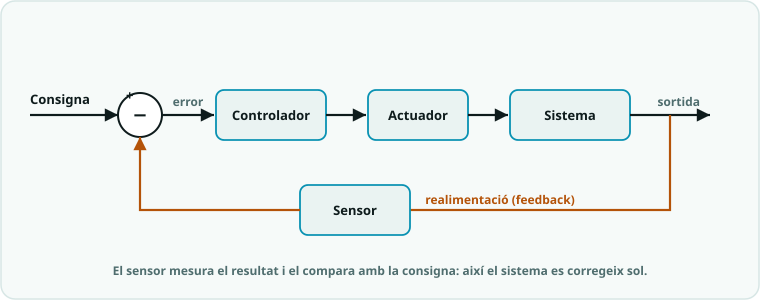

# SA6 · Qüestionari de conceptes (sistemes de control: llaç obert/tancat, histèresi i màquines d'estats)

> **Ús.** Comprovació breu dels conceptes de sistemes de control de la SA6.
> Es pot fer servir com a **repàs formatiu** o com a **prova curta qualificable**
> (10 preguntes × 1 punt = **nota 0-10**). Durada orientativa: **15-20 min**, individual.

> **📲 Fes-lo al Classroom.** Aquest qüestionari és una **tasca
> autocorrectiva** al Google Classroom del curs:
> **[obre «SA6 · Qüestionari de conceptes»](https://classroom.google.com/c/ODY4ODU4Njk0NTEy/a/ODcwNzAwNjYxNTc5/details)**
> (cal el compte del centre). Aquesta pàgina és la versió per repassar
> o fer en paper; les solucions són al full del docent.

**Nom:** ______________________  **Grup:** __________  **Data:** __________

---

## Preguntes (tria una resposta)

1. Quina és la diferència principal entre **llaç obert** i **llaç tancat**?
   - a) El llaç tancat mesura la sortida i corregeix segons l'error; el llaç obert no.
   - b) El llaç obert fa servir un sensor per corregir i el tancat no.
   - c) Són exactament el mateix.
   - d) El llaç tancat no fa servir cap sensor.

2. La **realimentació** (*feedback*) en un sistema de control consisteix a…
   - a) Un tipus de sensor de temperatura.
   - b) Apagar el sistema quan hi ha un error.
   - c) Mesurar la sortida real i tornar-la a l'entrada per comparar-la amb la consigna.
   - d) Augmentar la velocitat del programa.

3. La **consigna** (*setpoint*) és…
   - a) El valor que mesura el sensor en cada moment.
   - b) L'error del sistema.
   - c) La sortida de l'actuador.
   - d) El valor desitjat que volem que el sistema assoleixi.

4. En un llaç tancat, l'**error** es calcula normalment com…
   - a) `error = consigna * mesura`
   - b) `error = consigna - mesura`
   - c) `error = mesura + actuador`
   - d) `error = sensor / consigna`

5. La **histèresi** en un termòstat consisteix a…
   - a) Usar dos llindars diferents: un per encendre i un altre per apagar.
   - b) Encendre i apagar amb un únic llindar.
   - c) No fer servir cap sensor.
   - d) Augmentar la temperatura sense límit.

6. Si controlem un ventilador amb **un sol llindar** (sense histèresi), a prop de la consigna…
   - a) El ventilador queda apagat per sempre.
   - b) El sensor deixa de funcionar.
   - c) És el comportament ideal, no passa res.
   - d) El ventilador s'encén i s'apaga contínuament (parpelleig/oscil·lació).

7. Una **màquina d'estats** a Arduino s'implementa habitualment amb…
   - a) Només amb `delay()`.
   - b) Un `enum` per als estats i un `switch` per decidir què fer a cada estat.
   - c) Amb `analogRead()` únicament.
   - d) Amb `Serial.begin()`.

8. Per fer una màquina d'estats que **no es bloquegi** (que segueixi atenta als sensors) fem servir…
   - a) `delay()` a cada estat.
   - b) Apagar la placa entre estats.
   - c) `millis()` per controlar el temps sense aturar el programa.
   - d) `pinMode()`.

9. En el **control proporcional**, l'actuació sobre l'actuador…
   - a) És proporcional a l'error: com més gran l'error, més forta la correcció.
   - b) És sempre màxima o mínima (tot o res).
   - c) No depèn de l'error.
   - d) Depèn només del temps transcorregut.

10. Si en un control proporcional la constant `Kp` és **massa gran**, el sistema…
    - a) Es queda sempre apagat.
    - b) Deixa de necessitar el sensor.
    - c) Es converteix en un llaç obert.
    - d) Tendeix a oscil·lar (es pot limitar la sortida amb `constrain`).

---

## Pregunta oberta (opcional)

11. Dibuixa o descriu en paraules el **diagrama de blocs d'un llaç tancat**, i identifica-hi
    la **consigna**, l'**error**, l'**actuador**, el **sensor** i la **realimentació**:

___________________________________________________________________

___________________________________________________________________

---

*Qüestionari de conceptes de la SA6. Es recolza en `SA6_fitxa_alumnat.md`, `SA6_guia_docent.md`
i `SA6_esquemes_connexions.md` (sistemes de control). Llicència CC BY-SA 4.0.*
