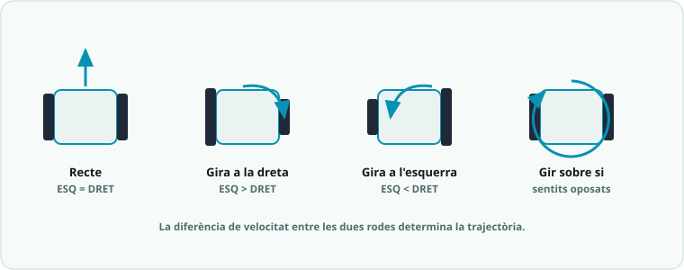

# SA7 · Robòtica mòbil: cinemàtica i trajectòries

Setena situació d'aprenentatge (**8 h · 4 sessions** + sessió 0 de muntatge, 3r trimestre). El robot **es mou sol**: control diferencial de motors, **trajectòries** programades (quadrat, recorregut) i **comportaments autònoms** (evita-obstacles amb ultrasons, seguidor de línia amb IR), amb proves i **iteració**. Maquinari: **el teu rover**, el robot que la teva parella munta a la **sessió 0** ([dossier del rover](../00_General/00_Projecte_T3_Rover.md)); la placa Imagina 3dBot queda de **reserva** (pla B). Programació oficial: [`Programació didàctica/16_SA7_Robotica_mobil.md`](../../Programació%20didàctica/16_SA7_Robotica_mobil.md).

> ⚙️ **Important:** cada `.ino` té un bloc `// === PINS (AJUSTAR) ===`. Amb el **rover propi**, els pins són els de la [taula de cablatge del dossier](../00_General/00_Projecte_T3_Rover.md) — es fixen **una sola vegada** i valen per a tota l'aula. Si treballes amb la 3dBot de reserva, els pins dels motors **depenen del model**: posa-hi els reals abans de pujar. La lògica no s'ha de tocar.

## 📦 Què has d'entregar

| Quan | Lliurable | On es lliura |
|---|---|---|
| S1 | [Activitat 1 · Moviment i cinemàtica](SA7_fitxa_alumnat.md#1-moviment-i-cinematica-s1) | [Tasca de Classroom](https://classroom.google.com/c/ODY4ODU4Njk0NTEy/a/ODcwNTE4MDMwMTA4/details) |
| S2 | [Activitat 2 · Trajectòries programades](SA7_fitxa_alumnat.md#2-trajectories-s2) | Mateixa tasca de Classroom |
| S3 | [Activitat 3 · Evitar obstacles](SA7_fitxa_alumnat.md#3-evita-obstacles-s3) | Mateixa tasca de Classroom |
| S4 | [Activitat 4 · Seguidor de línia + repte de pista](SA7_fitxa_alumnat.md#4-seguidor-de-linia-repte-de-pista-s4) | Mateixa tasca de Classroom |
| ⭐ | [Repte triat (A, B o C)](../../Reptes/Reptes_SA7.md) | El docent el valida i pinteu l'estrella al [tauler de reptes](../00_General/00_Tauler_reptes.md) |
| 📓 | Full del quadern tècnic de cada sessió | En paper, en acabar la sessió |
| 🤖 | El rover muntat i funcionant | és la plataforma de tota la SA: [dossier del rover](../00_General/00_Projecte_T3_Rover.md) |

## Itinerari per sessions

> La teva feina és a la **[fitxa base](SA7_fitxa_alumnat.md)**. Aquesta ruta et diu què toca fer a cada sessió i què necessites en aquell moment. Les respostes de la fitxa es lliuren a la **[tasca de Classroom](https://classroom.google.com/c/ODY4ODU4Njk0NTEy/a/ODcwNTE4MDMwMTA4/details)**.

0. **Sessió 0 · Muntatge del rover** — abans de començar, la teva parella construeix el rover: peces, muntatge pas a pas, cablatge i test de fum al **[dossier del rover](../00_General/00_Projecte_T3_Rover.md)** (hi ha el pla de la sessió sencer).
1. **Sessió 1 · Moviment i cinemàtica diferencial** — fes l'[Activitat 1 de la fitxa](SA7_fitxa_alumnat.md#1-moviment-i-cinematica-s1) (ajusta els pins del teu robot al bloc `// === PINS (AJUSTAR) ===` de cada `.ino`).
2. **Sessió 2 · Trajectòries programades** — fes l'[Activitat 2](SA7_fitxa_alumnat.md#2-trajectories-s2).
3. **Sessió 3 · Evitar obstacles** — fes l'[Activitat 3](SA7_fitxa_alumnat.md#3-evita-obstacles-s3), amb els [esquemes de connexió](SA7_esquemes_connexions.md).
4. **Sessió 4 · Seguidor de línia + repte de pista** — fes l'[Activitat 4](SA7_fitxa_alumnat.md#4-seguidor-de-linia-repte-de-pista-s4), amb el [codi](codi/) (s'avalua amb R1, R3, R4).
5. **Abans d'entregar** — repassa [el meu checklist](SA7_checklist_alumnat.md).

### Si vols més

- [Fitxa ampliada](SA7_fitxa_ampliada.md) — aprofundiment i ampliacions.
- [Recursos de vídeo](SA7_recursos_video_IA.md) — material de suport.
- [Reptes de la SA7](../../Reptes/Reptes_SA7.md) — tria el teu context.

<!-- web:only-github -->
## Contingut

| Fitxer | Descripció |
|---|---|
| [`SA7_guia_docent.md`](SA7_guia_docent.md) | Guia del professorat: objectius, 4 sessions, mètode de projecte, mapa d'avaluació i errors freqüents. |
| [`SA7_fitxa_alumnat.md`](SA7_fitxa_alumnat.md) | **Fitxa base** (nucli d'una cara, per a tot l'alumnat): Activitats 1-4 + quadern. |
| [`SA7_fitxa_ampliada.md`](SA7_fitxa_ampliada.md) | **Versió ampliada** (aprofundiment): totes les rutines (rols, coavaluació, exit ticket, ODS, PC) i ampliacions. |
| [`SA7_checklist_docent.md`](SA7_checklist_docent.md) | **Checklist docent** (una cara): logística prèvia, punts de control per sessió, avaluació i diversitat. |
| [`SA7_checklist_alumnat.md`](SA7_checklist_alumnat.md) | **Checklist alumnat** (una cara): què he de fer/lliurar + autoavaluació amb semàfor. |
| [`SA7_esquemes_connexions.md`](SA7_esquemes_connexions.md) | Esquemes i connexions (motors, sensors de línia/distància). |
| `codi/` | Sketches d'Arduino (vegeu la taula següent). |

### Codi (`codi/`)

| Sketch | Què mostra |
|---|---|
| `01_moviment_basic.ino` | Funcions de moviment i cinemàtica diferencial. |
| `02_trajectoria_quadrat.ino` | Trajectòria programada i calibratge del gir de 90°. |
| `03_evita_obstacles.ino` | Comportament reactiu (llaç tancat) amb ultrasons. |
| `04_seguidor_linia.ino` | Seguidor de línia amb sensors IR. |

<!-- /web:only-github -->

## Producte i avaluació

- **Producte:** robot mòbil que completa un repte autònom (seguir línia o evitar obstacles) amb codi modular i **registre d'iteracions**.
- **Criteris:** CA4.1, CA3.1, CA1.1 · **Rúbriques:** **R1** (codi), **R3** (robot/control), **R4** (documentació).

## Continuïtat

Ve de la **SA6** (control: llaç tancat i màquines d'estats) i porta a la **SA8** (IoT i IA). Aquí el control es posa **en moviment**; després el robot es **connectarà** i prendrà **decisions intel·ligents**.
