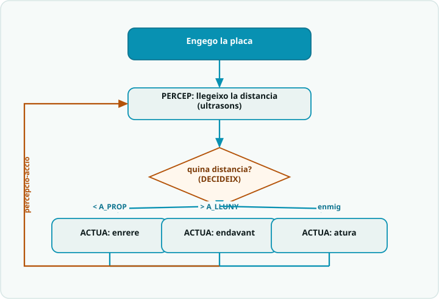

# SA7 · Diagrama de flux — Robot mòbil reactiu (percepció → decisió → acció)

> **Per a qui és?** Alumnat. És l'**evita-obstacles** de l'**Activitat 3 (S3)**, però **dibuixat** — el cicle *percep → decideix → actua* de tota la SA. Mira'l **abans de programar** aquella activitat; després l'exemple resolt i el codi.

## El flux

## Llegenda
- Caixa **fosca** = **inici**.
- Caixa **teal** `[ ... ]` = una **acció** (una instrucció o bloc de codi).
- **Rombe ambre** `< ... ? >` = una **decisió** (`if`): en surt una branca per cada cas.
- **Fletxa ambre** = **bucle**: torna enrere i es repeteix.

## Del diagrama al codi
- `[ d = distancia() ]` → `float d = distancia();` — **PERCEPCIÓ**: una lectura de l'ultrasons per cicle.
- `< d < A_PROP ? >` i `< d > A_LLUNY ? >` → `if (d < A_PROP) {...} else if (d > A_LLUNY) {...} else {...}` — **DECISIÓ**: dos llindars, tres situacions.
- Branques → `enrere()` (massa a prop), `endavant()` (via lliure), `atura()` (zona de confort) — **ACCIÓ**: crido la funció de moviment.
- El bucle és el `loop()`: **percep → decideix → actua** → `delay(50)` → torna a començar. Aquest cicle és el cor de la SA7.
