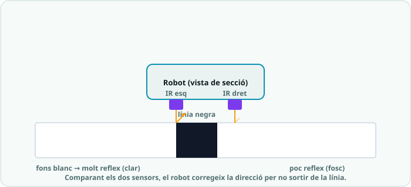

# SA7 · Exemple resolt (model «jo ho faig») — El robot prudent que manté la distància

> 🧑‍🎓 **Quan toca mirar-lo?** Després del teu **primer intent** amb l'evita-obstacles de l'**Activitat 3 (S3)** — mai abans. És un comportament **anàleg** (mantenir la distància, no esquivar) per veure *com es pensa*, no una solució per copiar.

> **Nota docent:** mostra'l **després del primer intent** amb `03_evita_obstacles.ino`, mai abans.
> No és la solució del repte de pista (S3/S4): és un problema **anàleg** resolt pas a pas perquè
> l'alumnat vegi *com es pensa* un comportament autònom, no què s'ha de copiar. Comenta en veu
> alta el pas «🧭 Com ho penso» (predicció abans de codi, PRIMM) i el «⚠️ Contraexemple». Aquí el
> robot **manté una distància**, no esquiva: així no és calcable com a evita-obstacles ni seguidor.

---



## 🔑 El repte model

> Fer un **robot prudent**: mira endavant amb l'ultrasons i **manté una distància de seguretat** a
> l'objecte que té al davant. Si s'hi acosta massa, **recula**; si té via lliure, **avança**; i si
> és a la distància justa, **s'atura i espera**. Comportament reactiu, sense girs ni línia.

Fa servir només conceptes de la SA7: **funcions de moviment** amb control diferencial (`endavant()`,
`enrere()`, `atura()`), **percepció** amb ultrasons (`distancia()`) i un **`loop()` reactiu**
percepció → decisió → acció. El punt crític és el mateix que al producte: **el bloc de pins s'ha
d'ajustar** i **els llindars s'han de calibrar**.

---

## 🧭 Com ho penso (abans d'escriure codi)

1. **Analitzo:** hi ha **tres situacions** segons la distància (massa a prop / justa / lliure) i
   **una acció per a cadascuna** (reculo / m'aturo / avanço). Això és un `if … else if … else` sobre
   una sola lectura del sensor.
2. **Descomponc:** faré **una funció per moviment** (`endavant()`, `enrere()`, `atura()`) i **una
   funció de percepció** (`distancia()`), com als sketches reals. Així el `loop()` queda net i es
   llegeix com la frase *«percebo → decideixo → actuo»*.
3. **Trio dos llindars, no un:** una distància per a «massa a prop» (`A_PROP`) i una altra per a
   «via lliure» (`A_LLUNY`), i entre totes dues una **zona de confort** on m'aturo. Amb un sol
   llindar el robot **oscil·laria** (avança-recula sense parar) just al límit.
4. **🔮 PREDIU (fes-ho tu abans de llegir el codi):** amb `A_PROP = 10` i `A_LLUNY = 20`, si el
   sensor mesura **15 cm**, el robot… ☐ avança ☐ recula ☐ **s'atura**. I si mesura **8 cm** →
   ______________ . I si no hi ha res al davant (`distancia()` retorna 400) → ______________ .

---

## 💡 La solució anotada

```cpp
/*
  SA7 - exemple_robot_prudent.ino  (EXEMPLE MODEL, no es el producte)
  Robot "prudent": mante una distancia de seguretat a l'objecte del davant.
    - Massa a prop      -> recula
    - Zona de confort   -> s'atura i espera
    - Via lliure (lluny)-> avanca
  Cicle reactiu: PERCEPCIO (distancia) -> DECISIO (if) -> ACCIO (motors).

  === PINS (AJUSTAR segons el manual de la teva placa) ===
  Cada motor te un pin de DIRECCIO i un de VELOCITAT (PWM).
*/

const int ESQ_DIR = 4, ESQ_VEL = 5, DRET_DIR = 7, DRET_VEL = 6;  // motors  <-- AJUSTAR
const int TRIG = 12, ECHO = 11;     // ultrasons frontal                    <-- AJUSTAR

const int VEL = 160;                // velocitat de marxa (0-255)
const int A_PROP  = 10;             // cm: per sota d'aixo, massa a prop -> recula
const int A_LLUNY = 20;             // cm: per sobre d'aixo, via lliure  -> avanca
// Entre A_PROP i A_LLUNY hi ha la "zona de confort": el robot s'atura.
// A_PROP ha de ser SEMPRE menor que A_LLUNY (si no, la zona de confort desapareix).

// --- Funcions de moviment (control diferencial) ---
void motors(int dirEsq, int velEsq, int dirDret, int velDret) {
  digitalWrite(ESQ_DIR, dirEsq);   analogWrite(ESQ_VEL, velEsq);
  digitalWrite(DRET_DIR, dirDret); analogWrite(DRET_VEL, velDret);
}
void endavant() { motors(HIGH, VEL, HIGH, VEL); }   // dues rodes igual = recte
void enrere()   { motors(LOW,  VEL, LOW,  VEL); }
void atura()    { analogWrite(ESQ_VEL, 0); analogWrite(DRET_VEL, 0); }

// --- Percepcio: distancia a l'obstacle, en cm ---
float distancia() {
  digitalWrite(TRIG, LOW);  delayMicroseconds(2);
  digitalWrite(TRIG, HIGH); delayMicroseconds(10);
  digitalWrite(TRIG, LOW);
  long t = pulseIn(ECHO, HIGH, 30000);   // timeout 30 ms (no bloqueja per sempre)
  if (t == 0) return 400;                // res detectat -> molt lluny
  return t * 0.034 / 2.0;                // temps (us) -> distancia (cm), anada i tornada
}

void setup() {
  pinMode(ESQ_DIR, OUTPUT);  pinMode(ESQ_VEL, OUTPUT);
  pinMode(DRET_DIR, OUTPUT); pinMode(DRET_VEL, OUTPUT);
  pinMode(TRIG, OUTPUT);     pinMode(ECHO, INPUT);   // TRIG surt, ECHO entra
}

void loop() {
  float d = distancia();          // 1) PERCEPCIO: mesuro una vegada per cicle

  if (d < A_PROP) {               // 2) DECISIO
    enrere();                     // 3) ACCIO: massa a prop -> recula
  } else if (d > A_LLUNY) {
    endavant();                   //    via lliure -> avanca
  } else {
    atura();                      //    zona de confort -> espera
  }

  delay(50);                      // ritme del cicle: prou curt per reaccionar de pressa
}
```

**Per què està escrit així (🌟):**
- **Funcions de moviment i de percepció separades:** el `loop()` es llegeix com *«percebo →
  decideixo → actuo»*. És el mateix esquelet que `03_evita_obstacles.ino`, però amb una decisió
  diferent (mantenir distància en lloc d'esquivar).
- **Constants amb nom** (`A_PROP`, `A_LLUNY`, `VEL`): calibro tocant **un sol lloc**, sense buscar
  números perduts dins del codi.
- **Dos llindars amb zona de confort:** evita l'oscil·lació al límit. És una versió minúscula del
  concepte d'**histèresi** (mateixa idea que el llaç tancat de la SA6).
- **`delay(50)` curt i no bloquejant:** dins de cada branca **no** poso esperes llargues, així el
  robot torna a mesurar de seguida i no queda «cec» mentre es mou.

---

## 🔬 Provo i mesuro

- **Predicció ✔:** amb 15 cm → **s'atura** (és entre 10 i 20); amb 8 cm → **recula**; sense res al
  davant (`400`) → **avança**.
- **Racó de mesura (regle + objecte):** poso una capsa a **exactament 12 cm** i comprovo què fa.
  Si tremola (avança-recula), **separo més** `A_PROP` i `A_LLUNY` (amplio la zona de confort).
- **Calibratge del llindar:** amb la mà a diferents distàncies i el `distancia()` obro el **Monitor
  sèrie** (si l'afegeixo) per veure els cm reals; ajusto `A_PROP`/`A_LLUNY` a la meva pista i objecte.
- Si vull que sigui **més cauto**, apujo `A_PROP`; si vull que s'acosti més, l'abaixo.

---

## ⚠️ Contraexemple (errors típics i com es detecten)

- **Poso `A_PROP = 20` i `A_LLUNY = 10`** (invertits) → la «zona de confort» desapareix i el robot
  **no s'atura mai** o fa coses rares. *Regla:* `A_PROP` **sempre menor** que `A_LLUNY`.
- **Fico un `delay(500)` dins de `enrere()` al `loop()`** «perquè reculi una estona» → durant mig
  segon el robot **no mesura** i es queda cec; pot xocar. Igual que fiar el gir **al temps**, és
  imprecís: en un cicle reactiu, **mou i torna a mesurar de seguida** (deixa els `delay` curts).
- **No calibro els llindars** i deixo els valors per defecte → amb una altra superfície/objecte el
  robot s'atura massa lluny o massa a prop. Els llindars **depenen de la pista**: cal mesurar-los.
- **Intercanvio `TRIG` i `ECHO`** (o oblido `pinMode(ECHO, INPUT)`) → `distancia()` retorna sempre
  **0** o **400** i el robot sempre avança o sempre recula. Revisa que **TRIG surt** i **ECHO entra**.
- **Poso `analogWrite` a un pin de velocitat que no és PWM (`~`)** → el motor va a tota o res i no
  gradua. Els pins de velocitat han de ser PWM (3, 5, 6, 9, 10, 11): revisa el bloc de pins.

---

## 📔 Diari de bord (entrada model, 1a persona)

> **Sessió 3:** He fet un **robot prudent** que manté la distància amb l'ultrasons. El `loop()`
> segueix el cicle **percepció → decisió → acció**: llegeixo `distancia()`, decideixo amb un
> `if/else if/else` i crido `enrere()`, `endavant()` o `atura()`. Al principi el robot **tremolava**
> just al límit: avançava i reculava sense parar. Ho vaig arreglar posant **dos llindars** (`A_PROP`
> i `A_LLUNY`) amb una **zona de confort** al mig, en comptes d'un de sol. També vaig haver de
> **calibrar** els cm mesurant amb un regle, perquè els valors per defecte no anaven amb la meva
> capsa. **Evidència:** vídeo del robot mantenint la distància + taula de calibratge (cm ↔ acció).

**Per què és una bona entrada:** usa el **vocabulari clau** (percepció→decisió→acció, llindar, zona
de confort, calibrar), explica *el com*, i és **honesta amb la dificultat** (l'oscil·lació) i com es
va resoldre.

---

*Exemple resolt de la SA7. Model de treball per a l'alumnat (alliberament gradual: es mostra
després del primer intent). Es recolza en `codi/01_moviment_basic` i `codi/03_evita_obstacles`.
Llicència CC BY-SA 4.0.*
