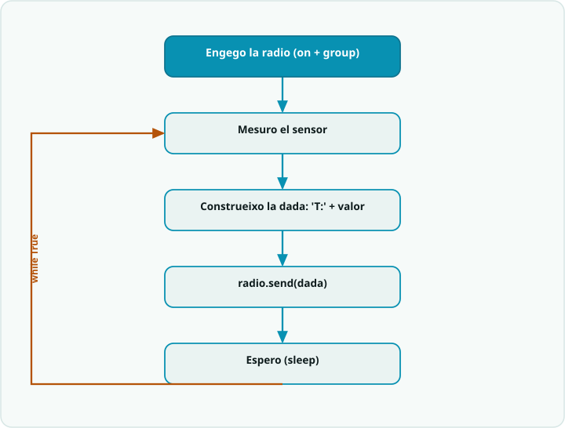

# SA8 · Diagrama de flux — Telemetria IoT (micro:bit + MicroPython)

> **Per a qui és?** Alumnat. És el mateix que fa el programa, però **dibuixat**. Mira'l **abans de programar**; després l'exemple resolt i el codi.

## El flux

## Llegenda
- Caixa **fosca** = **inici**.
- Caixa **teal** `[ ... ]` = una **acció** (una instrucció o bloc de codi).
- **Rombe ambre** `< ... ? >` = una **decisió** (`if`): en surt una branca per cada cas.
- **Fletxa ambre** = **bucle**: torna enrere i es repeteix.

## Del diagrama al codi
- **Engegar la ràdio (fora del bucle)** → `radio.on()` i `radio.config(group=GROUP)` a **totes dues** plaques, **abans** del `while True:` i amb el **mateix** `GROUP`.
- **Emissora: mesuro → etiqueto → envio → espero** → `valor = temperature()`, `radio.send("T:" + str(valor))`, `sleep(PERIODE)`. La dada va **etiquetada** i com a **text** (`str(...)`).
- **Receptora: rebo → registro → interpreto** → `missatge = radio.receive()`; si no és `None`, `print(missatge)` i `etiqueta, valor = missatge.split(":")`.
- **Regla del llindar** → `if int(valor) > LLINDAR:` mostra l'**avís** (`display.show`), `else:` tot OK.
