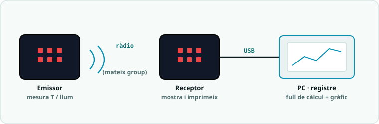

# SA8 · Exemple resolt (model «jo ho faig») — Sensor de moviment sense fils

> 🧑‍🎓 **Quan toca mirar-lo?** Després del teu **primer intent** amb la telemetria de l'**Activitat 1 (S1)** — mai abans. És un problema **anàleg** (una altra magnitud) per veure *com es pensa*, no la solució del teu producte.

> 🗺️ **Com es llegeix per apartats:** **🔑 El repte model** primer, per situar-te · **🧭 Com ho penso** abans d'escriure el **teu** codi (és l'apartat més important: el raonament) · **💡 La solució anotada** només **després del teu intent**, per comparar · **🔬 Provo i mesuro** quan provis el teu: copia'n el **mètode**, no el resultat · **⚠️ Contraexemple** quan una cosa no rutlli — i com a repàs abans d'entregar · **📔 Diari de bord** quan escriguis la teva entrada del quadern.

> 🔗 **D'on ve i on va.** Aquest exemple és el **bessó comentat** de la parella de pràctiques [Telemetria, l'emissor](codi/01_telemetria_emissor_EXPLICACIO.md) i [Telemetria, el receptor](codi/02_telemetria_receptor_EXPLICACIO.md): el mateix esquema emissor/receptor amb una magnitud expressament diferent (moviment en lloc de temperatura/llum) — serveix per veure **com es pensa**, no per copiar-lo. Quan l'hagis entès, torna a les pàgines de les pràctiques i fes-les teves.

> **Nota docent:** mostra'l **després del primer intent** amb `01_telemetria_emissor.py`
> i `02_telemetria_receptor.py`, mai abans. No és la solució del producte (telemetria de
> temperatura/llum): és un problema **anàleg** —una magnitud diferent— resolt pas a pas
> perquè l'alumnat vegi *com es pensa* la telemetria, no què s'ha de copiar. Comenta en veu
> alta el pas «🧭 Com ho penso» (predicció abans de codi, PRIMM) i el «⚠️ Contraexemple».

---



## 🔑 El repte model

> Fer un **sensor de moviment sense fils**: una micro:bit **emissora** mesura la **força del
> moviment** (quant es belluga o rep un cop) i l'envia per ràdio; una altra micro:bit
> **receptora** la rep, la **registra pel port sèrie** i **avisa** amb una alerta quan es
> supera un llindar (p. ex. algú ha mogut o colpejat l'objecte vigilat).

Fa servir només conceptes de la SA8: `radio.on()`, `radio.config(group=...)`, `radio.send()`,
`radio.receive()`, **dades etiquetades** (`"M:1200"`) i una **regla de llindar**. La magnitud
(`accelerometer.get_strength()`) és **diferent** de la del producte (temperatura/llum): l'esquema
emissor/receptor és el mateix, però el sistema no.

---

## 🧭 Com ho penso (abans d'escriure codi)

1. **Analitzo:** la telemetria és *mesurar en un lloc i transmetre a un altre*. Aquí hi ha **dues
   plaques** amb papers diferents: una **mesura i envia** (emissora), l'altra **rep i decideix**
   (receptora). Cada una té el seu programa.
2. **Descomponc:** l'emissora fa un bucle *mesura → etiqueta → envia → espera*. La receptora fa
   *rep → imprimeix → interpreta l'etiqueta → aplica la regla del llindar*. Etiquetar la dada
   (`"M:"` de moviment) és el que després em permet separar-la sense confondre-la.
3. **🔮 PREDIU (fes-ho tu abans de llegir el codi):** si les dues plaques tenen `group`
   **diferent**, la receptora mostrarà… ☐ les dades ☐ **res**. I `accelerometer.get_strength()`
   amb la placa **quieta sobre la taula** valdrà aproximadament… ☐ 0 ☐ **~1024** ☐ ~3000
   *(pista: la gravetat sempre hi és).*

---

## 💡 La solució anotada

**Placa EMISSORA** (mesura i envia):

```python
# SA8 - exemple_moviment_emissor.py  (EXEMPLE MODEL, no es el producte)
# Sensor de moviment sense fils: mesura la forca del moviment i l'envia per radio.
# L'emissora i la receptora han de compartir el MATEIX group.

from microbit import *
import radio

GROUP = 15         # emissora i receptora: MATEIX numero (canvia'l per equip)
PERIODE = 500      # ms entre enviaments: com mes petit, mes sovint envia

radio.on()                    # SEMPRE primer: engega la radio
radio.config(group=GROUP)     # tria el "canal" comu amb la receptora

while True:
    forca = accelerometer.get_strength()   # intensitat total del moviment (mil-li-g)

    # Enviem la dada ETIQUETADA: "M:" (moviment) + el valor com a TEXT
    radio.send("M:" + str(forca))

    display.show(Image.ARROW_N)   # indicador visual d'enviament
    sleep(PERIODE)
```

**Placa RECEPTORA** (rep, registra i avisa):

```python
# SA8 - exemple_moviment_receptor.py  (EXEMPLE MODEL, no es el producte)
# Rep la forca de moviment per radio, la imprimeix pel serie i avisa si es supera un llindar.

from microbit import *
import radio

GROUP = 15          # MATEIX group que l'emissora
LLINDAR = 1500      # per sobre: "moviment fort / cop" (quiet es ~1024)

radio.on()                    # engega la radio abans de rebre
radio.config(group=GROUP)

while True:
    missatge = radio.receive()        # None si no ha arribat res
    if missatge is not None:
        print(missatge)               # REGISTRE pel port serie (per graficar despres)

        # Interpretem "M:1200": separem etiqueta i valor pel ":"
        try:
            etiqueta, valor = missatge.split(":")
            forca = int(valor)                 # el text "1200" passa a numero
            if forca > LLINDAR:
                display.show(Image.NO)         # ALERTA: algu ha mogut l'objecte
            else:
                display.show(Image.YES)        # tot tranquil
        except:
            display.show(Image.CONFUSED)       # missatge inesperat o mal etiquetat
    sleep(50)
```

**Per què està escrit així (🌟):**
- **`radio.on()` i `radio.config(group=...)` a totes dues plaques**, i el **mateix `GROUP`**: és
  el que fa que es "sentin". El `group` és com sintonitzar la mateixa emissora de ràdio.
- **Dada etiquetada** (`"M:" + str(forca)`) en lloc del número sol: la receptora pot **separar**
  l'etiqueta del valor amb `split(":")` i sap *què* està rebent (com al producte amb `"T:.."`).
- **Constants amb nom** (`GROUP`, `PERIODE`, `LLINDAR`): canvio el canal, el ritme o la
  sensibilitat en **un sol lloc**.
- **`try/except`** a la receptora: si arriba un missatge estrany, no peta el programa; mostra
  `CONFUSED` i segueix. La telemetria real també ha de sobreviure a dades dolentes.

---

## 🔬 Provo i mesuro

- **Predicció ✔:** amb `group` diferent la receptora mostra **res** (no arriba cap missatge).
  Amb la placa quieta, `get_strength()` val **~1024** (la gravetat), no 0.
- **Racó de mesura (port sèrie):** obro el REPL/monitor sèrie de la receptora i **llegeixo els
  valors reals**: quieta ~1024, un copet ~2000, una sacsejada forta >3000. **Amb aquests números
  fixo el `LLINDAR`** (1500 deixa passar el repòs i salta amb un cop). *Mesurar abans de decidir
  el llindar, mai "a ull".*
- Si vull que avisi amb moviments més suaus → **abaixo** `LLINDAR`; si salta amb qualsevol cosa →
  l'**apujo**. Si vull més resolució temporal → **abaixo** `PERIODE`.

---

## ⚠️ Contraexemple (errors típics i com es detecten)

- **Poso `group` diferent a cada placa** (emissora `group=15`, receptora `group=10`) → la
  receptora **no rep mai res**, es queda en blanc. *Solució:* el **mateix** `radio.config(group=...)`
  a les dues plaques.
- **Oblido `radio.on()`** → la ràdio està **apagada**: `radio.send`/`radio.receive` **dona error**
  (la ràdio no arrenca). Sempre `radio.on()` **abans** d'enviar o rebre.
- **Envio la dada sense etiquetar** (`radio.send(str(forca))`, és a dir `"1200"`) → la receptora fa
  `split(":")`, no troba cap `:` i cau al `except` (`CONFUSED`). A més, si un dia envio dues
  magnituds, les **barrejaria**. *Solució:* etiquetar-la (`"M:" + str(forca)`).
- **Envio un número en lloc de text** (`radio.send(forca)`) → **error de tipus**: `radio.send()`
  només accepta **cadenes de text**. Cal convertir-lo amb `str(...)`; a la receptora es torna a
  número amb `int(...)`.

---

## 📔 Diari de bord (entrada model, 1a persona)

> **Sessió 1:** He fet un **sensor de moviment sense fils** amb dues micro:bit. L'**emissora**
> mesura `accelerometer.get_strength()` i l'envia **etiquetada** (`"M:1200"`); la **receptora** la
> rep, la **imprimeix pel sèrie** i mostra `NO` si passa del `LLINDAR`. Al principi no arribava res:
> tenia el **`group` diferent** a cada placa. En posar el mateix (`15`) ja va funcionar. He après
> que la **telemetria** és mesurar en un lloc i transmetre a un altre, i que **etiquetar la dada**
> (`M:`) és clau per interpretar-la bé, igual que el `T:`/`L:` del producte.
> **Evidència:** captura del port sèrie amb els valors registrats + vídeo de l'alerta en moure la placa.

**Per què és una bona entrada:** usa el **vocabulari clau** (telemetria, `group`, dada etiquetada,
llindar, port sèrie), explica *el com*, i és **honesta amb la dificultat** (el `group` diferent) i
com es va resoldre.

---

*Exemple resolt de la SA8. Model de treball per a l'alumnat (alliberament gradual: es mostra
després del primer intent). Es recolza en `codi/01_telemetria_emissor.py` i
`codi/02_telemetria_receptor.py`. Llicència CC BY-SA 4.0.*
