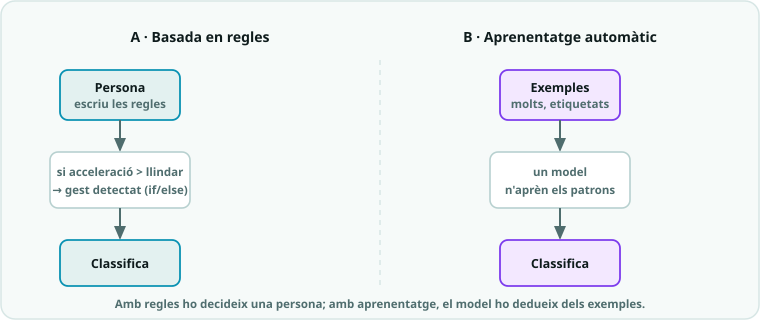

# SA8 · Qüestionari de conceptes (IoT i IA: telemetria, aprenentatge automàtic i ètica de dades)

> **Ús.** Comprovació breu dels conceptes de telemetria/IoT, introducció a la IA i ètica de
> dades de la SA8. Es pot fer servir com a **repàs formatiu** o com a **prova curta qualificable**
> (10 preguntes × 1 punt = **nota 0-10**). Durada orientativa: **15-20 min**, individual.

**Nom:** ______________________  **Grup:** __________  **Data:** __________

---

## Preguntes (tria una resposta)

1. La **telemetria** consisteix a…
   - a) Carregar la bateria de la placa sense fils.
   - b) **Mesurar una magnitud en un lloc i transmetre les dades a un altre.**
   - c) Dibuixar imatges a la pantalla de LED.
   - d) Programar un robot perquè es mogui sol.

2. Perquè dues micro:bit es comuniquin per ràdio, totes dues han de tenir…
   - a) **El mateix `group` (`radio.config(group=...)`).**
   - b) El mateix nom de fitxer.
   - c) La mateixa temperatura ambient.
   - d) Bateries de marques diferents.

3. Al codi de telemetria, la instrucció per **enviar** dades per ràdio és…
   - a) `radio.off()`
   - b) `radio.receive()`
   - c) **`radio.send()`**
   - d) `display.scroll()`

4. Al receptor, `print(missatge)` serveix sobretot per…
   - a) Apagar la ràdio en acabar.
   - b) **Registrar les dades pel port sèrie i poder-les graficar després a l'ordinador.**
   - c) Esborrar el missatge rebut.
   - d) Reenviar el missatge a una altra placa.

5. Enviem les dades etiquetades com `"T:23;L:120"` en comptes d'un sol número perquè…
   - a) **Així distingim cada magnitud (temperatura, llum) i les podem separar al receptor.**
   - b) Les etiquetes fan que el missatge viatgi més ràpid.
   - c) La placa no pot enviar números.
   - d) És l'única manera d'encendre la ràdio.

6. L'arquitectura típica d'un sistema **IoT** segueix l'ordre…
   - a) Núvol → dispositiu, sense cap xarxa pel mig.
   - b) Només dispositiu i app, sense xarxa ni núvol.
   - c) **Dispositiu → xarxa → núvol → app.**
   - d) App → dispositiu directament, sempre sense servidors.

7. Quina és la diferència entre **regles fetes a mà** i **aprenentatge automàtic (ML)**?
   - a) No hi ha cap diferència real.
   - b) Les regles necessiten internet i el ML no.
   - c) **Amb regles una persona escriu les condicions (`if`/`else`); amb ML el model APRÈN els patrons a partir d'exemples etiquetats.**
   - d) El ML mai s'equivoca i les regles sempre fallen.

8. A **Teachable Machine**, el cicle correcte per crear un classificador és…
   - a) **Recollir exemples de cada classe → entrenar el model → provar-lo → millorar-lo.**
   - b) Entrenar primer i recollir els exemples després.
   - c) Escriure totes les regles `if`/`else` a mà i executar-les.
   - d) Provar el model abans de tenir cap exemple.

9. La idea *"garbage in, garbage out"* (bones dades = bones decisions) vol dir que…
   - a) Cal esborrar totes les dades quan s'acaba la classe.
   - b) La IA sempre encerta encara que les dades siguin dolentes.
   - c) Com més gran és la pantalla, millor decideix el model.
   - d) **Si un model s'entrena amb dades dolentes o esbiaixades, les seves decisions també ho seran.**

10. Abans que el teu sistema mesuri o enregistri **dades d'una persona**, cal tenir present sobretot…
    - a) **La privacitat: demanar consentiment i recollir només les dades necessàries (minimització).**
    - b) Res, les dades personals es poden fer servir sempre.
    - c) Només que la placa tingui prou bateria.
    - d) Que el LED encès sigui de color vermell.

---

## Pregunta oberta (opcional)

11. Explica amb les teves paraules la diferència entre una "IA" feta amb **regles** (com
    `03_ia_gestos.py`) i una feta amb **aprenentatge automàtic** (com Teachable Machine).
    Posa un exemple de quan un classificador entrenat amb dades podria **fallar per biaix**:

___________________________________________________________________

___________________________________________________________________

---

## Clau de correcció (ús del professorat)

| Pregunta | 1 | 2 | 3 | 4 | 5 | 6 | 7 | 8 | 9 | 10 |
|---|---|---|---|---|---|---|---|---|---|---|
| **Resposta** | b | a | c | b | a | c | c | a | d | a |

> **Barem orientatiu:** 10 preguntes × 1 punt = 10. La pregunta 11 pot pujar nota
> (aplicació/argumentació) o quedar fora del còmput.

---

## Versió Google Forms (llesta per copiar)

> Crea un formulari nou a **Google Forms**, activa **"Convertir en qüestionari"** i marca
> la resposta correcta de cada pregunta. Assigna **1 punt** a les preguntes 1-10.

**Títol:** `SA8 · Conceptes — IoT i IA (telemetria, aprenentatge automàtic i ètica de dades)`
**Descripció:** `Comprovació dels conceptes de telemetria/IoT, introducció a la IA i ètica de dades de la SA8.`

**Camps inicials**
- Nom i cognoms — *Resposta curta* (obligatori).
- Grup/classe — *Resposta curta*.

**Preguntes 1-10** (tipus: *Opció múltiple*; **1 punt** cadascuna; correcta en **negreta**)
1. La telemetria és… → Carregar bateria sense fils / **Mesurar en un lloc i transmetre les dades a un altre** / Dibuixar a la pantalla / Moure un robot sol.
2. Dues micro:bit per ràdio han de compartir… → **El mateix `group`** / El mateix nom de fitxer / La mateixa temperatura / Bateries diferents.
3. Instrucció per enviar dades → `radio.off()` / `radio.receive()` / **`radio.send()`** / `display.scroll()`.
4. Al receptor, `print(missatge)` → Apagar la ràdio / **Registrar les dades pel port sèrie i graficar-les** / Esborrar el missatge / Reenviar-lo.
5. Etiquetar `"T:23;L:120"` serveix per… → **Distingir cada magnitud i separar-les al receptor** / Anar més ràpid / La placa no envia números / Encendre la ràdio.
6. Arquitectura IoT → Núvol → dispositiu / Només dispositiu i app / **Dispositiu → xarxa → núvol → app** / App → dispositiu sense servidors.
7. Regles vs ML → Cap diferència / Les regles necessiten internet / **Amb regles una persona escriu les condicions; amb ML el model aprèn dels exemples** / El ML mai falla.
8. Cicle de Teachable Machine → **Recollir exemples → entrenar → provar → millorar** / Entrenar abans de recollir / Escriure regles a mà / Provar sense exemples.
9. "Garbage in, garbage out" → Esborrar les dades / La IA sempre encerta / Com més gran la pantalla, millor / **Dades dolentes o esbiaixades → decisions dolentes**.
10. Abans d'enregistrar dades d'una persona → **Privacitat: consentiment i minimització** / Es poden fer servir sempre / Només bateria / El LED ha de ser vermell.

**Pregunta 11** (tipus: *Paràgraf*; sense puntuació) — diferència entre IA per regles i per aprenentatge automàtic + un exemple de biaix.

> **Recollida:** Respostes → full de càlcul vinculat, amb la nota de l'1 al 10 autocalculada.

---

*Qüestionari de conceptes de la SA8. Es recolza en `SA8_fitxa_alumnat.md`, `SA8_guia_docent.md`,
`SA8_connexions.md`, `SA8_practica_teachable_machine.md` i el marc `../00_IA_a_la_materia.md`.
Llicència CC BY-SA 4.0.*
