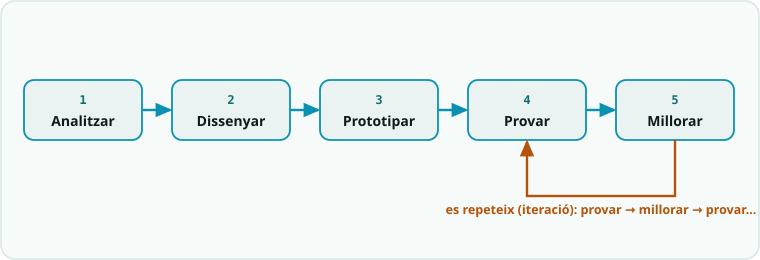

# SA9 · Repte final integrador (opció competició)

Novena i última situació d'aprenentatge (**10 h · 5 sessions**, 3r trimestre). És el **projecte de síntesi** del curs: en equip, l'alumnat dissenya, construeix, programa, documenta i defensa un **sistema robòtic autònom** que resol un repte real, integrant **tot l'après (SA1-SA8)**. Opció de vincular-lo a una **competició** (WRO, RoboCup Junior, FTC) o al **Treball de Recerca**. Maquinari i llenguatge **lliures**. Programació oficial: [`Programació didàctica/18_SA9_Projecte_final.md`](../../Programació%20didàctica/18_SA9_Projecte_final.md).

## 📦 Què has d'entregar

| Quan | Lliurable | On es lliura |
|---|---|---|
| S1 | [Sessió 1 · Idear (disseny de l'equip)](SA9_fitxa_alumnat.md#3-disseny) | [Tasca de Classroom (una per equip)](https://classroom.google.com/c/ODY4ODU4Njk0NTEy/a/ODcwNTE3OTM1Nzkw/details) |
| S2 | [Sessió 2 · Prototipar (planificació)](SA9_fitxa_alumnat.md#4-planificacio) | Mateixa tasca de Classroom |
| S3 | [Sessió 3 · Provar (proves i iteracions)](SA9_fitxa_alumnat.md#5-proves-i-iteracions) | Mateixa tasca de Classroom |
| S4 | [Sessió 4 · Comunicar (defensa)](SA9_fitxa_alumnat.md#6-defensa-s4) | Mateixa tasca de Classroom |
| S5 | **Prova pràctica T3 (individual, per estacions)** | A l'aula, sessió sencera |
| ⭐ | [Repte final integrador](plantilles/Banc_de_reptes.md) | El docent el valida com a part del producte del projecte, a la defensa de la S4 |
| 📓 | Full del quadern tècnic de cada sessió | En paper, en acabar la sessió |
| 🤖 | El rover al repte final i la competició | Es tanca al dossier del rover: [dossier del rover](../00_General/00_Projecte_T3_Rover.md) |

## Itinerari per sessions (per fases)

> El projecte segueix el **mètode de projecte** del curs. La teva feina d'equip és a la **[fitxa base](SA9_fitxa_alumnat.md)** amb les [plantilles](plantilles/). Les respostes de la fitxa es lliuren a la **[tasca de Classroom](https://classroom.google.com/c/ODY4ODU4Njk0NTEy/a/ODcwNTE3OTM1Nzkw/details)** (una per equip).

1. **Sessió 1 · Idear** — trieu repte al [banc de reptes](plantilles/Banc_de_reptes.md), formeu equips i planifiqueu amb el [taulell àgil](plantilles/Planificacio_agile_PLANTILLA.md); ompliu el [disseny de la fitxa](SA9_fitxa_alumnat.md#3-disseny).
2. **Sessió 2 · Prototipar** — munteu el prototip mínim viable i el primer codi; seguiu la [planificació](SA9_fitxa_alumnat.md#4-planificacio).
3. **Sessió 3 · Provar** — proves sistemàtiques i **primera iteració** ([proves i iteracions](SA9_fitxa_alumnat.md#5-proves-i-iteracions)).
4. **Sessió 4 · Millorar i documentar** — **segona iteració** + [dossier tècnic](plantilles/Dossier_tecnic_PLANTILLA.md).
5. **Sessió 5 · Comunicar** — [defensa oral](SA9_fitxa_alumnat.md#6-defensa-s5) + demostració i coavaluació (s'avalua amb **totes** les rúbriques R1-R5).
6. **Abans d'entregar** — repassa [el nostre checklist](SA9_checklist_alumnat.md).

### Si vols més

- [Fitxa ampliada](SA9_fitxa_ampliada.md) — guió complet i rutines.

<!-- web:only-github -->
## Contingut

| Fitxer | Descripció |
|---|---|
| [`SA9_guia_docent.md`](SA9_guia_docent.md) | Guia del professorat: sentit, 4 sessions de projecte + prova T3 (S5), rols, mapa d'avaluació i gestió de projecte. |
| [`SA9_fitxa_alumnat.md`](SA9_fitxa_alumnat.md) | **Fitxa base** de l'equip: repte, rols, disseny, planificació, iteracions, defensa, checklist. |
| [`SA9_fitxa_ampliada.md`](SA9_fitxa_ampliada.md) | **Versió ampliada**: guió complet + rutines (coavaluació, exit ticket final, PC). |
| [`SA9_checklist_docent.md`](SA9_checklist_docent.md) | **Checklist docent** (una cara): plantilles a punt, fites parcials per sessió, avaluació (R1–R5) i diversitat. |
| [`SA9_checklist_alumnat.md`](SA9_checklist_alumnat.md) | **Checklist d'equip** (una cara): fites per sessió, entrega final i autoavaluació amb semàfor. |
| `plantilles/` | Plantilles de treball (vegeu la taula següent). |

### Plantilles (`plantilles/`)

| Plantilla | Ús |
|---|---|
| `Banc_de_reptes.md` | Llista de reptes amb nivells de dificultat (atenció a la diversitat). |
| `Planificacio_agile_PLANTILLA.md` | Taulell de tasques (To Do / Fent / Fet) i rols. |
| `Dossier_tecnic_PLANTILLA.md` | Estructura del dossier tècnic a lliurar. |
| `Codi_base_PLANTILLA/` | Esquelet de codi modular per començar (sketch en carpeta pròpia). |

<!-- /web:only-github -->

## Producte i avaluació

- **Producte:** sistema robòtic autònom funcional + **dossier tècnic** + **defensa oral**.
- **Criteris:** CA1.x, CA2.1, CA3.1, CA4.1, **CA5.1, CA5.2, CA5.3** · **Rúbriques:** **R1, R2, R3, R4, R5** (totes).

## Continuïtat

És la **culminació del curs**: integra electrònica (SA2-SA4), programació en dos llenguatges (SA1-SA5, SA8), control (SA6), robòtica mòbil (SA7) i IoT/IA (SA8). Aquí es tanca el **mètode de projecte** introduït a la **SA1** (*analitzar → dissenyar → prototipar → provar → millorar*), ara aplicat de forma completa i autònoma.
