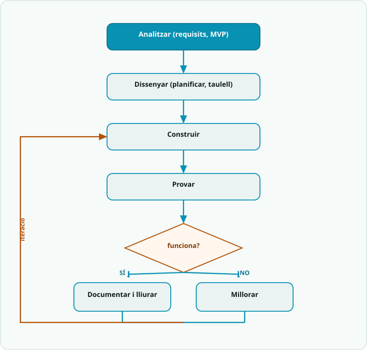

# SA9 · Diagrama de flux — Mètode de projecte (analitzar → dissenyar → construir → provar → iterar)

> **Per a qui és?** Alumnat. És el **mètode de treball** del projecte, dibuixat. Mira'l per no perdre't i saber sempre quin és el següent pas.

## El flux

## Llegenda
- Caixa **fosca** = **inici**.
- Caixa **teal** `[ ... ]` = una **acció** (una instrucció o bloc de codi).
- **Rombe ambre** `< ... ? >` = una **decisió** (`if`): en surt una branca per cada cas.
- **Fletxa ambre** = **bucle**: torna enrere i es repeteix.

## Del diagrama a la pràctica
- **ANALITZAR i DISSENYAR** → §1 de la `SA9_fitxa_alumnat` (requisits mínims vs. desitjables, triar l'**MVP**) i el **taulell àgil** de `Planificacio_agile_PLANTILLA` amb els rols repartits.
- **CONSTRUIR → PROVAR → MILLORAR** és el **bucle d'iteració**: munta i prova **una cosa cada cop** (mòduls provables per separat, rutina DEPURA); si no funciona, torna a construir i prova de nou (v1 → v2 → v3), tal com mostra l'`SA9_exemple_resolt`.
- **DOCUMENTAR** no és l'últim dia: omple el `Dossier_tecnic_PLANTILLA` **des de la primera sessió**; quan l'MVP funciona i està documentat, **lliura** (targeta T9.2).
