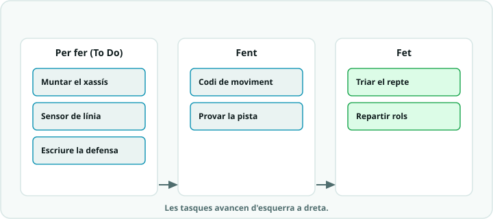

# SA9 · Exemple resolt (model «jo ho faig») — Com un equip enfoca un projecte: el «robot repartidor»

> **Nota docent:** mostra'l **a la S1 (Idear), després que cada equip hagi triat el repte** i abans
> d'omplir el taulell. No és cap solució del banc de reptes: és un projecte **anàleg i deliberadament
> diferent** perquè l'alumnat vegi *com es gestiona un projecte* (analitzar → MVP → iterar → documentar),
> no què s'ha de copiar. Aquí «La solució anotada» **no és codi**: és el **procés emplenat** (taulell,
> iteracions i decisions). Comenta en veu alta el pas «🧭 Com ho penso» (retallar l'abast fins a un MVP)
> i el «⚠️ Contraexemple» (els errors de gestió que enfonsen els projectes).

---



## 🔑 El repte model

> Un equip fictici, **els «Repartidors»**, vol un **robot que reparteix objectes petits per l'aula**:
> agafa un sobre d'un punt de sortida i el porta fins a una taula marcada, esquivant el que trobi pel
> camí. Tenen **5 sessions**. Com **enfoquen** el projecte perquè arribi a funcionar i estigui documentat?

Fixeu-vos: aquest repte **no és cap dels del banc** (ni seguidor de línia, ni evita-obstacles, ni braç
classificador) — combina trossos de diversos. Per això us serveix de **model del mètode**, no de solució
per copiar. El vostre repte serà un altre; el que heu d'imitar és **com pensen i s'organitzen**.

---

## 🧭 Com ho penso (abans de muntar res)

1. **Analitzo:** «repartir objectes» sona gros. El descomponc en **funcions**: *moure's* → *portar la
   càrrega* → *no xocar* → *saber on deixar-la*. Cada tros és un **mòdul** que sé provar per separat.
2. **Retallo fins a un MVP** (*producte mínim viable*: la versió més petita que **ja demostra la idea**).
   Em pregunto: «si només tingués **una** cosa funcionant, què n'hi hauria d'haver?» → **que es mogui
   endavant i s'aturi davant d'un obstacle**. Tota la resta (agafar el sobre amb un servo, girar cap a la
   taula, tornar) són **millores** per a iteracions posteriors, no per al primer dia.
3. **Poso fites parcials** (una per sessió) perquè no s'acumuli tot al final, i **reparteixo rols** perquè
   tothom sàpiga de què respon.
4. **🔮 PREDIU (fes-ho tu abans de llegir la solució):** si aquest equip volgués **tot el sistema a la
   primera** (moure + agafar + girar + tornar + esquivar) en la **sessió 2**, què creus que passaria?
   ☐ ho tindrien tot ☐ **no funcionaria res i no sabrien per què** ☐ acabarien abans. I l'MVP d'aquest
   projecte seria… ☐ el robot sencer ☐ **només moure's i aturar-se davant d'un obstacle**.

---

## 💡 La solució anotada (el *procés*, no el codi)

Això és el que l'equip **escriu a les plantilles**. No hi ha `.ino` a copiar: hi ha **decisions**.

**a) Requisits (de `SA9_fitxa_alumnat` §1) — es distingeix el mínim del desitjable**

- **Requisits mínims** (sí o sí): 1. es mou endavant de forma controlada · 2. **s'atura davant d'un
  obstacle** (ultrasons) · 3. porta una càrrega petita a sobre sense que caigui.
- **Desitjables** (si hi ha temps): agafar el sobre amb un servo · girar cap a la taula marcada · tornar
  al punt de sortida.

**b) Taulell àgil (de `Planificacio_agile_PLANTILLA`) al final de la S1 — l'MVP primer**

| 📋 Per fer | 🔧 Fent | ✅ Fet |
|---|---|---|
| Servo per agafar el sobre (*desitjable*) | Muntar xassís + motors | Triar repte i requisits |
| Girar cap a la taula (*desitjable*) | Codi: moure endavant + aturar amb ultrasons | Repartir rols |
| Tornar al punt de sortida (*desitjable*) | | Esbós del sistema (blocs) |

> La feina de l'MVP (moure + aturar) és a **Fent**; tot el que és *desitjable* espera a **Per fer**.
> Així ningú comença pel servo abans que el robot es mogui.

**c) Rols (§2)** — Coordinació: manté el taulell i les fites · Maquinari: xassís i connexions ·
Programació: codi i depuració · Documentació: fa fotos i omple el dossier **des del primer dia**.

**d) Fites parcials i iteracions planificades (2-3 voltes al cicle *provar → millorar*)**

| Sessió (fita) | Objectiu concret | Iteració |
|---|---|---|
| S2 (Prototipar) | **MVP:** es mou i s'atura davant d'un obstacle | — |
| S3 (Provar) | Prova per parts; corregeix el que falli | **v1 → v2** |
| S4 (Millorar) | Afegeix **un** desitjable (agafar el sobre) + dossier | **v2 → v3** |

**e) Pseudocodi de l'MVP** (només per fixar la lògica; encara *no* és el producte):

```text
// PSEUDOCODI de l'MVP - moure i aturar (sense accents als comentaris)
repeteix sempre:
  mesura la distancia amb ultrasons
  si distancia < LLINDAR:
    atura els motors        // primer el mes important: no xocar
  si no:
    avanca endavant
// els desitjables (servo, girar, tornar) s'afegeixen en iteracions posteriors
```

**Per què està enfocat així (🌟):**
- **MVP primer:** una cosa que funciona de veritat val més que cinc a mitges. Sobre l'MVP s'afegeix la
  resta **de manera incremental**.
- **Mòduls provables per separat:** moure, mesurar i aturar es proven un a un → quan alguna cosa falla,
  se sap **quin** tros mirar (rutina **DEPURA**, provar per parts).
- **Documentar des del dia 1:** el rol de documentació fa fotos i anota decisions **mentre passen**, no
  la nit abans de la defensa.
- **Fites per sessió:** cada dia té un objectiu tancat → res s'acumula per a l'últim dia.

---

## 🔬 Provo i mesuro

- **Predicció ✔:** voler-ho tot a la S2 acaba en «no funciona res i no sé per què»; l'MVP correcte és
  **només moure's i aturar-se davant d'un obstacle**.
- **Mesura del progrés (taulell):** al final de cada sessió compten quantes targetes han passat a **Fet**.
  Si a la S3 encara no hi ha res a Fet → senyal d'alarma: cal **retallar abast** (menys desitjables).
- **Mesura tècnica de l'MVP:** amb regle, comproven a quina distància s'atura el robot i ajusten el
  `LLINDAR` fins que frena **abans** de tocar l'obstacle (p. ex. a 12-15 cm).
- Si van sobrats de temps → afegeixen un desitjable (servo). Si van justos → **targeta T9.2** i lliuren
  l'MVP ben acabat i documentat: **també és un assoliment satisfactori**.

---

## ⚠️ Contraexemple (errors típics de gestió i com es detecten)

- **Ho volen tot a la primera** (munten servo + gir + tornada + ultrasons alhora a la S2) → res funciona i
  no saben **quin** mòdul falla. *Solució:* **MVP primer** i afegir d'un en un, provant per parts.
- **No documenten fins al final** → arriben a la defensa sense fotos ni registre d'iteracions i el dossier
  (R4) queda buit. *Solució:* el rol de documentació **anota i fotografia des de la S1**.
- **Ho deixen per a l'últim dia** (sense fites parcials) → a la S4 encara munten maquinari i no arriben a
  provar. *Solució:* **una fita tancada per sessió** i mirar el taulell cada dia.
- **Rols difusos** («ja ho farà algú») → dues persones toquen el mateix codi i la resta espera. *Solució:*
  **assignar i registrar rols** al taulell; cada targeta té un responsable.

---

## 📔 Diari de bord (entrada model, 1a persona)

> **Sessió 3:** Volíem que el robot ja **agafés el sobre i girés**, però vam decidir fer **primer l'MVP**:
> moure's i aturar-se amb els **ultrasons**. Bona decisió: a la v1 no frenava a temps perquè el `LLINDAR`
> era massa petit; el vam pujar a 15 cm (v2) i ja s'atura bé. Vam **provar per parts** (primer els motors
> sols, després el sensor sol) i així vam trobar de seguida que el problema era el llindar, no el motor.
> El servo per agafar el sobre queda per a la S4 com a **millora**. **Evidència:** foto del taulell amb
> les targetes mogudes + vídeo del robot aturant-se davant la mà.

**Per què és una bona entrada:** usa el **vocabulari clau** (MVP, iteració, llindar, provar per parts),
explica *una decisió de gestió* (retallar l'abast) i és **honesta amb la dificultat** (la v1 no frenava)
i com es va resoldre iterant.

---

*Exemple resolt de la SA9. Model de gestió de projecte per a l'alumnat (es mostra a la S1, després de triar
el repte): projecte **anàleg**, no copiable com a solució. Es recolza en les plantilles de `plantilles/`
(`Banc_de_reptes`, `Planificacio_agile_PLANTILLA`, `Dossier_tecnic_PLANTILLA`) i en la rutina DEPURA.
Llicència CC BY-SA 4.0.*
